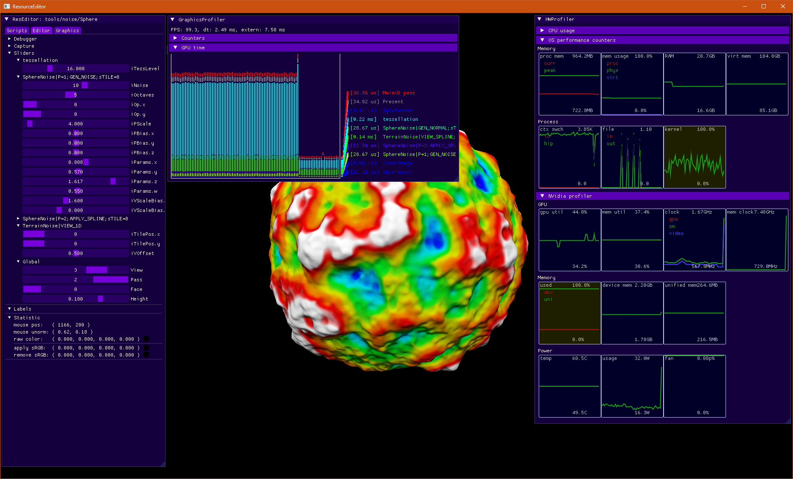

## Editor for shaders and procedural content

This is copy of [as-en/res-editor](https://github.com/azhirnov/as-en/tree/dev/AE/samples/res_editor) without C++ sources.

Content:
* [Features](#features)
* [Controls](#controls)
* [Editor UI](docs/EditorUI.md)
* [Samples](docs/Samples.md)
* [Scripts](docs/Scripts.md)

## Features

* Renderer is written in scripts.
* Hot reloading for scripts.
* Sliders and color pickers for passing data to the shader.
* Built-in shader debugger and profiler:
	- [GLSL-Trace](https://github.com/azhirnov/as-en/blob/dev/AE/engine/tools/res_pack/shader_trace/Readme.md).
	- RenderDoc.
* Built-in graphics profilers:
	- NSight, GPA (*in progress*)
	- Adreno/Mali/PowerVR/NV/AMD profilers (see [Engine Profiling](https://github.com/azhirnov/as-en/blob/dev/AE/docs/engine/Profiling.md)).
* Various 2D & 3D cameras.
* Geometry templates:
	- Spherical cube with tangential projection (skybox, planet rendering)
	- Particles
	- Raw draw calls
	- Terrain (*in progress*)
	- Models/Scenes (loaded using Assimp).
* Compatible with shadertoy (use `Postprocess()` with `Shadertoy` or `ShadertoyVR` flags).
* Supports modern features like a hardware ray tracing and mesh shading.
* Supports async streaming (async file and partially uploading in single graphics queue, async transfer queue is not used).
* Video encoder and decoder (using ffmpeg).
* Screenshot capture (dds, png, jpeg and other).
* Supports [HDR display](https://github.com/azhirnov/as-en/blob/dev/AE/docs/papers/HDR_Display.md).
* Resource export:
	- Image export to engine internal format.
	- Buffer export to binary or text format which reflect buffer structure in shader.
	- Scene export (*in progress*)

**Platforms:** 
* Windows x64
* Linux x64
* MacOS arm64
* Remote rendering on any platform

## Controls

`Esc` - switch between camera and UI 
`Tab` - show/hide UI 
`F1` - show/hide help with key bindings 
