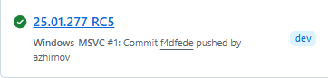
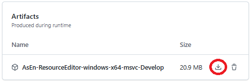

**How to get release binaries from CI**

## Links

Artifacts in CI:
* [Windows](https://github.com/azhirnov/as-en/actions/workflows/windows-msvc.yml)
* [Linux (Clang)](https://github.com/azhirnov/as-en/actions/workflows/linux-clang.yml), [Linux (GCC)](https://github.com/azhirnov/as-en/actions/workflows/linux-gcc.yml)
* [MacOS](https://github.com/azhirnov/as-en/actions/workflows/macos.yml)
* [Android](https://github.com/azhirnov/as-en/actions/workflows/android.yml)


## Get binaries

Download `AsEn-ResourceEditor-<platform>-<compiler>-<config>` archive with `ResourceEditor` binaries.

Choose stable version which pass tests.<br/>


Then download archive. Prefer `Develop` or `Profile` version.<br/>



### Remote version

Download `AsEn-ResourceEditor-<platform>-<compiler>-<config>-RemoteGraphics` archive with `ResourceEditor` binaries.

Download `AsEn-Tools-<platform>-<compiler>-<config>` archive with `RemoteGraphicsDevice` or `rg-device.apk` for Android.


## Folder structure

On CI ResourceEditor compiled with `AE_PORTABLE_APP=ON` which requires different folder structure than in git.

```
src                 -- git: AE/samples/res_editor/_data
docs                -- git: AE/samples/res_editor/docs  -- optional
res_editor_data     -- git: AE-Data/res_editor_data  -- optional
shadertoy_data      -- git: AE-Data/shadertoy_data  -- optional
shared_data         -- git: AE/engine/shared_data
ui                  -- unpack resources from CI (or AE-Temp/samples/res_editor)
- vk
-- ui_pipelines.bin
- controls.bin
din
- ResourceEditor      -- executable from CI (or build/bin/<config>/ResourceEditor)
- GraphicsRHI-shared  -- shared lib from CI, optional, see 'Remote version'
```

## Download resources

Minimal set of resources which required to run all samples.
Many samples can run without it.

Use script `AE-Data/download-resources`.
