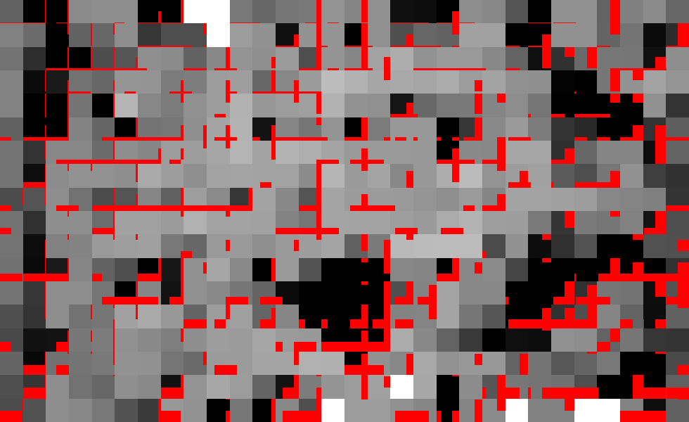

**What problems arise when increasing the amount of geometry**:
* Overdraw - when for one pixel, a heavy fragment shader is executed multiple times.
* Quad overdraw - fragment shaders are executed in 2x2 squares, some of which may be auxiliary and do not cover the pixel. For single-pixel triangles, 3 out of 4 streams are redundant, significantly reducing performance.
* The load on the rasterizer increases. Currently, cards with 4TFLOPS+ can fill a 4K screen with single-pixel triangles at 60+ frames per second, but everything depends on the fragment shader.
* The load on the vertex shader increases. For single-pixel triangles, the value approaches one VS per pixel, which is already a lot. For separate triangles, such as leaves, it's already 3 VS calls per pixel.
* Memory and cache are loaded. On TBDR, reading from global memory occurs multiple times.

# Geometry Culling Techniques

## Depth Pre-Pass (DPP)

The first pass fills the depth buffer, and the material is applied in the second pass.

* The first pass is limited by rasterization (fill rate) and the vertex shader.
* The second pass also loads rasterization, providing no acceleration.
* After rasterization, most pixels are discarded by the ZS test.
* The material is applied once per pixel, but due to auxiliary threads along the edges of the triangle, multiple FS calls per pixel may occur, even though only one result is written.
* As a result, the load on the vertex shader and rasterizer doubles.

## Depth Reprojection

The depth buffer from the previous frame is projected onto the new frame.

* Replaces the first pass of depth pre-pass, reducing the load on the rasterizer.
* Only applicable for static geometry.
* During reprojection, the precision of values decreases and must be compensated with offsetting.
* Some pixels are lost, and in these areas, the load on the rasterizer sharply increases.
  - Additional culling is required.
  - Another option is to take the maximum value from neighboring pixels and add an offset.

Also used for shadow drawing acceleration: [Camera Depth Reprojection for ShadowCulling (slide 26)](https://games-1312234642.cos.ap-guangzhou.myqcloud.com/course/GAMES104/GAMES104_Lecture22.pdf)

## Deferred Texturing

The first pass writes depth, material ID, normals, and derivatives for texture coordinates. The second pass (or sub-pass) applies the material. Further evolution led to the Visibility Buffer with an even more compact G-buffer.

* Rasterization occurs once.
* The heavy fragment shader is called once.
* Requires storing in the G-buffer:
  - Normals (packed: 2x 16-bit)
  - Material ID (16-bit)
  - UV (2x 16-bit)
  - UV derivatives or LOD (4x 16-bit)
  - Tangents (tangent, bitangent) for bump mapping
* More data goes into the G-buffer, which is not so bad for TBDR architectures as long as it fits within 128 bits.
  - The more attributes a vertex has, the larger the G-buffer.

**Links**
* [Nathan Reed: Deferred Texturing](https://www.reedbeta.com/blog/deferred-texturing/)
* [The Danger Zone: Bindless Texturing for Deferred Rendering and Decals](https://therealmjp.github.io/posts/bindless-texturing-for-deferred-rendering-and-decals/)

## Visibility Buffer (VisBuf)

The first pass writes depth, material index, and triangle index. The second pass retrieves vertices by triangle index, calculates barycentric coordinates, interpolates attributes, calculates derivatives, and applies the material.

* Rasterization occurs once.
* The heavy fragment shader is called once.
* Compact G-buffer (32 bits for depth and 32 for material + triangle).
* Requires geometry to be divided into clusters to compress triangle and material indices; otherwise, more memory is needed.
* Calculating the position of triangle vertices for each pixel is equivalent to three vertex shader calls, which is a significant overhead for light fragment shaders and weak GPUs.
* For animation, an intermediate buffer with transformed vertices is used, as in [Horizon Forbidden West](https://www.gdcvault.com/play/1027553/Adventures-with-Deferred-Texturing-in). Otherwise, the heavy VS is called three times per pixel.
* To completely eliminate quad overdraw, software rasterization like Nanite or Horizon is needed.
* Different shaders require pixel classification - select pixels with the same material, group them, and call the shader.
* On TBDR architectures, creating a VisBuf is twice as slow as depth pre-pass due to storing PrimitiveID and material.
* Transforming three vertices, interpolating attributes, and calculating derivatives for each fragment is very costly for mobile devices.
* Random memory reads for indices and then vertices can be slow.
  - For optimization, there is an option to cache unique vertices within a tile. But this won't work on mobile devices where global memory is in slower L2.
  - For mobile devices, it may be more optimal to read vertices from a texture or texture buffer (TBO), which would fit into L1 cache.

**Classification Stage**
* Material Depth Buffer ([Dawn Engine (page 16)](https://gitea.yiem.net/QianMo/Real-Time-Rendering-4th-Bibliography-Collection/raw/branch/main/Chapter%201-24/%5B0363%5D%20%5BGPU%20Zen%202017%5D%20Deferred%20-%20Next-Gen%20Culling%20and%20Rendering%20for%20the%20Dawn%20Engine.pdf) and [Nanite (slides 100-105)](https://advances.realtimerendering.com/s2021/Karis_Nanite_SIGGRAPH_Advances_2021_final.pdf), with a [performance test](https://github.com/azhirnov/AsEn-ShaderEditor/tree/main/src/scripts/gbuffer-classify/MaterialDepthBuffer.as)). The idea is that after the depth buffer pass, pixels (actually 2x2 squares) are grouped to fill warps as much as possible, but cannot collect pixels outside the tile (on TBR and TBDR), thus reducing efficiency. The tile size may depend on the number of registers in the fragment shader, so for heavy shaders, efficiency drops more.
* Classification in the compute shader as in [Horizon Forbidden West](https://www.gdcvault.com/play/1027553/Adventures-with-Deferred-Texturing-in). Tile size is manually set, allowing better pixel grouping, and there is no quad overdraw in the compute shader.
* Classification on workgraphs as in [Simple Classify demo](https://github.com/GPUOpen-LibrariesAndSDKs/WorkGraphsDirectX-Graphics-Samples/tree/main/Samples/Desktop/D3D12GPUWorkGraphs/SimpleClassify).

[Discover Metal enhancements for A14 Bionic: Visibility buffer with barycentric coordinates and primitiveID (6:24 - 14:40)](https://developer.apple.com/videos/play/tech-talks/10858/?time=384) An alternative G-buffer that additionally records triangle barycentric coordinates.
* This eliminates the need to calculate the position of all triangle vertices per pixel.
* Derivatives within one triangle are calculated correctly, but how to fix them at triangle boundaries is not explained.
* For non-TBDR architectures, we pay twice as much for G-buffer reads.

**Links**
* [The Visibility Buffer: A Cache-Friendly Approach to Deferred Shading (2013)](https://jcgt.org/published/0002/02/04/paper.pdf)
* [Visibility Buffer (2016)](https://gdcvault.com/play/1023792/4K-Rendering-Breakthrough-The-Filtered)
* [Visibility Buffer Rendering with Material Graphs](http://filmicworlds.com/blog/visibility-buffer-rendering-with-material-graphs/)

## Hierarchy Z-Buffer (HZB, HiZ)

Hierarchical depth buffer. Takes the depth buffer from the previous frame, generates mip levels. Before drawing, it checks if the object is visible - depth is less than in the depth buffer. A two-pass variant - first visibility check creates two lists: visible objects and possibly visible. Draw the first list, then build HZB for the current frame and check the second list.

* Reduces the load on the vertex shader and rasterizer.
* Does not solve the problem of multiple fragment shader calls per pixel, so it requires combination with other techniques.
* Requires copying the depth buffer before drawing dynamic objects; otherwise, false positives occur.
* Requires splitting geometry into smaller parts (meshlets) to improve accuracy; higher mip levels are then used.
* Alternative - draw simplified geometry in low resolution, build a pyramid, and check visibility.
* Visibility testing is performed in the compute shader, which is parallelized with other passes, such as shadows.
* Building the depth pyramid takes much more time than visibility testing. With increasing resolution, the load increases significantly.
* On slow memory, it struggles with 4K when building the pyramid; for optimization, the upper mip levels can be discarded as they are rarely used.
* Since a max filter is used, thin geometry and meshes with alpha testing often do not contribute to the depth pyramid. This reduces visibility test accuracy. For thin geometry,Raster Occlusion is better, and for alpha testing, Visibility Buffer is better.

<b>Implementation Details</b>

Depth HZB calculation should occur for textures of power 2, as `3/2=1`, so during filtering, we need to read 2 or 3 texels to avoid losing data. Also, coordinate offsetting and visibility test give incorrect results.

> For example, the mip chain 27, 13, 6, 2, 1 gives coordinate offset:
> texel 26 when reduced is 13, but it's outside the mip and either lost or goes to 12.
> The same applies to the second mip: 12 when reduced is 6, which is outside the third mip.

Here, one mip level is compared to a higher one. Red indicates areas where coordinates have shifted and maximum values do not match.

There are two options to solve the problem:
* First reduce to power of 2, then calculate mip levels. [Example](https://github.com/azhirnov/AsEn-ShaderEditor/tree/main/src/scripts/geom-cull/perf-GenHiZ-1.as).
  - For power of 2 mip levels are calculated faster.
  - Distorts proportions, squares become rectangles and visibility test accuracy slightly decreases.
* For each mip level, choose which pixels from the higher level affect it. [Example](https://github.com/azhirnov/AsEn-ShaderEditor/tree/main/src/scripts/geom-cull/perf-GenHiZ-2.as).

[Example HiZ with debug visualization](https://github.com/azhirnov/AsEn-ShaderEditor/tree/main/src/scripts/geom-cull/test-HiZ-DebugVis.as) 

**Links**
* [Hierarchical Z-Buffer Occlusion Culling (2010)](https://www.nickdarnell.com/hierarchical-z-buffer-occlusion-culling/)
* [GPU-based Scene Management for Rendering Large Crowds (2008)](https://drivers.amd.com/misc/siggraph_asia_08/GPUBasedSceneManagementLargeCrowds_SLIDES.pdf)
* [Hierarchical-Z map based occlusion culling](https://www.rastergrid.com/blog/2010/10/hierarchical-z-map-based-occlusion-culling/)
* [Hierarchical Depth Buffers (2020)](https://miketuritzin.com/post/hierarchical-depth-buffers/), [[translation](https://habr.com/ru/articles/494376/)]

## Raster Occlusion

Implemented in [gl_occlusion_culling](https://github.com/nvpro-samples/gl_occlusion_culling), which references the presentation [OpenGL Scene-Rendering Techniques (Siggraph 2014)](https://web.archive.org/web/20160314160241/http://on-demand.gputechconf.com/siggraph/2014/presentation/SG4117-OpenGL-Scene-Rendering-Techniques.pdf). Fill the depth buffer through depth pre-pass or reprojection. Draw bbox with depth write off, in the fragment shader mark the object as visible.

* Better accuracy than HiZ.
* Loads the rasterizer, but not as much as full geometry.
* Loads memory due to random writes and grows with increasing resolution.
* For optimization, can lower resolution as with HiZ.
* For better accuracy, requires splitting geometry into small parts (meshlets).
* Good for thin geometry: vegetation, poles, wires.

[Example Raster Occlusion debug visualization](https://github.com/azhirnov/AsEn-ShaderEditor/tree/main/src/scripts/geom-cull/test-RasterCull-DebugVis.as)

## Cone/Cluster Culling

For part of the geometry (meshlets), the visibility cone is calculated, the test occurs after frustum culling.

* Provides small acceleration by reducing draw calls and vertex shader calls.
* Replaces back face culling, which occurs before triangle rasterization, on TBDR this happens before global memory write, so only VS calls are saved.

Cluster Culling is described in [Optimizing the Graphics Pipeline with Compute](https://gdcvault.com/play/1023109/Optimizing-the-Graphics-Pipeline-With) (slides 28-30).

## Per Triangle Culling

Described in [Optimizing the Graphics Pipeline with Compute](https://gdcvault.com/play/1023109/Optimizing-the-Graphics-Pipeline-With) (slides 41-63).

A cluster of 256 triangles after Cluster Culling is sent to Per Triangle Culling. One thread checks the visibility of one triangle, then using prefix sums, visible triangles are shifted to the left.

* Works well with pre-transformed vertices; otherwise, double work is done.
* Memory load triples: need to read vertices, transform them, and write back, then read again in VS.
  But load decreases with culling and when vertices are compressed, as done on TBDR architectures.
  Also useful for visibility buffer, where vertex transformation is repeated per pixel.
* Invisible triangles are already culled in hardware, the software variant only differs in using HiZ from the previous frame.

## Potentially Visible Set (PVS)

A list of static objects that can be visible from a certain position.

* Requires pre-calculation.
* For large locations, takes up a lot of memory.
* May not contain data for all possible camera positions. For example, if the usual behavior is the camera on the ground and all precomputed, then in flight mode it won't work.

**Umbra3D dPVS** 
A library for calculating PVS in real-time. Uses rasterization of simplified geometry on the CPU.

**Links**
* [Improving Geometry Culling for 'Deus Ex: Mankind Divided'](https://www.gdcvault.com/play/1023678/)
* [Solving Visibility and Streaming in The Witcher 3: Wild Hunt with Umbra 3](https://gdcvault.com/play/1020231/Solving-Visibility-and-Streaming-in)

## Specific Optimizations

For cubic worlds, all faces with the same normal can be grouped and culled as a whole, similar to PVS, but built for free.
Video with technique description: [I Optimised My Game Engine Up To 12000 FPS](https://youtu.be/40JzyaOYJeY).

## Coverage Bitmasks

https://media.contentapi.ea.com/content/dam/ea/seed/presentations/seed-coverage-bitmasks-mittring.pdf

## Hardware Implementation

In all cases, we have to pay for draw calls and vertex shaders, and then it depends on the efficiency of the hardware implementation.

### Early ZS, Hierarchy Z-Buffer

* After rasterization, depth test occurs, and only for 2x2 pixel squares that pass the test will the fragment shader be launched.
* At this stage, built-in hierarchical depth buffer (HiZ) is used, which culls entire tiles without needing to test each pixel.
* Squares that pass the test are then grouped within the tile to fill all available warp threads.
* Discard in the shader and transparency do not change depth, so they can also be culled. More efficient culling on TBDR architectures.

**Links**
* [To Early-Z, or Not To Early-Z](https://therealmjp.github.io/posts/to-earlyz-or-not-to-earlyz/)
* [A trip through the Graphics Pipeline 2011, part 7](https://fgiesen.wordpress.com/2011/07/08/a-trip-through-the-graphics-pipeline-2011-part-7/)

### Facing test, XY plane test, Z plane test, Sample test

* Occurs during tiling. Here we pay only for part of the vertex shader that handles position.
* Objects with back-facing normals are discarded, which removes about half of the triangles for models, but zero for 2D.
* Checks if the triangle is visible on the screen (XY plane test, Z plane test), if not, it's culled.
* The triangle must cover at least one pixel, otherwise it's culled (Sample test).
* On TBDR this reduces memory load when uploading and downloading tiled geometry.

**Links**
* [Valhall Performance Counters Reference Guide](https://developer.arm.com/documentation/107775/0106)
* [A trip through the Graphics Pipeline 2011, part 5](https://fgiesen.wordpress.com/2011/07/05/a-trip-through-the-graphics-pipeline-2011-part-5/)

### AMD Vega Deferred pixel processing

Something similar to Mali FPK. Mentioned only in Vega (GCN5) architecture.

* The fragment shader is not immediately launched for rasterized triangles.
* First, pixels are accumulated in a small buffer, and then only one is drawn.

**Links**
* [Vega Whitepaper](https://en.wikichip.org/w/images/a/a1/vega-whitepaper.pdf)

### Adreno Low Resolution Z-Pass (LRZ)

* During tiling, the LRZ is filled. Some primitives may be culled at this stage.
* During rendering, first the LRZ is tested, and only then the full-resolution Z-buffer. This accelerates the ZS test and reduces L2 memory reads where the tile is stored.

**Links**
* [Low Resolution Z Buffer support on Turnip (2021)](https://blogs.igalia.com/siglesias/2021/04/19/low-resolution-z-buffer-support-on-turnip/)
* [Low-resolution-Z on Adreno GPUs](https://blogs.igalia.com/dpiliaiev/adreno-lrz/)

### Mali Forward Pixel Kill (FPK)

* The fragment shader starts executing, while the next triangle is rasterized and covers the current one, then the fragment shader is interrupted and a new one begins.
* Doesn't work for small triangles with simple shaders, then shaders finish faster than new triangles are rasterized.
* When the fragment shader starts, it can access memory, and after interruption, this request is not canceled and creates unnecessary memory load.

**Links**
* [Forward Pixel Kill](https://community.arm.com/arm-community-blogs/b/graphics-gaming-and-vr-blog/posts/killing-pixels---a-new-optimization-for-shading-on-arm-mali-gpus), [[webarchive](https://web.archive.org/web/20240922023725/https://community.arm.com/arm-community-blogs/b/graphics-gaming-and-vr-blog/posts/killing-pixels---a-new-optimization-for-shading-on-arm-mali-gpus)]

### Mali Fragment Prepass (FPP)

* Appears in the new 5th gen architecture.
* For each pixel, primitives are iterated and the only one is selected for rendering.
* For invisible pixels, the fragment shader is not called at all.

**Links**
* [Hidden Surface Removal in Immortalis-G925: The Fragment Prepass](https://community.arm.com/arm-community-blogs/b/graphics-gaming-and-vr-blog/posts/immortalis-g925-the-fragment-prepass), [[webarchive](https://web.archive.org/web/20241202033355/https://community.arm.com/arm-community-blogs/b/graphics-gaming-and-vr-blog/posts/immortalis-g925-the-fragment-prepass)]

### Mali Deferred Vertex Shading (DVS)

* Appears in the new 5th gen architecture.
* During tiling, part of the vertex shader that handles position is called. If the triangle is small, it's marked for DVS and not uploaded to global memory.
* During rasterization, the vertex shader is called again for DVS triangles and then the fragment shader. So for DVS triangles, vertex position calculation happens twice, which can be costly if there's vertex animation.

**Links**
* [Hidden Surface Removal in Immortalis-G925: The Fragment Prepass](https://community.arm.com/arm-community-blogs/b/graphics-gaming-and-vr-blog/posts/immortalis-g925-the-fragment-prepass), [[webarchive](https://web.archive.org/web/20241202033355/https://community.arm.com/arm-community-blogs/b/graphics-gaming-and-vr-blog/posts/immortalis-g925-the-fragment-prepass)]

### PowerVR Hierarchical Scheduling Technology (HST)

* Promises complete removal of invisible fragments, similar to depth pre-pass.
* Like LRZ, it occurs during tiling.
* During rasterization, the primitive that covers all other fragments in a given pixel is already known.

**Links**
* [Introduction to PowerVR for Developers (2021)](https://imagination-technologies-cloudfront-assets.s3.eu-west-1.amazonaws.com/website-files/documents/Introduction_to_PowerVR_for_Developers.pdf?dlm-dp-dl-force=1&dlm-dp-dl-nonce=5021498b5e)

# Performance Tests

[In a separate file](tests/GeometryCullingTests-ru.md).

# Test Results

### Rasterization

At the same geometry detail, rasterization at 1K and 2K takes similar time, but on some GPUs, 1K resolution is slower due to more triangles per pixel.
It turns out that techniques to lower resolution without geometry detail reduction work worse.

Moving from 2K to 4K only doubles rasterization time, although 4 times as many pixels are filled.

### Sorting by Distance from Camera

Performance without FS load is important for Depth pre-pass and Visibility buffer. With minimal losses, exact sorting can be avoided.
Good results shown by AMD RDNA, NV RTX, Mali, Adreno, Intel gen9, PowerVR.
AMD RX570 slows down by 2-3x, Intel N150 is slower by 70%.

With heavy FS, the situation changes and only Adreno 600 with LRZ maintains performance. Others slow down by 2-4x.

### Hardware Optimization

Mali FPK doesn't work on small triangles, so in tests it shows unstable results. So on G57 in 4K unsorted geometry gives only 15% slowdown, but the same test on G610 is always 2-2.5x slower.

Very well shown by Adreno LRZ, losses no more than 10%.

PowerVR behaves similarly to Mali FPK, but in 4K losses decrease from 2x to 20%.

Apple seems to use an FPK analog.

Mali FPK, PowerVR HST, and Apple optimize the no-depth-test case well. In 2K Mali is 3-4x slower, PowerVR 5-6x, while others slow down 10-20x.
In 4K the difference increases, PowerVR slows down by 3x, Mali G57 loses only 30%, Mali G610 in 4K doesn't give acceleration probably due to more cores.
On other GPUs in 4K load increases as expected.

### Depth pre-pass vs Visibility buffer

VisBuf as expected reduces quad overdraw, which is especially important with heavy ALU load.
With textures, quad overdraw is less noticeable since neighboring texels fit into cache.

DPP is more dependent on pre-culling since rasterization happens twice.

On AMD RX570 building VisBuf takes almost twice as long as DPP.
On others (NV RTX2080, AMD 780M, Intel UHD620, Intel N150) difference is only 20-30%.

Overall, VisBuf is much more efficient than DPP due to one rasterization pass with light FS, or due to no quad overdraw with heavy FS.

For TBDR architectures, VisBuf increases memory load due to storing vertices in global memory, as PrimitiveID is also saved.
Vertex transformation per pixel is very costly for weak mobiles.

### HiZ vs Raster Occlusion

Building the depth pyramid for HiZ becomes more expensive with increasing resolution, which is especially important for mobiles and integrated GPUs where slow LPDDR or DDR is used.
The exception is Apple M-series in Max/Ultra variants, where memory channel count and bandwidth is comparable to GDDR.
Memory load can be calculated without compression as 4/3 of pixel count. For 4K we get 44MB or 2.6GB/s at 60fps.
Compression and min sampler reduce load by 2-3x.

Raster occlusion also loads memory, but more due to random writes and less dependent on bandwidth.
So many GPUs are designed for 16-byte writes and using only 4 bytes reduces bandwidth by 4x.
Memory load can be calculated as pixel count plus approximately 20% for AABB overlap. For 4K we get 40MB/pixel or 2.4GB/s at 60fps.
From tests, Raster occlusion in 2K/4K works 2-4x slower.

Raster occlusion wins when geometry shape is poorly described by squares and spheres, and also wins when depth test passes few pixels, which doesn't load memory unlike HiZ, which is built for the entire screen size.

### Discard

It was assumed that discard in the shader wouldn't enable LateZS with significant performance loss.
On most GPUs this is what happened, the exception is Adreno 500.
On Adreno 600 and Intel gen9 performance drops 50-70% with light FS, on Mali G57 40-70%, on PowerVR 20-30%.
No performance changes on Intel N150, AMD 780M, AMD RX570, NV RTX, Mali G610 (in 2K), Apple.

### Intel N150 vs UHD620 vs AMD RX570
Similar performance hardware, but different generations. 
Large difference in Raster occlusion: 2.1ms on N150 and 12.5ms on UHD620, with the reason being large latency in DDR3/LPDDR3.

AMD RX570 has similar rasterizer performance but 2x faster in ALU and 4x better memory bandwidth.

### AMD vs NV

AMD 780M and NV RTX2080 differ by 2x in TFLOPS and 6x in memory bandwidth. In tests rasterization differs by 2.5x.

Both GPUs react similarly to different loads and don't require specific optimizations.

### Mobiles

Older GPUs like Adreno 505 and Mali T830 take a long time to build depth pyramids (10-20ms).
Adreno 505 struggles with random reads from the buffer, which negatively affects culling on the GPU.

More recent mobiles already have built-in optimizations, so depth pre-pass and visibility buffer have minimal impact on performance.
Larger effect has HiZ, Raster occlusion, and camera distance sorting.

# Source Code

* [GeometryCulling-1](https://github.com/azhirnov/AsEn-ShaderEditor/tree/main/src/scripts/geom-cull/GeometryCulling-1.as) - performance test, load on VS and rasterizer.
  Here are [VS and FS shaders](https://github.com/azhirnov/AsEn-ShaderEditor/tree/main/src/pipeline_inc/GeometryCulling-1-shared.as).
* [GeometryCulling-2](https://github.com/azhirnov/AsEn-ShaderEditor/tree/main/src/scripts/geom-cull/GeometryCulling-2.as) - performance test, load on FS.
  Here are [VS and FS shaders](https://github.com/azhirnov/AsEn-ShaderEditor/tree/main/src/pipeline_inc/GeometryCulling-2-shared.as).
* [GenHiZ-1](https://github.com/azhirnov/AsEn-ShaderEditor/tree/main/src/scripts/geom-cull/perf-GenHiZ-1.as) - HiZ mip level calculation, power of 2 variant.
* [GenHiZ-2](https://github.com/azhirnov/AsEn-ShaderEditor/tree/main/src/scripts/geom-cull/perf-GenHiZ-2.as) - HiZ mip level calculation, preserve proportions variant.
* [DepthPyramidCulling](https://github.com/azhirnov/AsEn-ShaderEditor/tree/main/src/scripts/geom-cull/test-DepthPyramidCulling.as) - debug visualization of rectangle visibility test on depth pyramid, used in HiZ.
* [ProjectSphere test](https://github.com/azhirnov/AsEn-ShaderEditor/tree/main/src/scripts/geom-cull/test-ProjectSphere.as) - debug visualization of fast sphere projection, used for HiZ.
  Here is [shader with projection](https://github.com/azhirnov/AsEn-ShaderEditor/tree/main/src/pipelines/tests/ProjectSphere.as).
* [HiZ-DebugVis](https://github.com/azhirnov/AsEn-ShaderEditor/tree/main/src/scripts/geom-cull/test-HiZ-DebugVis.as) - debug visualization of HiZ test.
* [RasterCull-DebugVis](https://github.com/azhirnov/AsEn-ShaderEditor/tree/main/src/scripts/geom-cull/test-RasterCull-DebugVis.as) - debug visualization of Raster Occlusion test.
* [MaterialDepthBuffer](https://github.com/azhirnov/AsEn-ShaderEditor/tree/main/src/scripts/gbuffer-classify/MaterialDepthBuffer.as) - performance test of classification stage for visibility buffer.
* [VisibilityBuffer](https://github.com/azhirnov/AsEn-ShaderEditor/tree/main/src/scripts/geom-cull/VisibilityBuffer.as) - visibility buffer implementation. In the shader editor there's no geometry preparation for VisBuf, so RTX is used where everything is prepared for bindless.
* [DeferredTexturing](https://github.com/azhirnov/AsEn-ShaderEditor/tree/main/src/scripts/geom-cull/DeferredTexturing.as) - compare different packing.
