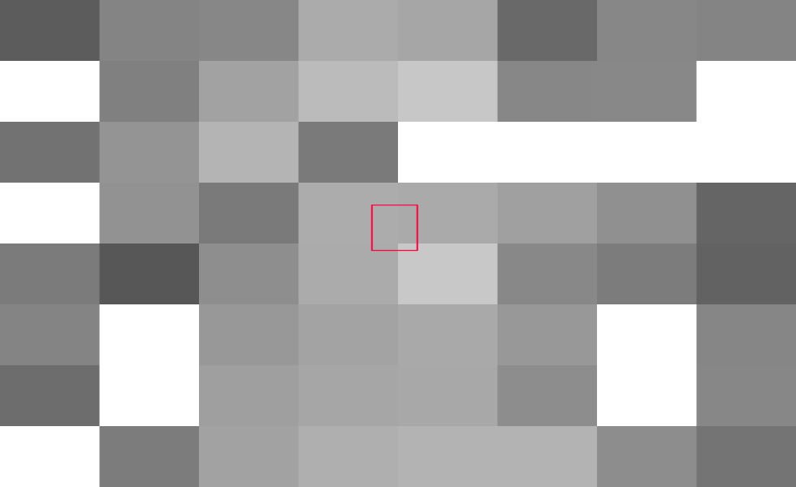

Содержание:
* [Техники отсечения невидимой геометрии](#Техники-отсечения-невидимой-геометрии)
	- [Depth Pre-Pass](#Depth-Pre-Pass-DPP)
	- [Depth reprojection](#Depth-reprojection)
	- [Deferred Texturing](#Deferred-Texturing)
	- [Visibility Buffer](#Visibility-Buffer-VisBuf)
	- [Hierarchy Z-Buffer](#Hierarchy-Z-Buffer-HZB-HiZ)
	- [Raster Occlusion](#Raster-Occlusion)
	- [Cone Culling](#Cone-Cluster-Culling)
	- [Per Triangle Culling](#Per-Triangle-Culling)
	- [Potentially Visible Set](#Potentially-Visible-Set-PVS)
	- [Аппаратная реализация](#Аппаратная-реализация)
		* [Early ZS, Hierarchy Z-Buffer](#Early-ZS-Hierarchy-Z-Buffer)
		* [Facing test, XY plane test, Z plane test, Sample test](#Facing-test-XY-plane-test-Z-plane-test-Sample-test)
		* [AMD Vega Deferred pixel processing](#AMD-Vega-Deferred-pixel-processing)
		* [Adreno Low Resolution Z-Pass](#Adreno-Low-Resolution-Z-Pass-LRZ)
		* [Mali Forward Pixel Kill](#Mali-Forward-Pixel-Kill-FPK)
		* [Mali Fragment Prepass](#Mali-Fragment-Prepass-FPP)
		* [Mali Deferred Vertex Shading](#Mali-Deferred-Vertex-Shading-DVS)
		* [PowerVR Hierarchical Scheduling Technology](#PowerVR-Hierarchical-Scheduling-Technology-HST)
* [Тесты производительности](#Тесты-производительности)
* [Итоги тестов](#Итоги-тестов)
* [Исходники](#Исходники)

**Какие возникают проблемы при увеличении количества геометриии**:
* Overdraw - когда для одного пикселя множество раз выполняется тяжелый фрагментный шейдер.
* Quad overdraw - фрагментные шейдеры выполняются квадратами 2x2, часть из них могут быть вспомогательными и не закрашивают пиксель. Для однопиксельных треугольников 3 из 4х потоков лишние, что сильно снижает производительность.
* Растет нагрузка на растеризатор. Сейчас карты на 4TFLOPS+ способны залить 4К экран однопиксельными треугольниками на 60+ кадров в секунду, но все упирается в фрагментный шейдер.
* Увеличивается нагрузка на вершинный шейдер. Для однопиксельных треугольников значение приближается к одному VS на пиксель, что уже много. Для отдельных треугольников, например листьев, уже 3 вызова VS на пиксель.
* Нагружается память и кэш. На TBDR чтение из глобальной памяти происходит несколько раз.

# Техники отсечения невидимой геометрии

## Depth Pre-Pass (DPP)

Первый проход заполняет буфер глубины, на второй происходит наложение материалов.

* Первый проход упирается в растеризацию (fill rate) и вершинный шейдер.
* Второй проход точно также нагружает растеризацию, тут ускорения нет.
* После растеризации большинство пикселей отбрасывается на ZS тесте.
* Наложение материала происходит один раз на пиксель, но из-за вспомогательных потоков по краям треугольника может вызываться несколько FS на пиксель, хотя записывает результат только один.
* В итоге вдвое увеличивается нагрузка на вершиный шейдер и растеризатор.

## Depth reprojection

Буфер глубины с предыдущего кадра проецируется на новый.

* Заменяет первый проход depth pre-pass, что меньше нагружает растеризатор.
* Применим только для статичной геометрии.
* При репроекции снижается точность значений, нужно компенсировать это смещением.
* Часть пикселей теряется и в этом месте резко увеличивается нагрузка на растеризатор.
	- Требуется дополнительное отсечение.
	- Другой вариант - взять наибольшее значение от соседних пикселей и добавить смещение.

Также используется для ускорения рисования теней: [Camera Depth Reprojection for ShadowCulling (слайд 26)](https://games-1312234642.cos.ap-guangzhou.myqcloud.com/course/GAMES104/GAMES104_Lecture22.pdf)

## Deferred Texturing

Первый проход пишет глубину, индекс материала, нормали и деривативы для текстурных координат.
Второй проход (или сабпасс) уже применяет материал.
Дальше эволюция привела к Visibility Buffer с еще более компактным G-буфером.

* Растеризация происходит один раз.
* Тяжелый фрагментный шейдер вызывается один раз.
* Требует хранить в G-буфере:
	- нормали (упакованые: 2х 16бит)
	- ID материала (16бит)
	- UV (2х 16бит)
	- UV деривативы или LOD (4х 16бит)
	- касательные (tangent, bitangent) для рельефного текстурирования
* Больше данных попадает в G-буфер, что не так страшно для TBDR архитектур пока умещается в 128 бит.
	- Чем больше атрибутов у вершины, тем больше G-буфер.

**Ссылки**
* [Nathan Reed: Deferred Texturing](https://www.reedbeta.com/blog/deferred-texturing/)
* [The Danger Zone: Bindless Texturing for Deferred Rendering and Decals](https://therealmjp.github.io/posts/bindless-texturing-for-deferred-rendering-and-decals/)

## Visibility Buffer (VisBuf)

Первый проход пишет глубину, индекс материала и индекс треугольника. 
Второй проход по индексу треугольника получает вершины, считает барицентрики. Далее интерполируются атрибуты, расчитываются деривативы и накладывается материал.

* Растеризация происходит один раз.
* Тяжелый фрагментный шейдер вызывается один раз.
* Легкий G-буфер (32 бита на глубину и 32 на материал + треугольник).
* Требует разбиение геометрии на кластеры, чтобы уплотнить индексы треугольников и материалов, иначе потребуется больше места.
* Расчет позиции вершин треугольника выполняется для каждого пикселя, это аналогично трем вызовам вершинного шейдера, что большой оверхэд для легкого фрагментного шейдера и слабых ГП.
* Для анимации используется промежуточный буфер с трансформированными вершинами, как в [Horizon Forbidden West](https://www.gdcvault.com/play/1027553/Adventures-with-Deferred-Texturing-in). Иначе тяжелый VS вызывается 3 раза для каждого пикселя.
* Чтобы полностью избавиться от quad overdraw нужна софтварная растеризация как в Nanite, Horizon.
* Для разных шейдеров требуется произвести классификацию пикселей - выбрать пиксели с одним материалом, сгруппировать их и вызвать шейдер.
* На TBDR архитектуре создание VisBuf в 2 раза медленее чем depth pre-pass из-за хранения PrimitiveID и материала.
* Трансформация трех вершин, интерполяция аттрибутов и расчет дериватив на каждый фрагмент очень затратно для слабых мобилок.
* Случайное чтение памяти для индексов, а затем вершин может быть медленным.
	- Для оптимизации есть вариант кэшировать уникальные вершины в пределах тайла. Но это не сработает на мобилках, где общая память находится в более медленной L2.
	- Для мобилок может быть оптимальнее читать вершины из текстуры или текстурного буфера (TBO), тогда они попадут в L1 кэш.

**Этап классификации**
* Material Depth Buffer ([Dawn Engine (страница 16)](https://gitea.yiem.net/QianMo/Real-Time-Rendering-4th-Bibliography-Collection/raw/branch/main/Chapter%201-24/%5B0363%5D%20%5BGPU%20Zen%202017%5D%20Deferred+-%20Next-Gen%20Culling%20and%20Rendering%20for%20the%20Dawn%20Engine.pdf) и [Nanite (слайды 100-105)](https://advances.realtimerendering.com/s2021/Karis_Nanite_SIGGRAPH_Advances_2021_final.pdf), есть [тест производительности](https://github.com/azhirnov/AsEn-ShaderEditor/tree/main/src/scripts/gbuffer-classify/MaterialDepthBuffer.as)). 
  Идея в том, что после прохождения буфера глубины пиксели (на самом деле квадраты 2х2) группируются чтобы максимально заполнить варп, но не могут собирать пиксели за пределами тайла (на TBR и TBDR), поэтому эффективность снижается.
  А размер тайла может зависить от количества регистров в фрагментном шейдере, то есть для тяжелого шейдера эффективность падает сильнее.
* Классификация в компьют шейдере как в [Horizon Forbidden West](https://www.gdcvault.com/play/1027553/Adventures-with-Deferred-Texturing-in). 
  Размер тайла задается вручную, что позволяет лучше сгруппировать пиксели, также в компьют шейдере нет quad overdraw.
* Классификация на воркграфах как в [Simple Classify demo](https://github.com/GPUOpen-LibrariesAndSDKs/WorkGraphsDirectX-Graphics-Samples/tree/main/Samples/Desktop/D3D12GPUWorkGraphs/SimpleClassify).

[Discover Metal enhancements for A14 Bionic: Visibility buffer with barycentric coordinates and primitiveID (6:24 - 14:40)](https://developer.apple.com/videos/play/tech-talks/10858/?time=384) 
Альтернативный вариант G-буфера куда дополнительно записываются барицентрические координаты треугольника.
* Это позволяет избавиться от расчета позиции всех вершин треугольника на пиксель.
* Деривативы в пределах одного треугольника расчитываются верно, а как их исправить на границе между треугольниками не объясняется.
* Для не-TBDR архитектур платим за вдвое большее чтение из G-буфера.

**Ссылки**
* [The Visibility Buffer: A Cache-Friendly Approach to Deferred Shading (2013)](https://jcgt.org/published/0002/02/04/paper.pdf)
* [Visibility Buffer (2016)](https://gdcvault.com/play/1023792/4K-Rendering-Breakthrough-The-Filtered)
* [Visibility Buffer Rendering with Material Graphs](http://filmicworlds.com/blog/visibility-buffer-rendering-with-material-graphs/)

## Hierarchy Z-Buffer (HZB, HiZ)

Иерархический буфер глубины. 
Берется буфер глубины с предыдущего кадра, генерируются мип-уровни. Перед рисованием проверяется виден ли объект - Z меньше чем в буфере глубины. 
Двухпроходный вариант - первой проверкой видимости создается 2 списка: видимые объекты и возможно видимые. Рисуется первый список, дальше строится HZB для текущего кадра и проверяется 2й список.

* Уменьшает нагрузку на вершинный шейдер и на растеризатор.
* Не решает проблему нескольких вызовов фрагментного шейдера на пиксель, поэтому требует комбинации с другими техниками.
* Требуется скопировать буфер глубины до рисования динамических объектов, иначе будут ложные срабатывания.
* Требуется нарезать геометрию на более мелкие части (мешлеты), чтобы улучшить точность, тогда берутся более высокие мип-уровни.
* Альтернативный вариант - рисовать упрощенную геометрию в низком разрешении, строить пирамиду и проверять видимость.
* Тестирование видимости выполняется в компьют шейдере, который параллелится с другими проходами, например тенями.
* Построение пирамиды глубины занимает намного больше времени, чем тест видимости. С увеличением разрешения нагрузка сильно увеличивается.
* На медленной памяти плохо справляется с 4К при построении пирамиды, для оптимизации можно не сохранять верхние мип-уровни, так как они редко используются.
* Так как используется max фильтр, то тонкая геометрия и меши с альфа-тестом часто не дают вклада в пирамиду глубины.
  Это снижает точность проверки видимости. Для тонкой геометрии лучше Raster Occlusion, а для альфа-теста - Visibility Buffer.

<b>Детали реализации</b>

Рассчет HZB должен происходить для текстуры степени 2, так как `3/2=1`, то при фильтрации надо читать 2 или 3 текселя, чтобы не потерять данные.
Также происходит смещение координат и тест видимости дает неверный результат.

> Например цепочка мипов 27, 13, 6, 2, 1 дает смещение координат:
> тексель 26 при уменьшении это 13, но он за пределами мипа и либо теряется, либо идет в 12.
> То же самое со вторым мипом: 12 при уменьшении это 6 что за пределами третьего мипа.

Здесь один мип-уровень сравнивается с более высоким. Красным обозначены места, где сместились координаты и максимальные значения не совпадают.

Есть 2 варианта решения проблемы:
* Сначала уменьшить до степени 2, затем расчитывать мип-уровни. [Пример](https://github.com/azhirnov/AsEn-ShaderEditor/tree/main/src/scripts/geom-cull/perf-GenHiZ-1.as).
	- Для степени 2 мип-уровни расчитываются быстрее.
	- Искажаются пропорции, квадраты становятся прямоугольниками и точность проверки видимости немного снижается.
* Для каждого мип уровня выбирать какие пиксели из верхнего уровня влияют на него. [Пример](https://github.com/azhirnov/AsEn-ShaderEditor/tree/main/src/scripts/geom-cull/perf-GenHiZ-2.as).

[Пример HiZ с визуализацией для отладки](https://github.com/azhirnov/AsEn-ShaderEditor/tree/main/src/scripts/geom-cull/test-HiZ-DebugVis.as) 

**Ссылки**
* [Hierarchical Z-Buffer Occlusion Culling (2010)](https://www.nickdarnell.com/hierarchical-z-buffer-occlusion-culling/)
* [GPU-based Scene Management for Rendering Large Crowds (2008)](https://drivers.amd.com/misc/siggraph_asia_08/GPUBasedSceneManagementLargeCrowds_SLIDES.pdf)
* [Hierarchical-Z map based occlusion culling](https://www.rastergrid.com/blog/2010/10/hierarchical-z-map-based-occlusion-culling/)
* [Hierarchical Depth Buffers (2020)](https://miketuritzin.com/post/hierarchical-depth-buffers/), [[перевод](https://habr.com/ru/articles/494376/)]

## Raster Occlusion

Реализовано в [gl_occlusion_culling](https://github.com/nvpro-samples/gl_occlusion_culling), где ссылаются на доклад [OpenGL Scene-Rendering Techniques (Siggraph 2014)](https://web.archive.org/web/20160314160241/http://on-demand.gputechconf.com/siggraph/2014/presentation/SG4117-OpenGL-Scene-Rendering-Techniques.pdf).
Заполняем буфер глубины через depth pre-pass или репроекцией.
Рисуем bbox с выключеной записью глубины, в фрагментном шейдере помечаем объект как видимый.

* Лучше точность чем у HiZ.
* Нагружает растеризатор, но не так сильно как полноценная геометрия.
* Нагружает память из-за случайной записи и растет с увеличением разрешения.
* Для оптимизации можено понизить разрешение как для HiZ.
* Для лучшей точности требуется нарезать геометрию на мелкие части (мешлеты).
* Хорошо подходит для тонкой геометрии: растительность, столбы, провода.

[Пример Raster Occlusion визуализацией для отладки](https://github.com/azhirnov/AsEn-ShaderEditor/tree/main/src/scripts/geom-cull/test-RasterCull-DebugVis.as)

## Cone/Cluster Culling

Для части геометрии (мешлета) рассчитывается конус видимости, проверка идет после frustum culling.

* Дает небольшое ускорение, за счет уменьшения вызовов рисования и вершинных шейдеров.
* Заменяет back face culling, который происходит перед растеризацией треугольника, на TBDR это происходит до записи в глобальную память, так что экономятся только вызовы VS.

Cluster Culling описан в [Optimizing the Graphics Pipeline with Compute](https://gdcvault.com/play/1023109/Optimizing-the-Graphics-Pipeline-With) (слайды 28-30).

## Per Triangle Culling

Описан в [Optimizing the Graphics Pipeline with Compute](https://gdcvault.com/play/1023109/Optimizing-the-Graphics-Pipeline-With) (слайды 41-63).

Кластер на 256 треугольников после Cluster Culling отправляется на Per Triangle Culling.
Один поток проверяет видимость одного треугольника, затем с помощью prefix sum видимые треугольники сдвигаются влево.

* Хорошо сочетается с предварительной трансформацией вершин, иначе делается двойная работа.
* В 3 раза увеличивается нагрузка на память: нужно прочитать вершины, трансформировать их и записать обратно, затем снова прочитать в VS.
  Но нагрузка снижается при отсечении невидимых и при сжатии вершн, как это сделано на TBDR архитектурах.
  Также полезно для visibility buffer, где трансформация вершин повторяется попиксельно.
* Невидимые треугольники и так отсекаются в железе, софтварный вариант отличается только использованием HiZ от предыдущего кадра.

## Potentially Visible Set (PVS)

Список статичных объектов, которые могут быть видимы из определенного положения.

* Требуется предрасчет.
* Для больших локаций занимает много места.
* Может не содержать данных для всех возможных положений камеры. Например, если обычное поведение - камера на земле и все предрасчитано, то в режиме полета уже не получится все расчитать.

**Umbra3D dPVS** 
Библиотека для расчета PVS в рантайме. Использует растеризацию упрощенной геометрии на ЦП.

Ссылки:
* [Improving Geometry Culling for 'Deus Ex: Mankind Divided'](https://www.gdcvault.com/play/1023678/)
* [Solving Visibility and Streaming in the The Witcher 3: Wild Hunt with Umbra 3](https://gdcvault.com/play/1020231/Solving-Visibility-and-Streaming-in)

TODO:
https://medium.com/@Umbra3D
https://medium.com/@Umbra3D/introduction-to-occlusion-culling-3d6cfb195c79

## Специфичные оптимизации

Для кубического мира можно сгруппировать все грани с одинаковой нормалью и отсекать их целыми группами, что аналогично PVS, но строится бесплатно.
Видео с описанием техники: [I Optimised My Game Engine Up To 12000 FPS](https://youtu.be/40JzyaOYJeY).

## Coverage Bitmasks

https://media.contentapi.ea.com/content/dam/ea/seed/presentations/seed-coverage-bitmasks-mittring.pdf

## Аппаратная реализация

Во всех случаях приходится платить за вызов отрисовки и вершинный шейдер, а дальше влияет только эффективность реализации в железе.

### Early ZS, Hierarchy Z-Buffer

* После растеризации идет тест глубины и только для квадратов (2х2 пикселя), которые прошли тест, будет запущен фрагментный шейдер.
* На этом этапе применяется встроенный иерархический буфер глубины (HiZ), который отсекает целые тайлы без необходимости тестировать каждый квадрат.
* Квадраты, которые прошли тест, далее группируются в пределах тайла, чтобы занять все свободные потоки варпа.
* Discard в шейдере и прозрачность не меняют глубину, поэтому также может отсекаться. Более эффективное отсечение на TBDR архитектуре.

**Ссылки**
* [To Early-Z, or Not To Early-Z](https://therealmjp.github.io/posts/to-earlyz-or-not-to-earlyz/)
* [A trip through the Graphics Pipeline 2011, part 7](https://fgiesen.wordpress.com/2011/07/08/a-trip-through-the-graphics-pipeline-2011-part-7/)

### Facing test, XY plane test, Z plane test, Sample test

* Происходит на этапе нарезки на тайлы. Здесь платим только за вызов части вершинного шейдера, который отвечает за позицию.
* При отсечении задних граней выкидывает треугольники, которые не прошли тест. Это около половины треугольников для моделей, но ноль для 2D.
* Проверяется что треугольник виден на экране (XY plane test, Z plane test), если нет - он отбрасывается.
* Треугольник должен занимать хотя бы один пиксель, иначе отбрасывается (Sample test).
* На TBDR это снижает нагрузку на память при выгрузке и загрузке нарезаной на тайлы геометрии.

**Ссылки**
* [Valhall Performance Counters Reference Guide](https://developer.arm.com/documentation/107775/0106)
* [A trip through the Graphics Pipeline 2011, part 5](https://fgiesen.wordpress.com/2011/07/05/a-trip-through-the-graphics-pipeline-2011-part-5/)

### AMD Vega Deferred pixel processing

Что-то похожее на Mali FPK. Упоминается только в Vega (GCN5) архитектуре.

* Фрагментный шейдер не сразу запускается для растеризованных треугольников.
* Сначала пиксели накапливаются в небольшом буфере, а потом рисуется только один.

Ссылки: [Vega Whitepaper](https://en.wikichip.org/w/images/a/a1/vega-whitepaper.pdf)

### Adreno Low Resolution Z-Pass (LRZ)

* На этапе нарезки на тайлы заполняется LRZ. Часть примитивов может быть отброшена уже на этом этапе.
* На этапе рисования сначала тестируется LRZ и только потом полноразмерный Z-буфер. Это ускоряет ZS тест и уменьшает чтение из L2, где хранится тайл.

**Ссылки**
* [Low Resolution Z Buffer support on Turnip (2021)](https://blogs.igalia.com/siglesias/2021/04/19/low-resolution-z-buffer-support-on-turnip/)
* [Low-resolution-Z on Adreno GPUs](https://blogs.igalia.com/dpiliaiev/adreno-lrz/)

### Mali Forward Pixel Kill (FPK)

* Фрагментный шейдер начинает выполняться, тем временем следующий треугольник растеризуется и перекрывает текущий, тогда фрагментный шейдер прерывется и начинается новый.
* Не работает для микротреугольников с простыми шейдерами, тогда шейдеры завершаются быстрее чем растеризуются новые треугольники.
* Когда фрагментный шейдер запускается, он может обратиться к памяти, а после прерывания этот запрос не отменяется и создает излишнюю нагрузку на память.

**Ссылки**
* [Forward Pixel Kill](https://community.arm.com/arm-community-blogs/b/graphics-gaming-and-vr-blog/posts/killing-pixels---a-new-optimization-for-shading-on-arm-mali-gpus), [[webarchive](https://web.archive.org/web/20240922023725/https://community.arm.com/arm-community-blogs/b/graphics-gaming-and-vr-blog/posts/killing-pixels---a-new-optimization-for-shading-on-arm-mali-gpus)]

### Mali Fragment Prepass (FPP)

* Появился в новой архитектуре 5th gen.
* Для каждого пикселя перебирает примитивы и выбирает единственный для отрисовки.
* Для невидимых пикселей фрагментный шейдер не вызывается совсем.

**Ссылки**
* [Hidden Surface Removal in Immortalis-G925: The Fragment Prepass](https://community.arm.com/arm-community-blogs/b/graphics-gaming-and-vr-blog/posts/immortalis-g925-the-fragment-prepass), [[webarchive](https://web.archive.org/web/20241202033355/https://community.arm.com/arm-community-blogs/b/graphics-gaming-and-vr-blog/posts/immortalis-g925-the-fragment-prepass)]

### Mali Deferred Vertex Shading (DVS)

* Появился в новой архитектуре 5th gen.
* На этапе нарезания на тайлы вызывается часть вершинного шейдера, отвечающая за позицию, если треугольник маленький, то он помечается для использования DVS и не выгружается в глобальную память.
* На этапе растеризации для DVS треугольников заново вызывается вершинный шейдер и затем фрагментный. Получается расчет позиции для DVS треугольников происходит дважды, что может быть затратно если есть вершинная анимация.

**Ссылки**
* [Hidden Surface Removal in Immortalis-G925: The Fragment Prepass](https://community.arm.com/arm-community-blogs/b/graphics-gaming-and-vr-blog/posts/immortalis-g925-the-fragment-prepass), [[webarchive](https://web.archive.org/web/20241202033355/https://community.arm.com/arm-community-blogs/b/graphics-gaming-and-vr-blog/posts/immortalis-g925-the-fragment-prepass)]

### PowerVR Hierarchical Scheduling Technology (HST)

* Обещают полное удаление невидиых фрагментов, как и при depth pre-pass.
* Как и LRZ происходит на этапе нарезки на тайлы.
* На этапе растеризации уже известен примитив, который закрывает все остальные в заданом пикселе.

**Ссылки**
* [Introduction to PowerVR for Developers (2021)](https://imagination-technologies-cloudfront-assets.s3.eu-west-1.amazonaws.com/website-files/documents/Introduction_to_PowerVR_for_Developers.pdf?dlm-dp-dl-force=1&dlm-dp-dl-nonce=5021498b5e)

# Тесты производительности

[В отдельном файле](tests/GeometryCullingTests-ru.md).

# Итоги тестов

### Растеризация

При одинаковой детализации геометрии растеризация в 1К и 2К занимает схожее время, а на некоторых ГП 1К разрешение даже медленее за счет большего количества треугольников на пиксель.
Получается, что техники понижения разрешения при пременном снижении производительности хуже работают без понижения детализации геометрии.

Переход от 2К к 4К дает всего вдвое большее время растеризации, хотя пикселей закрашивается в 4 раза больше.

### Сортировка по расстоянию от камеры

Производительность без нагрузки на FS важна для Depth pre-pass и Visibility buffer. При минимальных потерях можно избавиться от этапа точной сортировки.
Хороший результат показали AMD RDNA, NV RTX, Mali, Adreno, Intel gen9, PowerVR.
А AMD RX570 замедляется в 2-3 раза, Intel N150 медленее на 70%.

С тяжелым FS ситуация меняется и только Adreno 600 за счет LRZ не теряет производительность. Остальные замедляются в 2-4 раза.

### Оптимизация в железе

Mali FPK не работает на мелких треугольниках, поэтому в тестах он показывает нестабильный результат. Так на G57 в 4К неотсортированная геометрия дает всего 15% замедление, но аналогичный тест на G610 всегда в 2-2.5 раза медленее.

Очень хорошо показал себя Adreno LRZ, потери не более 10%.

У PowerVR схожее поведение с Mali FPK, только в 4К потери уменьшаются с 2х до 20%.

У Apple похоже используется аналог FPK.

Mali FPK, PowerVR HST и Apple хорошо оптимизирует вариант без теста глубины, в 2К Mali всего в 3-4 раза медленее, PowerVR в 5-6 раз, тогда как остальные замедляются в 10-20 раз.
В 4К разница увеличивается, так PowerVR в 3 раза медленее, Mali G57 теряет всего 30%, Mali G610 в 4К не дает ускорения видимо из-за большего количества ядер.
На других ГП в 4К нагрузка растет, как и ожидалось.

### Depth pre-pass vs Visibility buffer

VisBuf как и ожидалось уменьшает quad overdraw, что особенно важно при нагрузке на ALU.
При чтении текстур quad overdraw менее заметен, так как соседние тексели попадают в кэш.

DPP сильнее зависит от предварительного отсечения, так как растеризация происходит два раза.

У AMD RX570 построение VisBuf занимает почти в 2 раза большее времи чем DPP.
На остальных (NV RTX2080, AMD 780M, Intel UHD620, Intel N150) отличие всего в 20-30%.

В целом VisBuf намного эффективнее DPP за счет одного прохода с растеризацией при легком FS, либо за счет отсутствия quad overdraw при тяжелом FS.

Для TBDR архитектур VisBuf увеличивает нагрузку на память при сохранении вершин в глобальную память, так как дополнительно хранится PrimitiveID.
Трансформация трех вершин на пиксель очень затратна для слабых мобилок.

### HiZ vs Raster occlusion

Строить пирамиду глубины для HiZ становится дороже с увеличением разрешения, это особенно важно для мобилок и встроеных ГП, где используется медленная LPDDR или DDR.
Исключение только Apple M-серия в варианте Max/Ultra, где увеличенно количество каналов к памяти и пропускная способность не уступает GDDR.
Можно расчитать нагрузку на память без учета компрессии как 4/3 от количества пикселей. Для 4К получаем 44МБ или 2.6ГБ/с при 60фпс.
Компрессия и min sampler снижают нагрузку в 2-3 раза.

Raster occlusion также нагружает память, но больше за счет случайной записи и меньше зависит от пропускной способности.
Так многие ГП рассчитаны на запись по 16 байт и использование всего 4 байт снижает пропускную способность в 4 раза.
Можно расчитать нагрузку на память как количество пикселей плюс примерно 20% на наложение AABB. Для 4К получаем 40МБ/к или 2.4ГБ/с при 60фпс.
По тестам Raster occlusion в 2К/4К работает в 2-4 раза медленее.

Raster occlusion выигрывает, когда форма геометрии плохо описывается квадратами и сферами, также выигрывает когда тест глубины проходит немного пикселей, что не нагружает память в отличие от HiZ, который строится для всего размера экрана.

### Discard

Предполагалось, что discard в шейдере не включит режим LateZS с большой потерей производительности.
На большинстве ГП так и произошло, исключение Adreno 500.
На Adreno 600 и Intel gen9 производительность падает на 50-70% с легким FS, на Mali G57 на 40-70%, на PowerVR на 20-30%.
Нет изменений в производительности у Intel N150, AMD 780M, AMD RX570, NV RTX, Mali G610 (в 2К), Apple.

### Intel N150 vs UHD620 vs AMD RX570
Похожее по производительности железо, но разное поколение. 
Большое отличие показал Raster occlusion: 2.1мс на N150 и 12.5мс на UHD620, а причина в больших задержках у DDR3/LPDDR3.

AMD RX570 имеет схожую производительность растеризатора, но вдвое быстрее в ALU и в 4 раза лучше пропускная способность памяти.

### AMD vs NV

AMD 780M и NV RTX2080 отличаются в 2 раза по TFLOPS и в 6 раз по пропускной способности памяти. В тестах растеризация отличается в 2.5 раза.

Обе ГП одинаково реагируют на разную нагрузку и не требуют специфичных оптимизаций.

### Мобилки

Старые ГП типа Adreno 505 и Mali T830 долго строят пирамиду глубины (10-20мс). TODO (Проверить D16 и генерацию в FS ?)
Adreno 505 плохо справляется со случайным чтением из буфера, что плохо влияет на отсечение на стороне ГП.

Более свежие мобилки уже имеют встроенную оптимизацию, поэтому depth pre-pass и visibility buffer слабо влияют на производительность.
Больший эффект имеет HiZ, Raster occlusion и сортировка по расстоянию от камеры.

# Исходники

* [GeometryCulling-1](https://github.com/azhirnov/AsEn-ShaderEditor/tree/main/src/scripts/geom-cull/GeometryCulling-1.as) - тест производительности, нагрузка на VS и растеризатор.
  Тут [VS и FS шейдеры](https://github.com/azhirnov/AsEn-ShaderEditor/tree/main/src/pipeline_inc/GeometryCulling-1-shared.as).
* [GeometryCulling-2](https://github.com/azhirnov/AsEn-ShaderEditor/tree/main/src/scripts/geom-cull/GeometryCulling-2.as) - тест производительности, нагрузка на FS.
  Тут [VS и FS шейдеры](https://github.com/azhirnov/AsEn-ShaderEditor/tree/main/src/pipeline_inc/GeometryCulling-2-shared.as).
* [GenHiZ-1](https://github.com/azhirnov/AsEn-ShaderEditor/tree/main/src/scripts/geom-cull/perf-GenHiZ-1.as) - расчет мип-уровней HiZ, вариант со степенью 2.
* [GenHiZ-2](https://github.com/azhirnov/AsEn-ShaderEditor/tree/main/src/scripts/geom-cull/perf-GenHiZ-2.as) - расчет мип-уровней HiZ, вариант с сохранением пропорций.
* [DepthPyramidCulling](https://github.com/azhirnov/AsEn-ShaderEditor/tree/main/src/scripts/geom-cull/test-DepthPyramidCulling.as) - визуализация проверки видимости прямоугольника на пирамиде глубины, используется в HiZ.
* [ProjectSphere test](https://github.com/azhirnov/AsEn-ShaderEditor/tree/main/src/scripts/geom-cull/test-ProjectSphere.as) - отладочная визуализация быстрой проекции сферы, используется для HiZ.
  Тут [шейдер с проекцией](https://github.com/azhirnov/AsEn-ShaderEditor/tree/main/src/pipelines/tests/ProjectSphere.as).
* [HiZ-DebugVis](https://github.com/azhirnov/AsEn-ShaderEditor/tree/main/src/scripts/geom-cull/test-HiZ-DebugVis.as) - отладочная визуализаций HiZ теста.
* [RasterCull-DebugVis](https://github.com/azhirnov/AsEn-ShaderEditor/tree/main/src/scripts/geom-cull/test-RasterCull-DebugVis.as) - отладочная визуализаций Raster Occlusion теста.
* [MaterialDepthBuffer](https://github.com/azhirnov/AsEn-ShaderEditor/tree/main/src/scripts/gbuffer-classify/MaterialDepthBuffer.as) - тест производительности этапа классификации для visibility buffer.
* [VisibilityBuffer](https://github.com/azhirnov/AsEn-ShaderEditor/tree/main/src/scripts/samples-3d/VisibilityBuffer.as) - реализация visibility buffer. В редакторе шейдеров нет подготовки геометрии для VisBuf, поэтому используется RTX, где все подготовленно под bindless.
* [DeferredTexturing](https://github.com/azhirnov/AsEn-ShaderEditor/tree/main/src/scripts/samples-3d/DeferredTexturing.as) - реализация отложенного текстурирования.
