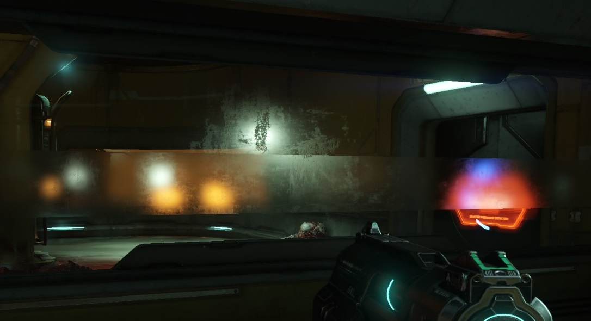
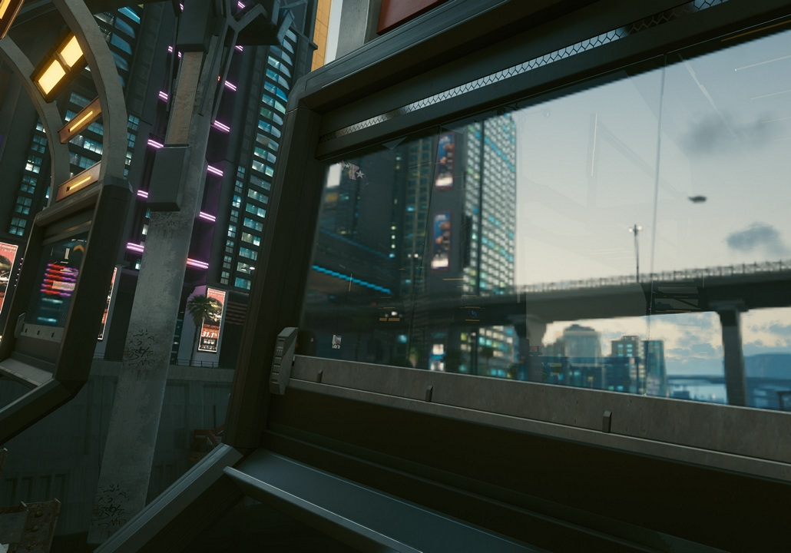
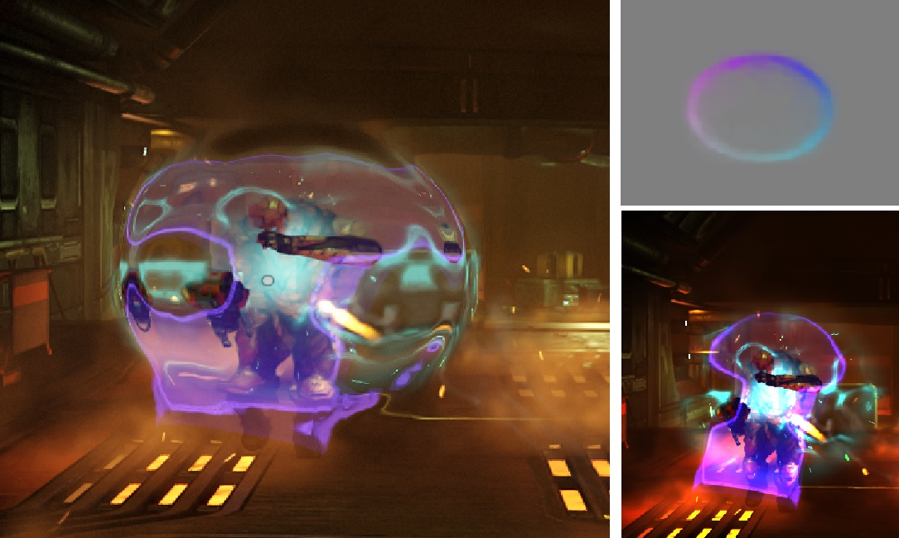
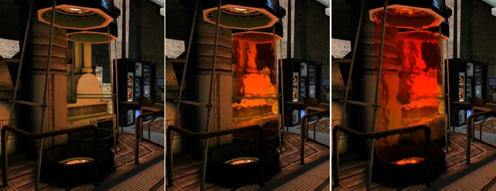

## Glass

In Doom 2016, glass is rendered in the forward pass. First, 5 mips are constructed for the scene behind the glass, then they are blurred in two passes, followed by rendering the glass with decals.

In the shader, a loop runs through all the glass decals, calculates the final smoothness of the glass, and then selects the appropriate mip:
* If smoothness > 0.975, mip 1/2 is used
* If smoothness > 0.75, mip 1/2 and 1/4 are blended
* If smoothness > 0.5, mip 1/4 and 1/8 are blended
* If smoothness > 0.25, mip 1/8 and 1/16 are blended
* Otherwise, mip 1/16 and 1/32 are blended

Details in front of the glass are also blurred, which is incorrect. In Doom Eternal, this was fixed by blacking out everything in front of the glass.

Cyberpunk does not apply blur, making the stepped effect visible.

The article [Refracting Pixels](https://www.froyok.fr/blog/2024-12-refraction/) explores approaches from different games, all using a similar method, with only the details varying.

## Screen-space Distortion

A separate texture, 1/4 the size, is rendered for each object with refraction, containing the distortion map. The final pass applies the distortions, adds tonemapping, and outputs to the screen.

The effect is described in [GPU Gems 2: Generic Refraction Simulation](https://developer.nvidia.com/gpugems/gpugems2/part-ii-shading-lighting-and-shadows/chapter-19-generic-refraction-simulation).

[Example DistortionMap](https://github.com/azhirnov/AsEn-ShaderEditor/tree/main/src/scripts/posteffects/DistortionMap.as).

The article [Refracting Pixels](https://www.froyok.fr/blog/2024-12-refraction/) also considers refraction. In Half-Life 2 and F.E.A.R., each transparent object with refraction copies the render target and then reads from it with refraction applied. Since all opaque objects are rendered before transparent ones, when applying refraction, objects in front of the transparent one are also copied and used for refraction, which is incorrect.

Later, games removed the copying, and the distortions are applied once in the final post-processing step.
