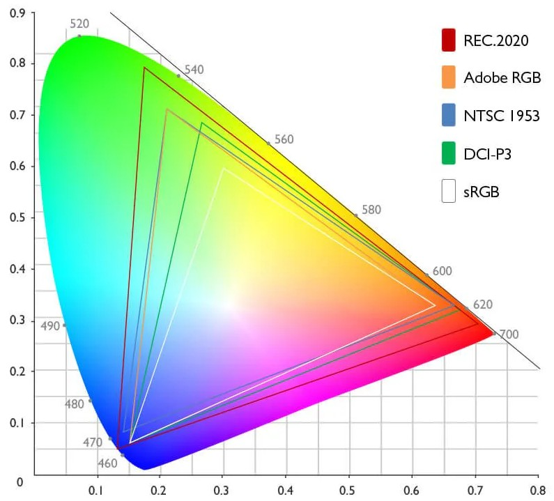
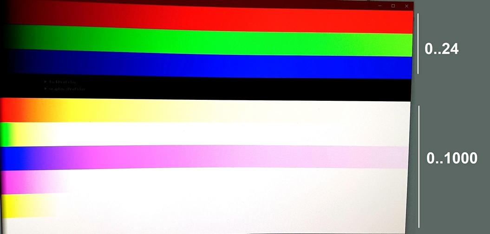
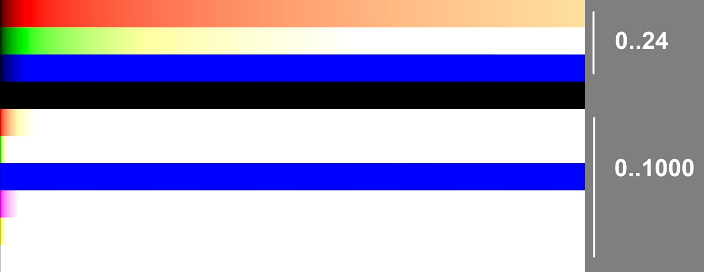

**HDR экраны**

Изначально экраны отображали цвета в диапазоне [0, 1], а для имитации более ярких цветов использовался тонемапинг в шейдере, где например чисто красный плавно переходил в белый, тем самым яркость (luminance) самого цвета увеличивалась.

С появлением HDR экранов появились и новые возможности.

## Цветовые пространства

На свопчей передается картинка с цветами в диапазоне [0, 1], а дальше монитор преобразует эти значения в длину волны [460, 700] нм.

В Vulkan добавили расширение `VK_EXT_swapchain_colorspace` для поддержки различных функций преобразования цвета.

Теперь цветовое пространство задается при создании свопчейна и требуется модифицировать шейдеры, чтобы финальный цвет содержал нужное преобразование.
Вместо устеревшей гамма-коррекции вида `pow(color, 2.2)` нужно делать преобразование под выбранное цветовое пространство,
пример из DX: [ColorSpaceUtility.hlsli](https://github.com/Microsoft/DirectX-Graphics-Samples/blob/master/MiniEngine/Core/Shaders/ColorSpaceUtility.hlsli)
и порт на GLSL: [ColorSpace](https://github.com/azhirnov/as-en/blob/dev/AE/engine/shared_data/shaders/ColorSpace.glsl).

## Extended sRGB

В Vulkan это константы `VK_COLOR_SPACE_EXTENDED_SRGB_LINEAR_EXT` и `VK_COLOR_SPACE_EXTENDED_SRGB_NONLINEAR_EXT`.

Диапазон [0, 1] работает как обычный sRGB, но имею максимальную яркость в 80 нит.
Значение от 1 до максимальной яркости монитора задает яркость каждого пикселя (OLED, micro-LED) или области (local dimming).

Для `Extended_sRGB_linear` максимальная яркость считается как `яркость_подсветки / 80 нит`. 
Для `Extended_sRGB_nonlinear` зависимость экспоненциальная и продолжает кривую sRGB, диапазон 1.0 - 7.83 соответствует яркости от 80 до 10 000 нит..

Значения за пределами максимальной яркости, поддерживаемой монитором, обрабатываются встроенным тонемапером, который смещает цвета в сторону белого цвета, чтобы визаульно еще увеличить яркость.
У каждой модели монитора может быть свой тонемапер, не совместимый с другими, поэтому полагаться на него не стоит.
Чаще всего используют ACES или что-то похожее.

### Монитор

Монитор Samsung с VA + QLED матрицей с максимальной яркостью 1000 нит (cd/m^2^), средней - 600 нит. Режим `RGBA16F_Extended_sRGB_linear`.

Встроенный тонемапинг включается после значения 12.5 *(1000 нит / 80)* и визуально схож с ACES.

### Смартфон

Смартфон ASUS с AMOLED экраном с максимальной яркостью 800 нит, средней - 400 нит. Режим `RGBA16F_Extended_sRGB_linear`.

* На смартфоне используется более простой тонемапинг, который некорректно работает с чисто синим цветом.
* Переход в белый цвет начинается с 1.0.
* Яркость экрана не зависит от значения цвета, а задается глобально.

### Windows

HDR режим требует Windows версии 10 и выше.

В 2024 году NV обвили драйвера и использование свопчейна с `Extended_sRGB_linear` не включает HDR режим на мониторе, теперь это делается либо заранее в настройках Windows, либо программно через DXGI или NvAPI.

### Android

На Android цветовое пространство `Extended_sRGB_linear` работает не по стандарту - значения более 1.0 не увеличивают яркость, а сразу срабатывает встроенный тонемапинг и смещает цвета в сторону белого.
На Android 14 добавили HDR режим, но для Vulkan ничего не изменилось.

`Display.HdrCapabilities` содержит некорректную информацию, а значит не получится расчитать цвет, после которого включается тонемапинг, если бы `Extended_sRGB_linear` работал по стандарту.

На некоторых смартфонах пространство Extended sRGB искажает цвета - красный на всем диапазоне смещается в красно-оранжевый, этого не происходит в sRGB пространстве, а так как цвета более 1.0 не используются, то нет смысла в Extended sRGB.

Смартфоны с IPS дисплеем часто не поддерживают настоящий HDR, хотя Android заявляет о поддержке HDR форматов, но значения цвета более 1.0 ни на что не влияют.

## 10bit

Большинство смартфонов используют 10-битную матрицу. На ноутбуках и мониторах ситуация хуже и для экономии используются 8-битные матрицы.

Я сделал простой тест для определения битности выводимого изображения: [MonitorBitDepth](https://github.com/azhirnov/AsEn-ShaderEditor/blob/main/src/scripts/tests/MonitorBitDepth.as). 
Важно, чтобы свопчейн поддерживал `RGBA16F` формат иначе точность теряется еще до вывода на экран.
Тест выводит градиент в небольшом диапазоне цветов, что приводит к видимым полосам на экране, измерив ширину полосы узнаем с каким шагом меняется цвет и соответственно сколько бит у матрицы.

Чтобы замаскировать полосы на 8-битной матрице есть простой способ - дизеринг, когда поверх прибавляется небольшой шум, который скрывает шум, но невидим для глаза.
Пример [Dithering](https://github.com/azhirnov/AsEn-ShaderEditor/blob/main/src/scripts/samples-2d/Dithering.as).

## Эмуляция HDR

OLED экраны с 10-битной точностью позволяют имитировать HDR.
Выделить диапазон, например 0.5-1.0, для особо ярких эффектов, таким образом остается еще 9-бит точности на все остальное.
Яркость экрана придется выставить ближе к максимальной, это может увеличить расход батареи, но позволит управлять яркостью цветом как и в стандарте Extended sRGB.

