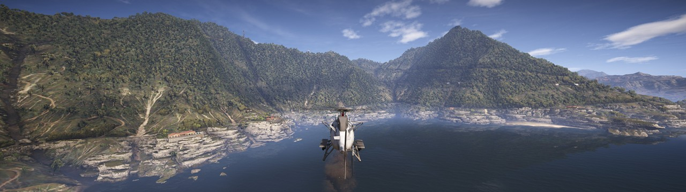
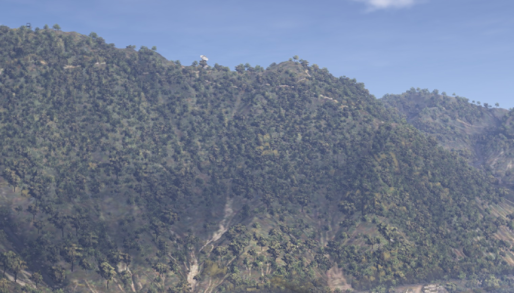
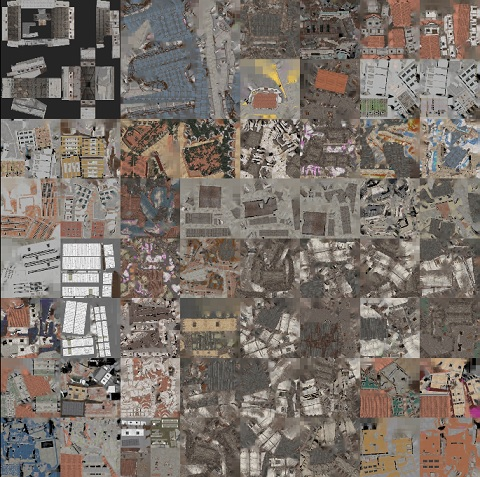
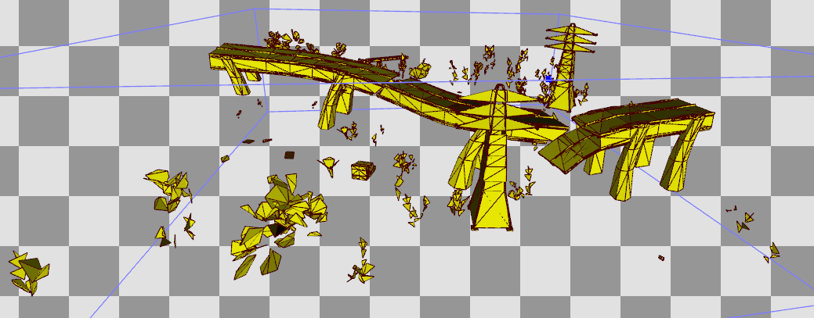

Рисовать детализированную геометрию вдали очень дорого:
* Мелкие треугольники дают большой quad overdraw.
* Большое количество вершин нагружает VS.
* Накладывающиеся треугольники добавляют pixel overdraw.
* Разнообразные текстуры нагружают кэш.
* На старом железе без bindless это еще затратнее из-за частых привязок новых текстур.

При этом геометрия вдали видна только с одного ракурса, движение камеры не дают видмых изменений.
Поэтому для оптимизации запекают модель в 2D импостер. Обычно он содержит тоже самое что и GBuffer: цвет, нормали и PBR параметры.

## GR: Wildlands

На скриншоте рисуется всего 2 типа деревьев представленные обычными 2D текстурами с картами нормалей.
Рандомизация сделана за счет вращения карты нормалей. А атмосферная дымка, размытие, тени от облаков дополнительно скрывают повторяющиеся импостеры.

Такие импостеры деревьев хорошо скрывают низкую детализацию текстур на горах вдали.
На современном железе нет смысла так занижать детализацию, тем более в 4К это слишком заметно, сейчас такая оптимизация имеет смысл только для встроек и мобилок с медленной DDR/LPDDR.

Здания используют атлас 2Кх2К и сделаны как 3D модели, который чуть сложнее куба.
Это не совсем импостер, а скорее последний LOD.

## Fallout 4

В F4 используются старые технологии - каждый квадрат карты объединен в один вызов рисования и использует атлас текстур.

