Эффекты на линзе, в том числе и в глазу.

## Bloom

Рассеивания света на линзе. Чем больше яркость, тем больше площадь/радиус пятна.

Эффект состоит из нескольких частей:
* Из HDR цвета извлекаются самые яркие пиксели.
	- В Doom 2016 берут максимальную яркость покомпонентно, в результате получается немного искаженный цвет.
* Генерация мипов с размытием.
* Апскейл, нижние мипы прибавляются к верхним.
* Перед тонемапингом верхний размытый мип прибавляется к цвету сцены.

Примеры:
* [Gaussian blur, без оптимизаций](https://github.com/azhirnov/AsEn-ShaderEditor/blob/main/src/scripts/perf/Blur-1.as)
* [Gaussian blur в 2 прохода](https://github.com/azhirnov/AsEn-ShaderEditor/blob/main/src/scripts/perf/Blur-2.as)
* [Dual filter blur, быстрее на мобилках](https://github.com/azhirnov/AsEn-ShaderEditor/blob/main/src/scripts/perf/Blur-3.as)
* [Kawase blur, похож на Dual filter](https://github.com/azhirnov/AsEn-ShaderEditor/blob/main/src/scripts/perf/Blur-4.as)
* [Bloom](https://github.com/azhirnov/AsEn-ShaderEditor/blob/main/src/scripts/samples-2d/Bloom.as)

## Glow

В Doom 2016 эффект состоит из двух частей:
* Обычный bloom с даунскейлом
* Отдельный RT куда рисуются flares несколькими спрайтами.

Для каждого спрайта нужен тест видимости источника света. Это можно сделать разными способами:
* Прочитать буфера глубины в определенной области, но такие проверки затратны.
* Прочитать один раз мип из HiZ, но тут хуже точность.
* Комбинированный подход: полноразмерный буфер глубины для точного теста и HiZ чтобы узнать насколько он загорожен и снизить яркость.
* [Raster occlusion](https://github.com/azhirnov/AsEn-ShaderEditor/blob/main/papers/graphics/GeometryCulling-ru.md#Raster-Occlusion) когда рисуется светящаяся геометрия и каждый пиксель увеличивает счетчик.

Затем две части комбинируются, bloom дополнительно комбинируется с lensDirt.

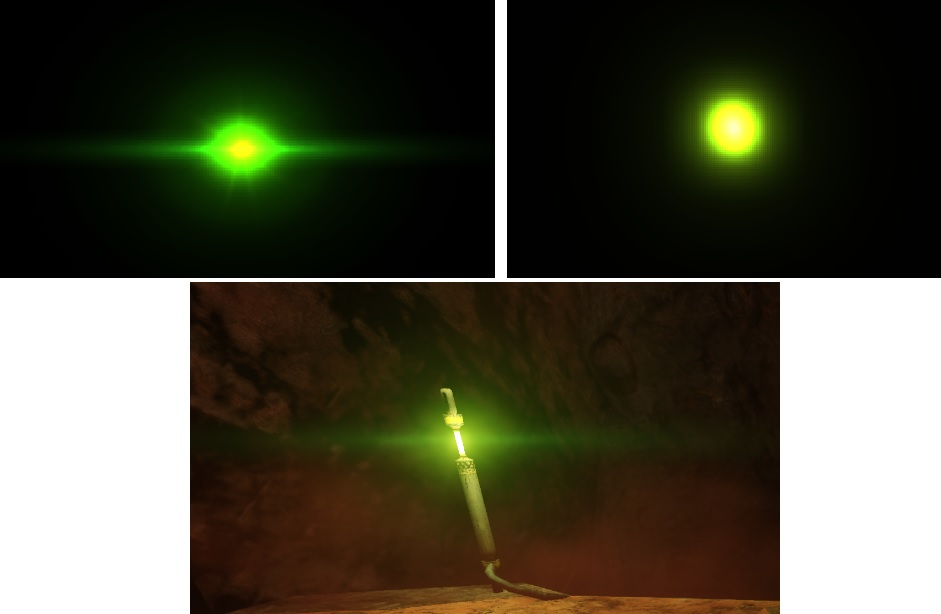

В Horizon Zero Dawn аналогично сделан свет от роботов.
Блики на линзе рисуются геометрией в отдельный RT.

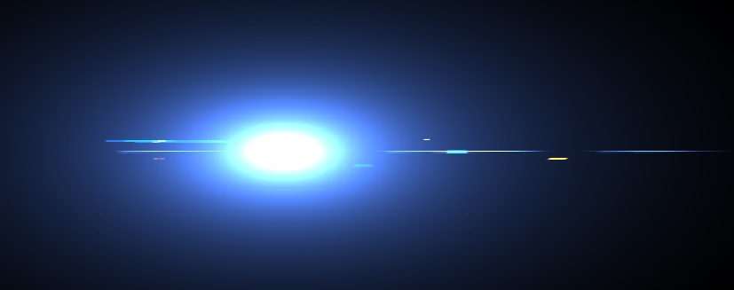

В новой игре эффект улучшили [glare](#Glare) эффектом с лучами.

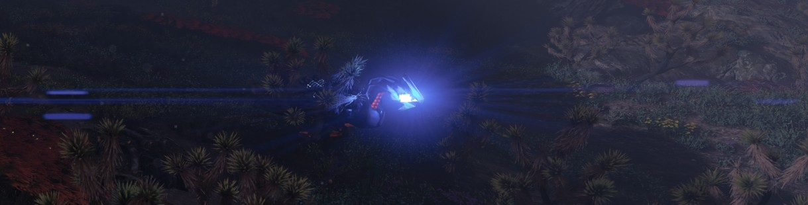

Такое разделение нужно так как bloom дает однообразную размытую картинку, а заранее подготовленные четкие спрайты придают более красивый вид и имитируют рассеивание света на линзе.

Что бывает при использовании только блура можно увидеть в Unreal Tournament 3 и других играх того времени, когда картинка была слишком мыльной.

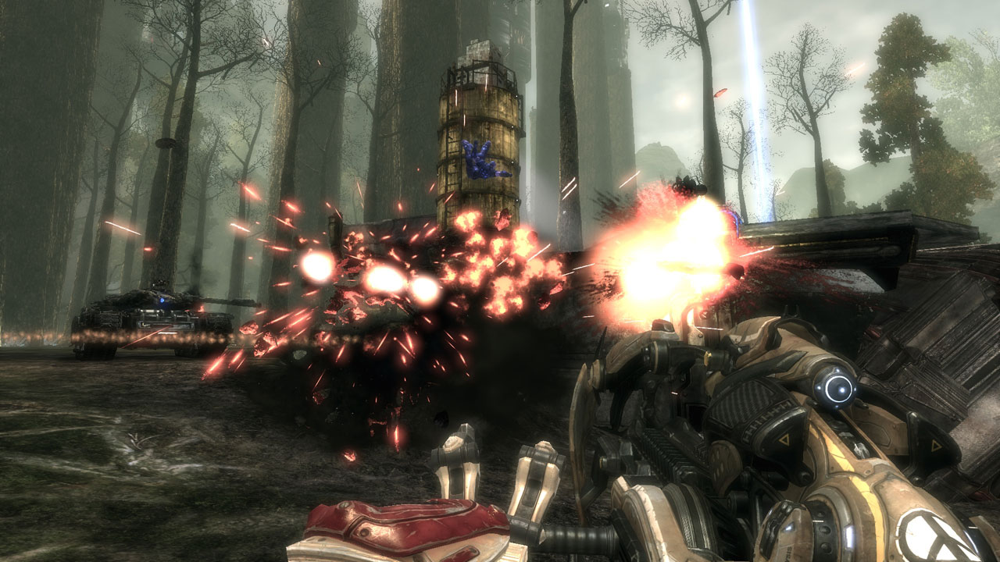

Другой вариант эффекта разбирается в [Doom 3 – Volumetric Glow](https://simonschreibt.de/gat/doom-3-volumetric-glow/).
Более дешевый эффект строится геометрией и накладывается текстура с градиентом, либо рассчитывается затухание в FS, но тут стоит учитывать, что интерполяция может давать артефакты на стыках геометрии, поэтому нужно считать расстояние после интерполяции.

Если доработать построение геометрии, то получится имитировать и объемный свет.

[Пример](https://github.com/azhirnov/AsEn-ShaderEditor/blob/main/src/scripts/vfx/FakeGlow.as)

## Блики на линзах

Круглые или многоугольные светящиеся блики. Получаются когда в результате преломления засвечивается вся линза. Если засвечивание произошло до апертурной диафрагмы, то блик принимает ее форму и становится в виде многоугольника.

Также происходят абберации из-за дисперсии - свет раскладывается по длинам волн и получаются радужные кольца или дублирование света в разных местах и с разной длиной волны.

Симуляция эффекта подробна разобрана в статье [Custom Lens-Flare Post-Process in Unreal Engine](https://www.froyok.fr/blog/2021-09-ue4-custom-lens-flare/).

Физически корректная симуляция разобрана в блог-посте [Physically Based Lens Flare](https://bitsquid.blogspot.com/2017/07/physically-based-lens-flare.html).

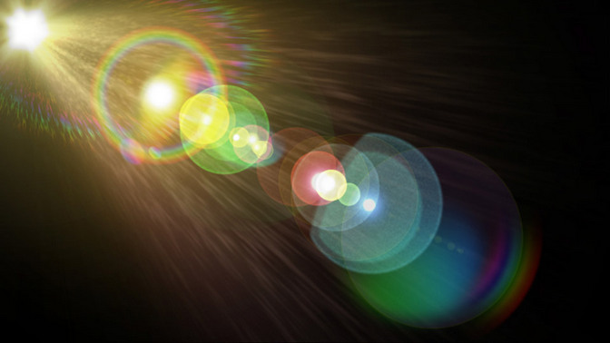 
*Пример из интернета*

В статье есть примеры, когда каждая яркая вывеска создает блики на линзах, в таком виде эффект излишний и создает дискомфорт.
Из-за этого в играх я часто отключаю такие эффекты еще при первом заходе в настройки.

Интересно придумали в GTA - блики от солнца видны только для камеры от третьего лица, имитируя поведение реальной камеры, а от первого лица имитируется поведение глаза.

Самый современный подход - использовать MLP он же нейрошейдер для апроксимации бликов: [Precomputed Lens Transport Maps](https://arxiv.org/pdf/2605.04017).

## Glare

Эффект лучей вокруг яркого света.
В реальности эффект сильно зависит от линз камеры.

Так в телескопах это часто 4-6 лучей.

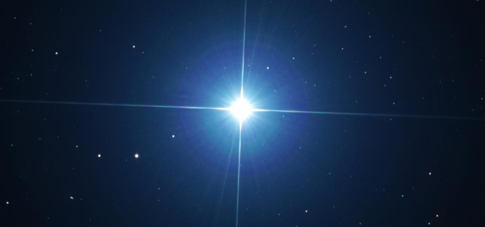

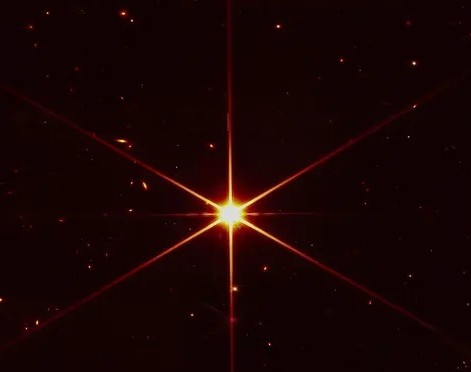

В старых фильмах просто размытие как от Bloom.

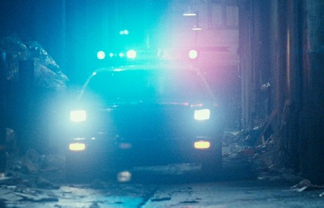

Потом появились лучи.

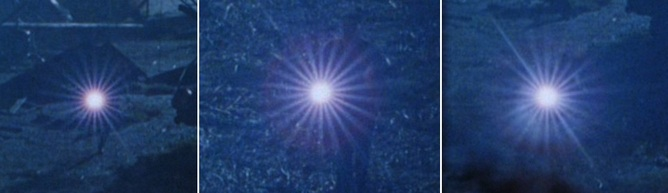

А сейчас экспериментируют с сильным горизонтальным размытием, скорее всего в пост обработке. 
Также бывает на дешевых камерах, например на моем старом регистраторе, и лучи не горизонтальные, а радиальные, чаще под 45°.

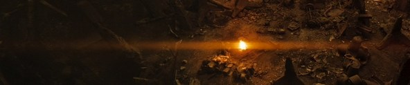

### В играх

В играх используют комбинированный подход - Bloom + спрайты с лучами.

Эффект заменяет тонемапинг и адаптацию глаза на больших яркостях.
То есть при конвертации из HDR в SDR слишком яркие точки игнорируются, либо еще на этапе рисования занижается яркость, что не совсем физически корректно.

**Unreal Tournament 2004**

Одна из первых игр, где появился такой эффект.

Сделан через проверку видимости точки на светильнике на стороне ЦП. Сам эффект рисуется постпроцессом, поэтому не перекрывается сценой, что правильно.

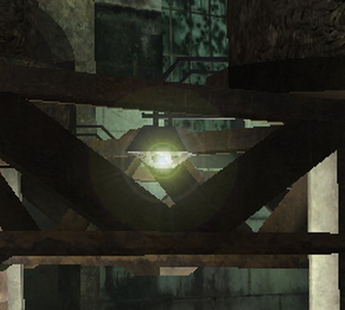

Вблизи видно, что спрайт рисуется со смещением по нормали от светильника, вместо того чтобы смещать к камере.

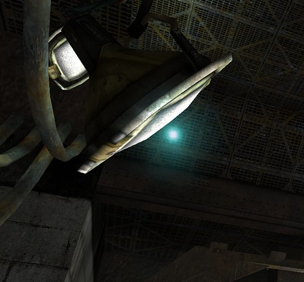

Сделано плавное затухание, из-за чего спрайты остаются на экране еще несколько секунд, что выглядит некорректно.
Это может быть имитации засветки в глазу, но свет не достаточно яркий для этого.

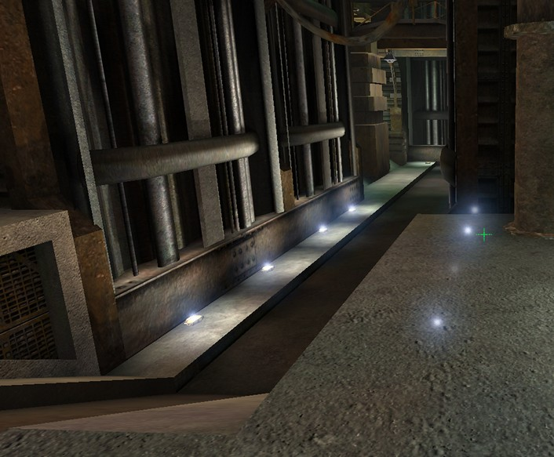

**GTA V**

Разобрано в блог-посте [GTA V – Underestimated Glow](https://simonschreibt.de/gat/gta-v-underestimated-glow/).

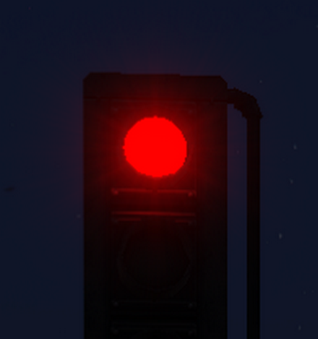

**Killzone Shadow Fall**

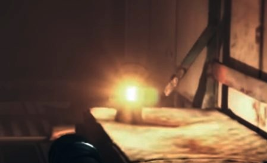

В Killzone используется тест глубины в небольшой области вокруг светильника. Если только часть пикселей прошла тест, то радиус уменьшается.
По какой-то причине вдали тест глубины работает с ошибками и часто видно мигание - изменение радиуса спрайта.

Для исправления мигания достаточно вычесть X% и Y константу, значения подбираются под точность буфера глубины, например 5% и 0.25.

**Horizon Forbidden West**

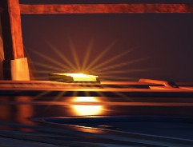 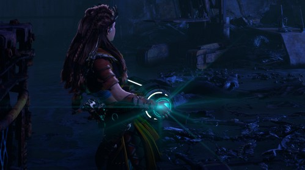

**Ghost Recon: Wildlands**

*Яркость увеличина, чтобы лучше рассмотреть эффект, в игре он намного тусклее.*

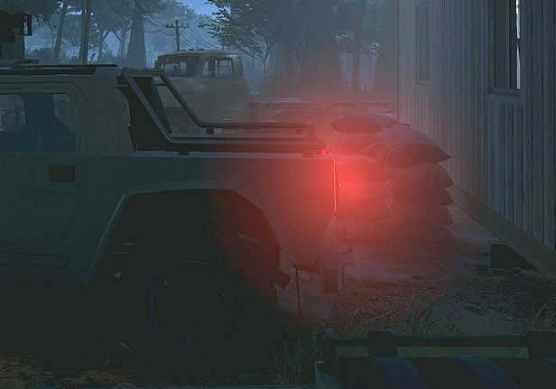

## Dirt Lens

Имитирует рассеивание света на стекле автомобиля или шлема/очков.

Достаточно умножить текстуру с бликами на один из мипов после Bloom.

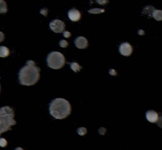

[Пример](https://github.com/azhirnov/AsEn-ShaderEditor/blob/main/src/scripts/vfx/DirtLens.as).

## Depth of Field (DOF)
