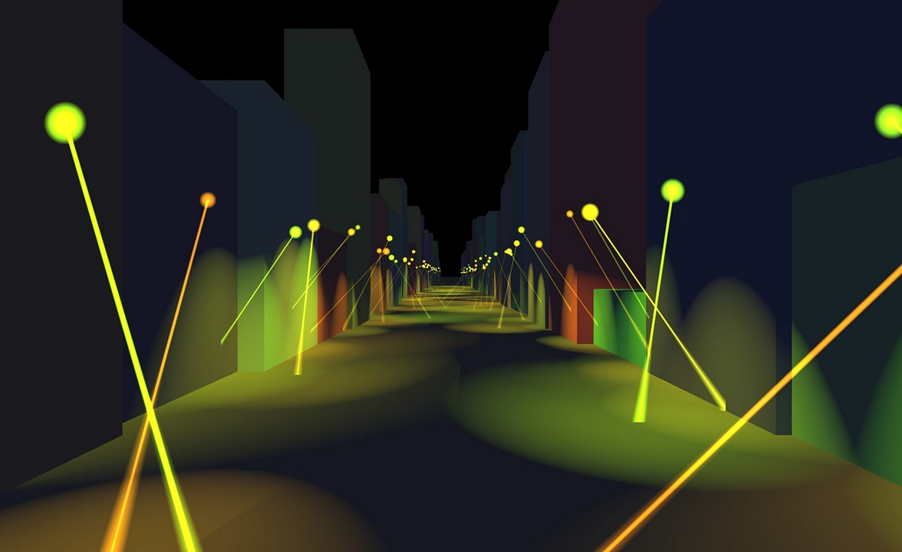
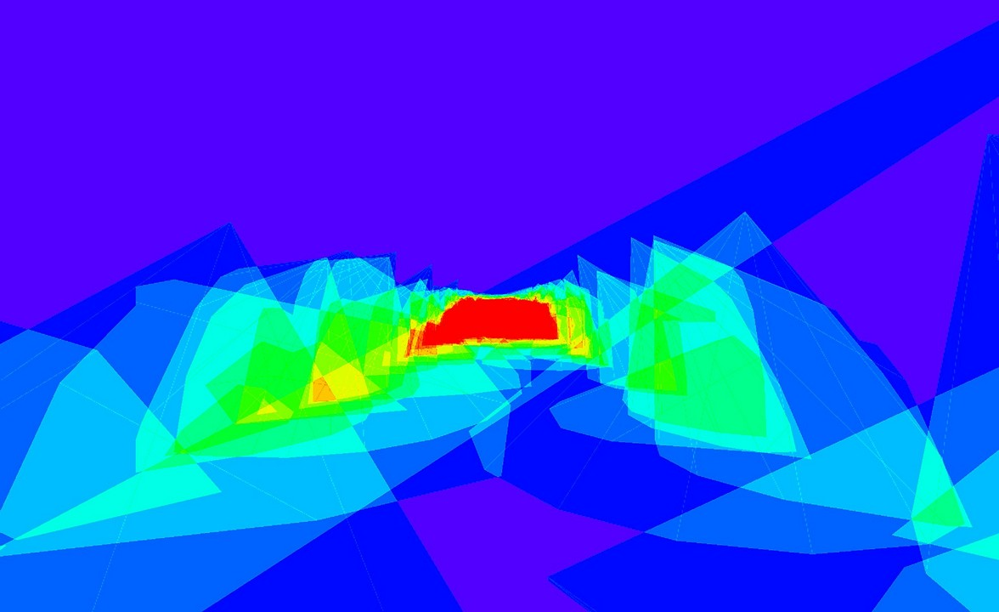
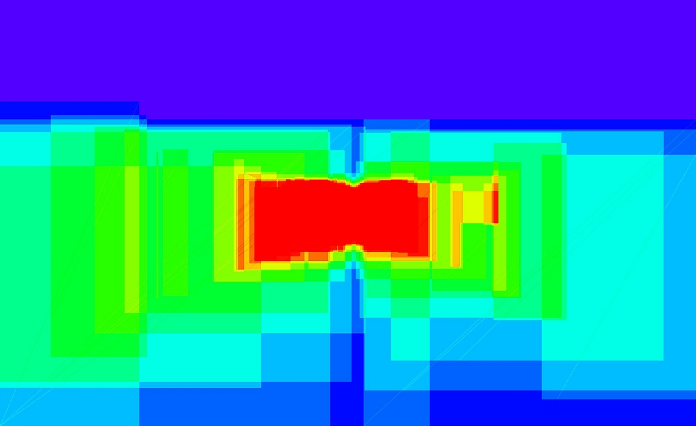
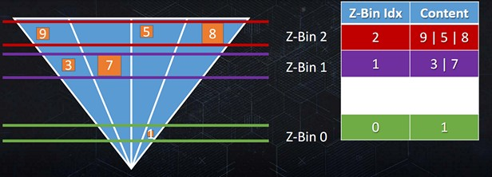
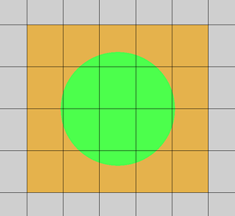
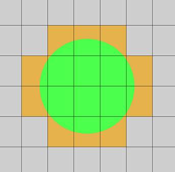
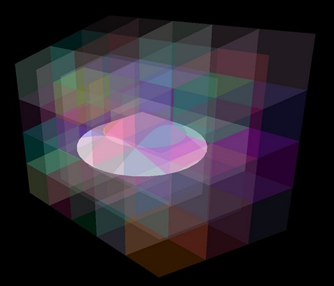
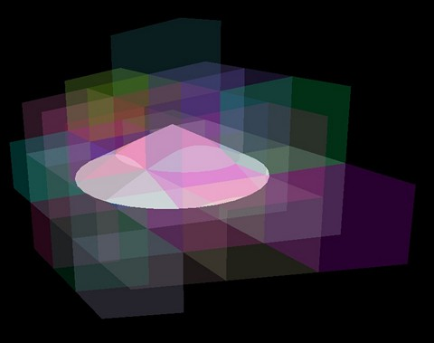
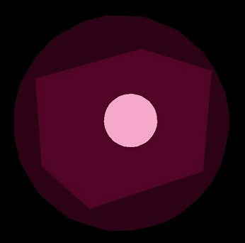

## Способы отсечения света

### Light Volume

Рисуется геометрия в форме освещенной области, обычно это сфера и конус. Результат суммируется за счет блендинга.
Тест глубины позволяет отсечь невидимые области.

У этого подхода много недостатков:
* Обрабатывается вся область за отрисованым объемом, даже если расстояние слишком большое. Тест глубины в FS не решает проблему так как нужно чтобы завершились все потоки варпа.
* Quad overdraw - на границах треугольников создаются дополнительные потоки.
* В один варп могут попасть треугольники соседних светильников, поэтому все данные для расчета освещения хранятся в векторных регистрах и при превышении лимита на регистры производительность уменьшается.
* Смешивание в fp16 формате не очень быстрое на некоторых ГП, а использовать R11G11B10F формат не получится из-за низкой точности при накоплении.
* Каждый источник света будет читать GBuffer, но на тайловом рендере все останется в кэше.
* Не работает для полупрозрачных объектов и частиц.

Из не самых старых игр такой подход использовался в Fallout 4.

На современных дискретных картах это все равно работает очень быстро, даже несмотря на множественное наложение.
Иногда для оптимизации делают предварительное отсечение по HiZ.

Хороший пример недостатков классического подхода - улица с фонарями. Освещенная область около 30% для каждого источника, остальное это простаивающие потоки.

А по центру наложение максимальное, в данном примере доходит до 45 фрагментов на пиксель.

[Пример](https://github.com/azhirnov/AsEn-ShaderEditor/blob/main/src/scripts/light-cull/ClassicDeferred.as).

### Billboard

Освещенная область проецируется на экран и рисуется прямоугольник. 
Недостатки такие же как у рисования геометрии, только меньше нагружает VS и растеризатор, но занимает больше пикселей из-за чего работает медленее, особенно в 4К. 
Главное преимущество - меньше quad overdraw, что хорошо для рисования небольших областей, например дальних светильников (distant lights) и декоративного освещения.
Также не требует предвариательного отсечения, так как используется всего 4 вызова VS.

Для оптимизации quad overdraw есть вариант использовать point sprites или расширение `VK_NV_fill_rectangle`.

Здесь доходит до 72 фрагментов на пиксель.

### Tiled

Экран разбивается на тайлы.
Для каждого тайла формируется список источников света, чья освещаемая область попадает в тайл.

Для лучшего отсечения используют depth pre-pass и рассчитывают min/max глубины в тайле, тогда если свет не освещает никакую геометрию, то и не добавляется в список.
Но возникает проблема с depth discontinuities - когда в тайл попадает геометрия вблизи камеры и вдали, в результате отсечение по глубине становится менее эффективным.
Также оптимизация с DPP не позволяет подсвечивать полупрозрачные объекты сцены.

Из плюсов GBuffer читается один раз на пиксель тайла, в отличие от кластерного подхода.
В целом чисто тайловый подход устарел и не дает существенного ускорения.

Ссылки:
* [Optimizing tile-based light culling](https://turanszkij.wpcomstaging.com/2018/01/optimizing-tile-based-light-culling/) - способ српавиться с depth discontinuities.

### Clustered

Экран также разбивается на тайлы, а затем нарезается по Z.
Обычно используют 16-64 Z слоев, так кластеры получаются более квадратные.

В [Avalanche engine](https://www.humus.name/Articles/PracticalClusteredShading.pdf) использовали 16 слоев и вручную настроеные Z координаты.
Так максимальная дальность кластеров 500м, дальше используются только distant lights, light bulbs.
Ближний кластер растянут по Z на 0.1 - 0.5м, это ухудшает точность отсечения, зато значительно уменьшает количество слоев.

Размеры кластера в играх:
* [Detroit: Become Human](https://www.gdcvault.com/play/1025420/Cluster-Forward-Rendering-and-Anti) - 2 уровня иерархии: 36х20х64 и 18х10х32.
* [Avalanche engine](https://www.humus.name/Articles/PracticalClusteredShading.pdf) - 64x64 pix, 16 slices
* [CoD Infinite Warfare](https://advances.realtimerendering.com/s2017/2017_Sig_Improved_Culling_final.pdf) - 60х32х18 (?)
* [Doom2016 (idTech6)](https://advances.realtimerendering.com/s2016/Siggraph2016_idTech6.pdf) - 16x8x24

Плюсы:
* Не требует depth pre-pass, что хрошо для мобилок.
* Подходит для освещения полупрозрачных объектов и частиц.
* В forward+ режиме не требует чтения из GBuffer.

Минусы:
* Чем больше количество кластеров, тем лучше отсечение, но дороже рассчеты и расходуется больше памяти.
* Есть худшие случаи, когда малая часть объема попадает в кластер или из-за неточности проверки пересечения. Но такие случаи хорошо сглаживаются за счет однородности выполнения (uniform control flow), что позволяет пропустить светильник для всего варпа, если все потоки не прошли тест на расстояние.
* В deferred режиме, где нужно пройтись по многим кластерам получается дублирование светильников из соседних кластеров и пересвеченная картинка в этих местах.
* Как и тайловый плохо подходит для мелких освещенных объемов, например декоративного освещения.

### Tiled + ZBin

Способ описан в презентации [Improved Culling for Tiled and Clustered Rendering in Call of Duty Infinite Warfare](https://advances.realtimerendering.com/s2017/2017_Sig_Improved_Culling_final.pdf) на слайдах 20-40.
Экран разбивается на тайлы 240х135, светильники сортируются по Z и разбиваются на группы (zbin).
Для каждой группы используется битовая маска с индексам активных источников света в тайле.

При освещении для каждого пикселя по его глубине выбирается zbin и идет обход всех светильников из битовой маски.

Преимущества такие же как у кластеров, но разрешение намного больше, а памяти расходуется меньше.
Битовые маски решают проблему дублирования светильников в кластерах (ZBin'ах).

Главный недостаток - фиксированный размер битовой маски, если все светильники не влезают, то остаток рисуется другим способом, чаще всего геометрией.
Также дальние светильники рисуются другим способом и более простым шейдером.

## Deferred vs Forward+

### Forward+

Оригинальный forward подход делает перебор всех светильников при рисовании геометрии. В forward+ предполагается, что светильники расположены в некоторой структуре.
С forward+ совместимы только тайловые и кластерные методы разбиение.

В презентации по [CoD Infinite Warfare](https://advances.realtimerendering.com/s2017/2017_Sig_Improved_Culling_final.pdf)
на слайде 7 разбирают случай, когда треугольник попадает на несколько тайлов со списком светильников.

На современных NV, ARM Mali, Apple используются тайлы 16х16 - 32х32 и такой проблемы не возникает.

Судя по тестам на [AMD](https://github.com/azhirnov/AsEn-ShaderEditor/blob/main/papers/bench-gpu/AMD_780M.md#Wavefront-scheduler) и [Intel](https://github.com/azhirnov/AsEn-ShaderEditor/blob/main/papers/bench-gpu/Intel_Arc140T.md#Tile-size) в один варп попадают пиксели на расстоянии до 142 (AMD) и 48 (Intel) друг от друга, что в тайловом/кластерном подходе приведет к вырождению потоков и потере производительности.
Аналогично на Adreno, где размер тайла доходит до 512х512, а на новых 840/X2 даже до 1600х1600.
В таком случае только отложенное освещение позволяет избавиться от вырождения потоков.

С другой стороны выход за пределы тайла это редкость и на общую производительность влияет процент худших случаев.

### Deferred

Кроме классического отложенного освещения сюда относится и отложенное текстурирование и Visibility buffer, последние два никак нельзя перевести на Forward+.

С отложенным освещением совместимы все методы отсечения светильников, разница только в производительности.

Для отложенного освещения проще решить проблему вырождения потоков.
Даже нетайловые ГП для полноэкранного прохода распределяют потоки и варпы компактно в тайлы 4х2 - 8х8 ([примеры тут](https://github.com/azhirnov/AsEn-ShaderEditor/blob/main/papers/GPU_Benchmarks.md#Subgroup-threads-order)).
Достаточно выровнять размер тайла/кластера к границе варпа при полноэкранном прохде, либо к размеру тайла на NV, Mali, Apple.

Кластерный и ZBin подходы можно использовать и с отложенным освещением, это позволит отрисовать прозрачные объекты в forward режиме.
Но тогда возвращается проблема с depth discontinuities, так как в пределах одного тайла идет обход всех кластеров по Z, в результате вся эффективность теряется.

Это можно решить дополнительным этапом клссификации: в stencil-буфер записать биты кластеров, которые пересекаются с буфером глубины.
Затем отрисовать полноэкранный квадрат для каждого кластера с нужным stencil-тестом.
Только пиксели прошедшие тест объединятся в варп и не будет вырождения, но останется quad overdraw и небольшая вероятность, что объединятся пиксели из соседних вызовов рисования.

Другой вариант - использовать классификацию в компьют шейдере, тогда для каждого кластера выбираются пиксели с нужной глубиной.
В этом случае при записи в текстуру не будет компрессии (delta color compression), кроме AMD RDNA, где это работает и в компьют шейдере.

### Итог

Наиболее удачные сочетания:
* Clustered Forward
* Tiled (+ZBin) Deferred
* Tiled ZBin Forward
* Clustered Deferred + Classification, Translucent pass (Clustered Forward) - сложнее в реализации

## Варианты заполнения списка источников света

### 1 вариант

В каждом потоке компьют шейдера проверить видимость каждого источника света.

Для тайлового подхода, где не так много потоков это неплохой вариант:
* Сохраняется когерентность потоков.
* Последовательное чтение всех источников света хорошо кэшируется и префетчится.
* Можно сохранять индексы источников света в локальную память и затем записать в линейную память для более быстрого чтения.
* Из минусов только повышенная нагрузка на ALU, но современные ГП с этим хорошо справляются.

Для кластерного подхода это уже не оптимально.

Такой подход используют в [Filament](https://google.github.io/filament/Filament.md.html#annex/lightassignmentwithfroxels), только запускают по несколько потоков на фроксель, чтобы лучше распараллелить.

Также делают в [Detroit: Become Human](https://www.gdcvault.com/play/1025420/Cluster-Forward-Rendering-and-Anti), но в 3 прохода в async compute.
1й проход считает количество светильников в кластере, 2й - расчитывает индекс первого светильника, 3й - записывает индексы в кластер.

### 2 вариант

Запустить по одному потоку компьют шейдера на каждый источник света и спроецировать его на тайлы или кластеры.

* Потоки вырождаются - каждый обрабатывает свои данные и обходит разное количество тайлов. В результате время выполнения всего варпа зависит от времени самого медленного.
* Хороший вариант для большого количества мелких источников света, тогда вырождение не оказывает существенного влияния, а работа хорошо параллелится.

### 3 вариант

Запустить по одному варпу на каждый источник света.
Потоки варпа будут проверять видимость для отдельного тайла или кластера, то есть одновременно проверяется 16-64 кластера.

* Сохраняется когерентность потоков.
* Работа хорошо параллелится и меньше варпов простаивает.
* Для мелких источников света не все потоки варпа будут активны, что плохо для мобилок, где намного меньше активных варпов.

### 4 вариант

Используя консервативную растеризацию спроецировать освещенный объем на тайлы или кластеры.

В презентации по [CoD Infinite Warfare](https://advances.realtimerendering.com/s2017/2017_Sig_Improved_Culling_final.pdf) на слайдах 41-49 разбирается подход с консервативной растеризацией.
Каждый прошедший пиксель через AtomicOr записывает индекс светильника в битовое поле тайла, тут каждый пиксель рендер таргета соответствует целому тайлу.

Такой подход чаще используется для сложной геометрии, которую труднее просчитать аналитически.
Например, в Infinite Warfare используют прокси геометрию, чтобы ограничить область света, тогда светильник вблизи занимает меньше тайлов.

[Пример](https://github.com/azhirnov/AsEn-ShaderEditor/blob/main/src/scripts/tests/ConservativeRaster.as) с разными способами эмуляции консервативной растеризации.

Нюансы оптимизации

*Старое железо содержит оптимизации всего для нескольких атомиков, превышение этого количество может быть сильно дороже, но если результат атомарной операции не используется, то выполнение варпа не остановится и все будет достаточно быстро.*

*Стоит помнить, что многие ГП не выполняют рендер пассы параллельно, поэтому рисование низкополигональной геометрии в низком разрешении приводит к простою большинства вычислительных блоков (CU).
В Infinite Warfare предлагают добавить async compute, чтобы нагрузить простаивающие CU.*

### 5 вариант

В [idTech6](https://advances.realtimerendering.com/s2016/Siggraph2016_idTech6.pdf) (слайд 5) используют растеризацию на ЦП с помощью SIMD.
Но сейчас ГП намного быстрее справляются с этой задачей и выделяют меньше тепла, поэтому подход устарел.

В блог-посте [Clustered shading evolution in Granite](https://themaister.net/blog/2020/01/10/clustered-shading-evolution-in-granite/) предлагается софтварная растеризация на ГП, что является хорошей заменой консервативной растеризации и при этом может выполняться на компьют шейдере не блокируя все вычислительные блоки ГП.

## Точность аналитического метода

### Сфера

Точесный источник света создает освещенный объем в форме сферы.

Есть несколько вариантов проверки видимости сферы.

**Проверка попадания в фрустум**

Для каждого тайла или кластера расчитывается фрустум (призма, параллелепипед).
Далее проверяется дистанция до каждой плоскости фрустума.

У этого метода бывают ложные срабатывания, когда сфера оказывается между вертикальными и горизонтальными плоскостями, но не внутри объема.

В тайловом подходе проблема решается отсечением по расстоянию до оси Z фрустума.
В кластерном подходе дешевле использовать проверку пересечения сферы с ограничивающей сферой кластера.

В презентации [Practical Clustered Shading](https://www.humus.name/Articles/PracticalClusteredShading.pdf) на слайде 33-35 предлагают другой способ с проверкой расстояния до X и Y плоскостей.
Результат такой же, но вычислений должно быть поменьше.

**Проекция сферы на экран**

Более быстрый метод. Сфера проецируется на экран, затем для нее расчитываются затронутые тайлы.
Из-за перспективного искажения сфера проецируется в виде эллипса.

Здесь точно такие же ложные срабатывания по углам, но проверка более дешевая в 2D пространстве.

### Конус

Направленный источник света создает освещенный объем в форме конуса.

**Проверка попадания в фрустум**

Детально разобрано в статье [Cull that cone! Improved cone/spotlight visibility tests for tiled and clustered lighting](https://bartwronski.com/2017/04/13/cull-that-cone/).

Какие есть варианты:
* Проверка по ограничивающей сфере. Тут чем больше угол, тем хуже точность.
* Проверка по вершине и ограничивающей сфере основания конуса. Аналогично, чем больше угол, тем больше радиус основания.
Пример [Frustum2D](https://github.com/azhirnov/AsEn-ShaderEditor/blob/main/src/scripts/tests/Frustum2D-2.as).

Столько получается ложных срабатываний для проверки по фрустуму.

Другой способ - рассчитать расстояние от конуса до центра кластера и сравнить с радиусом ограничивающей сферы.
Используется SDF функция [от iquilezles](https://iquilezles.org/articles/distfunctions/), либо более быстрая, но менее точная формула из [Cull that cone](https://bartwronski.com/2017/04/13/cull-that-cone/).

Но из-за формы кластера ограничивающая сфера слишком большая и ложных срабатываний все еще много.
Оптимальней должен быть более точный тест по фрустуму, AABB или OOBB.

## Разбиение по глубине

Важно для кластерного метода, так как в зависимости от формы кластера меняется точность проверки попадания освещенного объема в кластер.

Чем ближе форма кластера к кубу, тем точнее метод проверки пересечения с ограничивающими сферами.
Но когда форма кластера более вытянутая, требуется более точная проверка на пересечение с AABB или пирамидой.

С другой стороны, чем больше кластеров, тем больше расход памяти, а значит сильнее загрязняется кэш.

Различные варианты разбиения по Z есть в [примере](https://github.com/azhirnov/AsEn-ShaderEditor/blob/main/src/scripts/light-cull/test-ClusterBoundingSphere.as).

## Хранение списка светильников

### 1 вариант

Для каждого тайла/кластера копировать данные светильников в отдельный список.
Копирование дешевое и места занимает не много, зато при обходе списка данные хранятся локально.

В худшем случае данные светильников продублируются во многих тайлах/кластерах.

В результате первое обращение к списку загрузит данные из глобальной памяти в кэш, затем быстро пробегает по светильникам.
Это имеет смысл только для очень больших списков или очень маленьких кэшей, в который невозможно уместить один глобальный список светильников.

### 2 вариант

Для каждого тайла хранится битовая маска или минимальный и максимальный индекс светильников.
Так как индекс первого светильника заранее неизвестен, то варп остановится в ожидании пока прочитаются данные.
За счет того, что список светильников один на все тайлы, эти данные попадают в кэш и последующий доступ будет быстрее.

Тут важно чтобы все светильники уместились в кэш, что не сложно даже на слабом железе.

## Ссылки

* [HPG2012: Clustered Deferred and Forward Shading](https://www.highperformancegraphics.org/previous/www_2012/media/Papers/HPG2012_Papers_Olsson.pdf), [mirror](https://www.cse.chalmers.se/~uffe/clustered_shading_preprint.pdf)
* [Practical Clustered Shading](https://www.humus.name/Articles/PracticalClusteredShading.pdf)
* [A Primer On Efficient Rendering Algorithms & Clustered Shading](https://www.aortiz.me/2018/12/21/CG.html)
* [Clustered shading evolution in Granite](https://themaister.net/blog/2020/01/10/clustered-shading-evolution-in-granite/)
* [Cull that cone! Improved cone/spotlight visibility tests for tiled and clustered lighting](https://bartwronski.com/2017/04/13/cull-that-cone/)
* [Improved Culling for Tiled and Clustered Rendering in Call of Duty Infinite Warfare](https://advances.realtimerendering.com/s2017/2017_Sig_Improved_Culling_final.pdf)
* [PRACTICAL CLUSTERED DEFERRED AND FORWARD SHADING](https://advances.realtimerendering.com/s2013/Olsson-SIGGRAPH_2013.pptx), [part2](https://advances.realtimerendering.com/s2013/Practical%20Clustered%20Shading.ppt)
* [GDC2018: Clustered Forward Rendering and Anti-Aliasing in ‘Detroit: Become Human’](https://www.gdcvault.com/play/1025420/Cluster-Forward-Rendering-and-Anti)
* [Siggraph2016: The devil is in the details](https://advances.realtimerendering.com/s2016/Siggraph2016_idTech6.pdf)
* [Physically Based Rendering in Filament](https://google.github.io/filament/Filament.md.html#imagingpipeline/lightpath)
* [Forward and Deferred Rendering - Cambridge Computer Science Talks](https://www.youtube.com/watch?v=n5OiqJP2f7w)
* [Optimizing tile-based light culling](https://turanszkij.wpcomstaging.com/2018/01/optimizing-tile-based-light-culling/)
* [Thoughts on light culling: stream compaction vs flat bit arrays](https://turanszkij.wpcomstaging.com/2019/02/thoughts-on-light-culling-stream-compaction-vs-flat-bit-arrays/)
* [Intro to GPU Scalarization – Part 2 -Scalarize all the lights](https://flashypixels.wordpress.com/2018/11/10/intro-to-gpu-scalarization-part-2-scalarize-all-the-lights/)

## Исходники

* [Conservative Rasterization](https://github.com/azhirnov/AsEn-ShaderEditor/blob/main/src/scripts/tests/ConservativeRaster.as) - сравниваются разные подходы для определения попадает ли примитив в пиксель (тайл/кластер).
* [Project light volume to tile](https://github.com/azhirnov/AsEn-ShaderEditor/blob/main/src/scripts/light-cull/test-LightVolToTile.as) - аналитически проверяется попадает ли освещенный объем в тайл на экране.
* [Project light volume to cluster](https://github.com/azhirnov/AsEn-ShaderEditor/blob/main/src/scripts/light-cull/test-LightVolToClusters.as) - аналитически проверяется попадает ли освещенный объев в кластер.
* [Cluster bounding sphere](https://github.com/azhirnov/AsEn-ShaderEditor/blob/main/src/scripts/light-cull/test-ClusterBoundingSphere.as) - визуализация ограничивающих сфер для кластеров и различных вариантов распределения по глубине.
