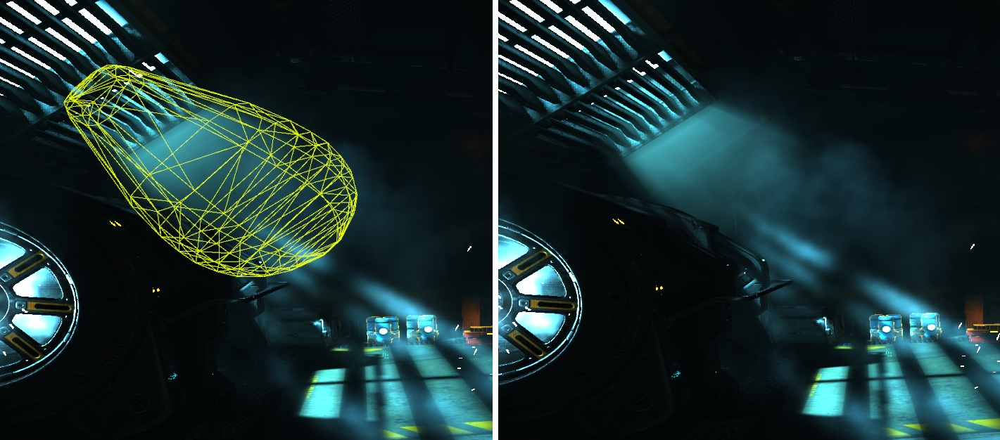
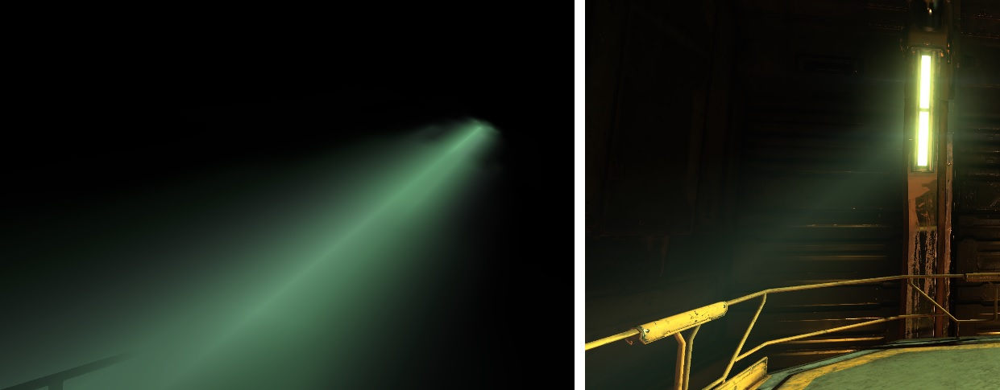
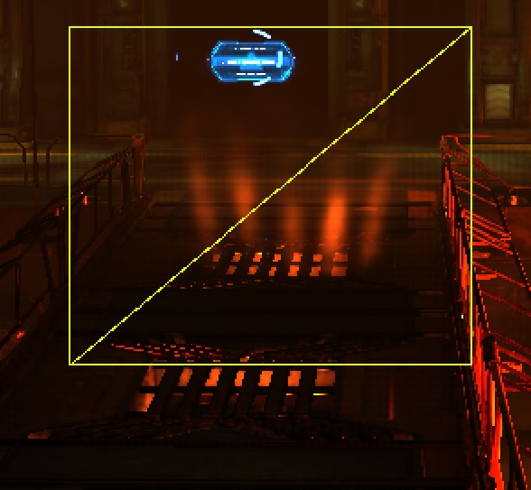
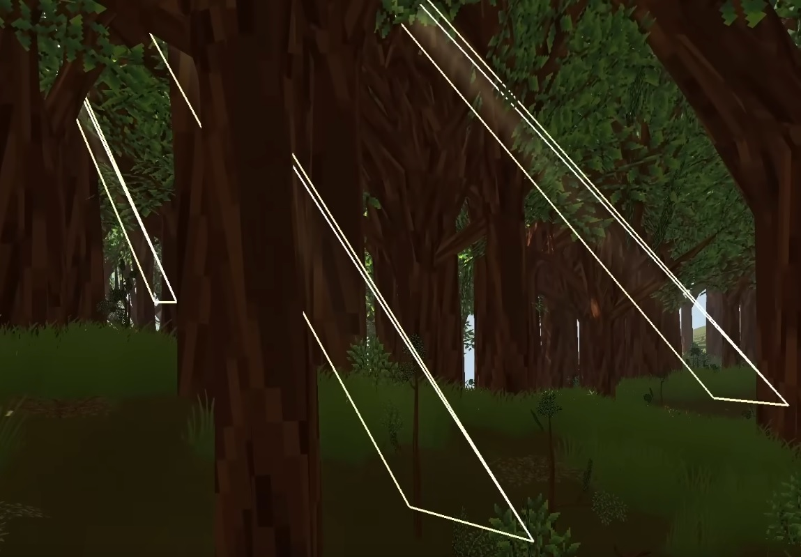
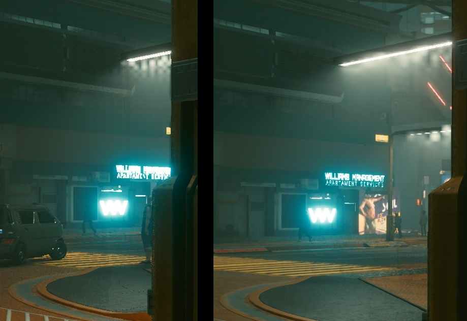
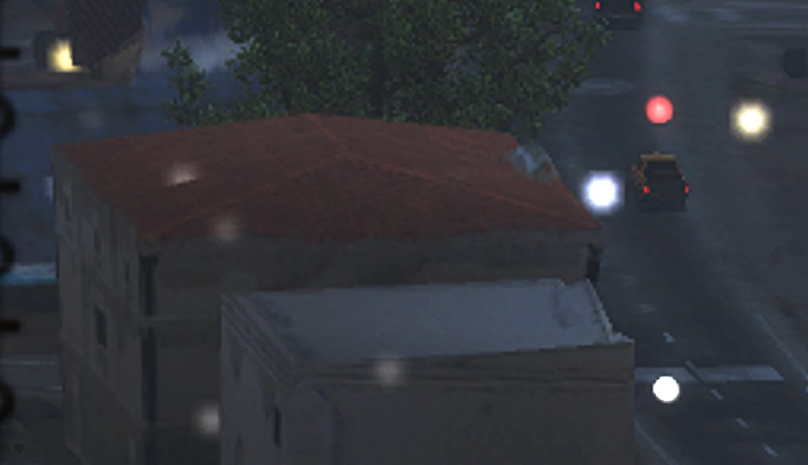
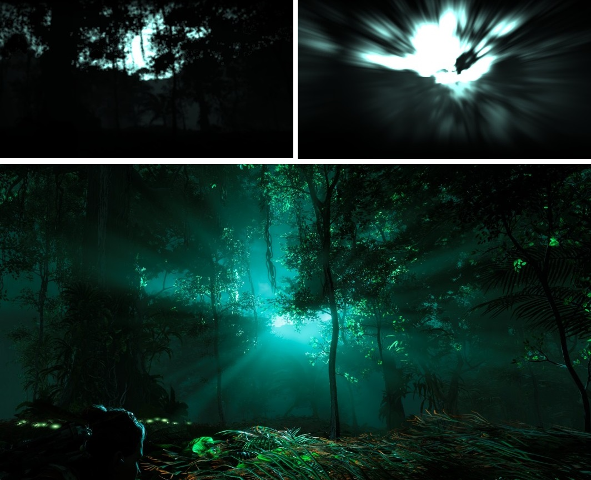

## Glow

В Doom 2016 эффект состоит из двух частей:
* Обычный bloom с даунскейлом
* Отдельный RT куда рисуются flares несколькими спрайтами.

Затем две части комбинируются, bloom дополнительно комбинируется с lensDirt.

В Horizon Zero Dawn аналогично сделан свет от роботов. Блики на линзе рисуются геометрией.

Такое разделение нужно так как bloom дает однообразную размытую картинку, а заранее подготовленные четкие спрайты придают более красивый вид и имитируют рассеивание света на линзе.

Что бывает при использовании только блура можно увидеть в Unreal Tornament 3 и других играх того времени, когда картинка была слишком мыльной.

Другой вариант эффекта разбирается в [Doom 3 – Volumetric Glow](https://simonschreibt.de/gat/doom-3-volumetric-glow/).
Более дешевый эффект строится геометрией и накладывается текстура с градиентом, либо рассчитывается затухание в FS, но тут стоит учитывать, что интерполяция может давать артефакты на стыках геометрии, поэтому нужно считать расстояние после интерполяции.

Если доработать построение геометрии, то получится имитировать и объемный свет.

[Пример](https://github.com/azhirnov/AsEn-ShaderEditor/tree/main/src/scripts/vfx/FakeGlow.as)

## Light Volume

В Doom 2016 как и в Doom 3 объемный свет рисуется через геометрию.

Также в Doom 2016 есть имитация освещения дыма. Сделано также через геометрию, сбоку смотрится хорошо, но при взгляде прямо на источник света геометрия нереалистично уходит вбок.

Эффект разобран в видео [A Game Engine Built For Optimisation](https://www.youtube.com/watch?v=i6VVegoRuy0). 
Здесь лучи солнца пробивающиеся через крону деревьев заданы вытянутыми спрайтами.
Для леса спрайты раскиданы случайным образом, плотность зависит от прозрачности кроны деревьев.

В Cyberpunk 2077 эффект сделали маршингом объема и добавили темпоральные техники и DLSS для оптимизации.
В результате при первом появлении эффекта на экране рисуется только один пиксель из квадрата 2х2 или 4х4, и только после 8/16 кадров эффект полностью отрисуется, но за это время камера сдвинется и появятся ошибки репроекции.

Подробный разбор как создать эффект на спрайтах: [Light beam shader in godot](https://passivestar.xyz/posts/light-beam-shader-in-godot/)

## Light Bulbs

В GTA V и Ghost Recon Wildlands спрайтами рисуют источники света вдали.

Разобрано в [GTA V - Graphics Study - Part 2](https://www.adriancourreges.com/blog/2015/11/02/gta-v-graphics-study-part-2/).

Для проверки видимости используют попиксельный тест глубины, что создает артефакты, когда источник света (Light bulb) частично закрывается геометрией.
Физически такое поведение не корректно - большое светлое пятно появляется за счет рассиевания света на линзе, а оно всегда круглой формы.
Поэтому частичное перекрытие геометрией при попиксельном тесте дает неправильную картинку.

Более корректный способ - делать тест глубины только для одного пикселя или квадрата, по результатам теста решать рисовать light bulb или нет.

## Screenspace Light Shafts

Быстрая версия эффекта выглядит так:
* Создаем маску по буферу глубины, небо считается за 1, остальное за 0. Для оптимизации работают в 1/4 от разрешения экрана.
* Маска умножается на цвет солнца/луны.
* Используется радиальный блур с центром в месте, где находится солнце.
  Для оптимизации радиальный блур делается в 2 прохода с разным шагом. Первый дает ступенчатую картинку, а второй сглаживает ее. Но двухпроходная версия дает другую форму лучей, что выглядит даже красивее.
* Размытая картинка прибавляется к цвету.

Нюансы:
* Так как эффект работает в 2D, то это может создавать артефакты, когда луч света накладывается поверх объекта, тогда как в 3D он должен быть за ним.
* После размытия цвет вблизи солнца остается очень ярким и при сложении яркость солнца удваивается и небо поблизости пересвечивается, что плохо смотрится.
  При наложении эффекта нужно корректировать яркость, учитывая что это имитация рассеивания света частицами пыли и туманом/дымкой, поэтому испускаемый свет от угла между светом и камерой, от плотности дымки.

[Пример](https://github.com/azhirnov/AsEn-ShaderEditor/tree/main/src/scripts/vfx/LightShafts.as)

[GDC2014: Adding High-End Graphical Effects to GT Racing 2 on Android x86 (слайды 15-21)](https://gdcvault.com/play/1020220/Adding-High-End-Graphical-Effects) - другая версия эффекта.
Здесь размывают только точку от солнца, что дает все те же лучи, но не дает тени. Поэтому для более красивого эффекта важно рисовать область намного большую чем солнце.

Более дорогая, но физически корректная версия реализована в Fallout 4 с помощью NVIDIA Volumetric Lighting ([pdf](https://d29g4g2dyqv443.cloudfront.net/sites/default/files/akamai/gameworks/downloads/papers/NVVL/Fast_Flexible_Physically-Based_Volumetric_Light_Scattering.pdf), [video](https://gdcvault.com/play/1023519/Fast-Flexible-Physically-Based-Volumetric)).

* Рендерится shadow map для источника освещения (солнца).
* По shadow map строится геометрия и вытягивается.
* Геометрия рисуется с тестом глубины, где геометрия видна запускается маршинг, чтобы физически-корректно рассчитать рассеивание света.

## Bloom

Рассеивания света на линзе. Чем больше яркость, тем больше площадь/радиус пятна.

Эффект состоит из нескольких частей:
* Из HDR цвета извлекаются самые яркие пиксели.
	- В Doom 2016 берут максимальную яркость покомпонентно, в результате получается немного искаженный цвет.
* Генерация мипов с размытием.
* Апскейл, нижние мипы прибавляются к верхним.
* Перед тонемапингом верхний размытый мип прибавляется к цвету сцены.

Примеры:
* [Gaussian blur, без оптимизаций](https://github.com/azhirnov/AsEn-ShaderEditor/tree/main/src/scripts/perf/Blur-1.as)
* [Gaussian blur в 2 прохода](https://github.com/azhirnov/AsEn-ShaderEditor/tree/main/src/scripts/perf/Blur-2.as)
* [Dual filter blur, быстрее на мобилках](https://github.com/azhirnov/AsEn-ShaderEditor/tree/main/src/scripts/perf/Blur-3.as)
* [Kawase blur, похож на Dual filter](https://github.com/azhirnov/AsEn-ShaderEditor/tree/main/src/scripts/perf/Blur-4.as)
* [Bloom](https://github.com/azhirnov/AsEn-ShaderEditor/tree/main/src/scripts/samples-2d/Bloom.as)

https://blog.frost.kiwi/dual-kawase/

## Tonemapping

Преобразование HDR цвета в совместимые с монитором диапазон цветов.

Подробнее про цветовые пространства экранов разобрано в [HDR Display](HDR_Display-ru.md).

