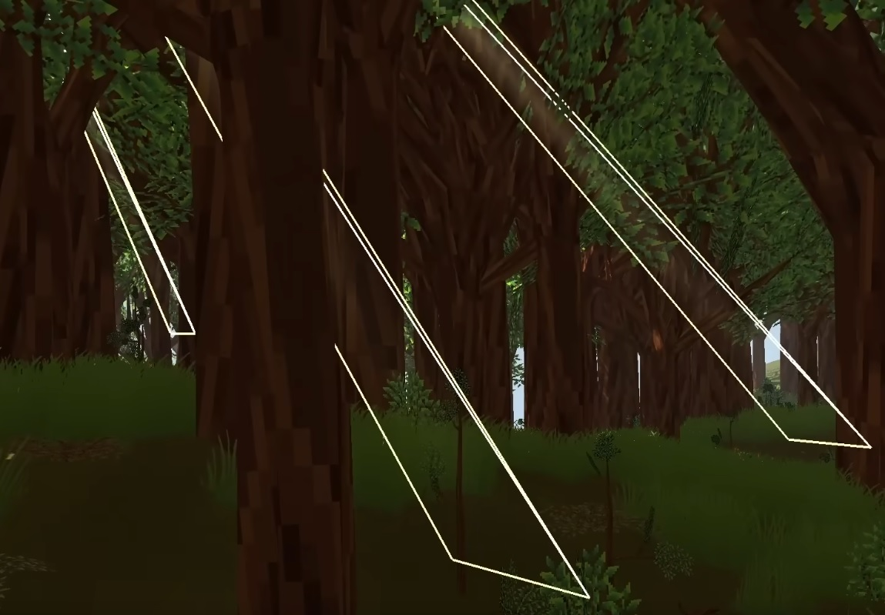
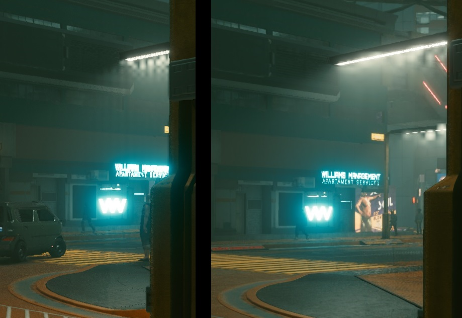
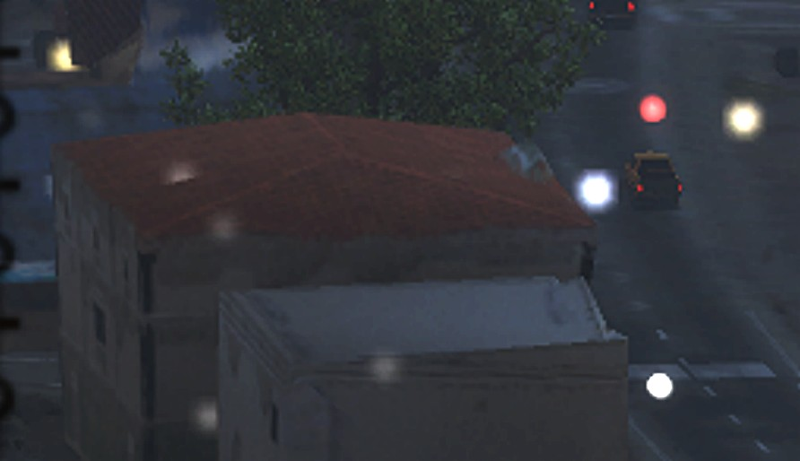
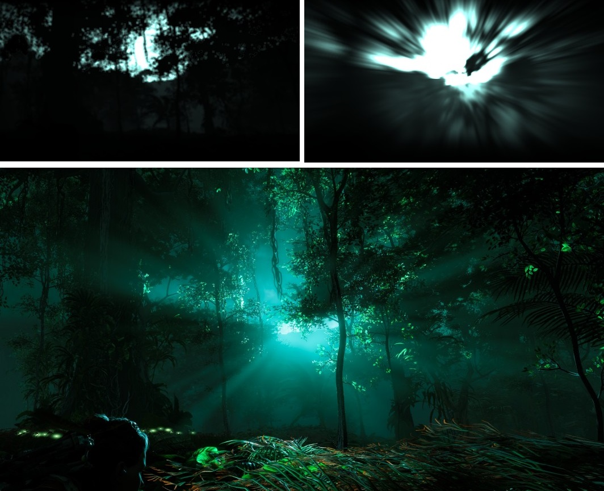
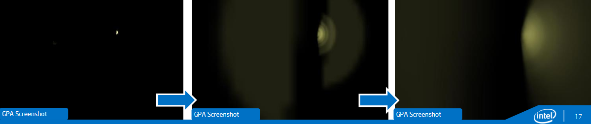
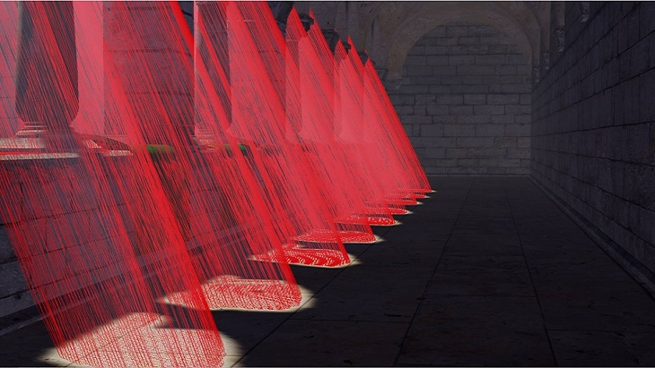

## Light Volume

В Doom 2016 как и в Doom 3 объемный свет рисуется через геометрию. 
Похожий вариант с 3D геометрией использовался в VR игре: [Lighting mannequin](https://real-mrbeam.github.io/2025/10/28/Lighting-Mannequin.html).

Также в Doom 2016 есть имитация освещения дыма. Сделано также через геометрию, сбоку смотрится хорошо, но при взгляде прямо на источник света геометрия нереалистично уходит вбок.

Эффект разобран в видео [A Game Engine Built For Optimisation](https://www.youtube.com/watch?v=i6VVegoRuy0). 
Здесь лучи солнца пробивающиеся через крону деревьев заданы вытянутыми спрайтами.
Для леса спрайты раскиданы случайным образом, плотность зависит от прозрачности кроны деревьев.

Подробный разбор как создать эффект на спрайтах в [Light beam shader in godot](https://passivestar.xyz/posts/light-beam-shader-in-godot/)

В Cyberpunk 2077 эффект сделали маршингом объема и добавили темпоральные техники и DLSS для оптимизации.
В результате при первом появлении эффекта на экране рисуется только один пиксель из квадрата 2х2 или 4х4, и только после 8/16 кадров эффект полностью отрисуется, но за это время камера сдвинется и появятся ошибки репроекции.

## Light Bulbs

Светящийся объект виден на большее расстояние, чем освещаемая им область, так как большинство поверхностей диффузные и отражают свет во всех направлениях (по полусфере), а часть света поглощается.
Таким образом до глаза свет доходит уменьшаясь по квадрату от расстояния, а отраженный свет как: `1/a2 * 1/b2`, где a2 - квадрат расстояния от света до поверхности и b2 - квадрат расстояния от поверхности до глаза.
К этому добавляется угловое разрешение глаза/камеры, когда светящаяся точка вдали занимает как минимум один пиксель, и рассеивание на линзе, когда засвечиваются и соседние пиксели.
В итоге сам источник света виден намного дальше, чем освещенная область от него.

В GTA V и Ghost Recon Wildlands спрайтами рисуют источники света вдали.
Эффект идет как дополнение к Bloom, когда источники света слишком далеко и их геометрия может даже не рисоваться, из-за чего они не попадают в Bloom.

Разобрано в [GTA V - Graphics Study - Part 2](https://www.adriancourreges.com/blog/2015/11/02/gta-v-graphics-study-part-2/).

Для проверки видимости используют попиксельный тест глубины, что создает артефакты, когда источник света (Light bulb) частично закрывается геометрией.
Физически такое поведение не корректно - большое светлое пятно появляется за счет рассиевания света на линзе, а оно всегда круглой формы.
Поэтому частичное перекрытие геометрией при попиксельном тесте дает неправильную картинку.

Более корректный способ - делать тест глубины только для одного пикселя или квадрата, по результатам теста решать рисовать light bulb или нет.

Объекты перед источником света могут его частично закрывать, поэтому до линзы доходит меньше света. Частичное перекрытие проверяется дополнительным чтением глубины или одним чтением из мипа HiZ.

## Screenspace Light Shafts

Быстрая версия эффекта выглядит так:
* Создаем маску по буферу глубины, небо считается за 1, остальное за 0. Для оптимизации работают в 1/4 от разрешения экрана.
* Маска умножается на цвет солнца/луны.
* Используется радиальный блур с центром в месте, где находится солнце.
  Для оптимизации радиальный блур делается в 2 прохода с разным шагом. Первый дает ступенчатую картинку, а второй сглаживает ее. Но двухпроходная версия дает другую форму лучей, что выглядит даже красивее.
* Размытая картинка прибавляется к цвету.

Нюансы:
* Так как эффект работает в 2D, то это может создавать артефакты, когда луч света накладывается поверх объекта, тогда как в 3D он должен быть за ним.
* После размытия цвет вблизи солнца остается очень ярким и при сложении яркость солнца удваивается и небо поблизости пересвечивается, что плохо смотрится.
  При наложении эффекта нужно корректировать яркость, учитывая что это имитация рассеивания света частицами пыли и туманом/дымкой, поэтому испускаемый свет от угла между светом и камерой, от плотности дымки.

Эффект достаточно дешевый и его можно применять несколько раз, например отдельно к облакам для эффекта сумеречных лучей (рассеивания света в атмосферной дымке) и отдельно для объектов сцены для имитации рассеивания света в тумане или пыли.
Также эффект можно применить отдельно ко всем ярким источникам света на сцене, создав дешевый аналог объемного света (volumetric light).

[Пример](https://github.com/azhirnov/AsEn-ShaderEditor/blob/main/src/scripts/vfx/LightShafts.as)

[GDC2014: Adding High-End Graphical Effects to GT Racing 2 on Android x86 (слайды 15-21)](https://gdcvault.com/play/1020220/Adding-High-End-Graphical-Effects) - другая версия эффекта.
Здесь размывают только точку от солнца, что дает все те же лучи, но только одну тень, которая загораживает солнце.
Поэтому для более красивого эффекта важно рисовать область намного большую чем само солнце.

Более дорогая, но физически корректная версия реализована в Fallout 4 с помощью NVIDIA Volumetric Lighting ([pdf](https://d29g4g2dyqv443.cloudfront.net/sites/default/files/akamai/gameworks/downloads/papers/NVVL/Fast_Flexible_Physically-Based_Volumetric_Light_Scattering.pdf), [video](https://gdcvault.com/play/1023519/Fast-Flexible-Physically-Based-Volumetric)).

* Рендерится shadow map для источника освещения (солнца).
* По shadow map строится геометрия и вытягивается.
* Геометрия рисуется с тестом глубины, где геометрия видна запускается маршинг, чтобы физически-корректно рассчитать рассеивание света.

На старых дискретных видеокартах такие вытянутые треугольники заметно снижают производительность, но с переходом на тайловую архитектуру (TBR) это большне не проблема и эффект стал достаточно быстрым.
