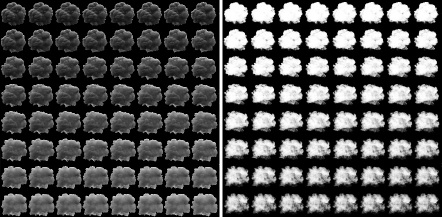

## Particles

### Screen Space Particles

Sprites, shells, debris, and other short-lived particles are simulated in screen space, using the depth and normal buffers for collision detection.

This effect first appeared in the Infiltrator Demo: [Infiltrator Breakdown: Visual Effects 01](https://youtu.be/-VANuJCM29E?t=243), [Infiltrator Breakdown: Visual Effects 02](https://www.youtube.com/watch?v=RURQSR788Dg).

[Example](https://github.com/azhirnov/AsEn-ShaderEditor/blob/main/src/scripts/particles/ScreenSpace.as)

### Explosion

The explosion effect is rendered using animated textures stored in a large atlas (8k*8k). The R channel holds brightness, while the G channel contains opacity.

Lighting simulation for each sprite is done in a separate low-resolution pass, with results stored in a secondary atlas (4k*2k).

The effect combines a small number of sprites; on the left image, 4 sprites are used, and on the right, 3.

In Star Wars Battlefront II, the explosion consists of a much larger number of sprites. Detailed breakdown is available in [Battlefront II: Layered Explosion](https://simonschreibt.de/gat/battlefront-ii-layered-explosion/) and [Community Transmission — Visual Effects in Star Wars Battlefront II](https://www.reddit.com/r/StarWarsBattlefront/comments/cho15m/community_transmission_visual_effects_in_star/).

Example effect: 

Geometry: 

[Fallout 4 – The Mushroom Case](https://simonschreibt.de/gat/fallout-4-the-mushroom-case/) - how the nuclear explosion is made in F4. An animated texture atlas is used, along with a gradient map for color assignment.

### Splash

Detailed breakdown in [Jedi: Fallen Order – Splishy Splashy](https://simonschreibt.de/gat/jedi-fallen-order-splishy-splashy/).

The splash effect consists of particles for small droplets and geometry for larger detail elements. Geometry is needed when the direction relative to the camera can change significantly, making sprites look unrealistic in such cases. Geometry can also be rotated.

### Rain

Rain is created using particles in front of the camera. At a distance, it's replaced with fog.

It can be combined with particle simulation using the depth buffer to detect scene collisions and enable splash effects.

Refraction in the drop is done similarly to glass, reading a reduced and blurred scene.

### Traces / Decals

Laser and welding marks. Analyzed in [Alien vs Wolfenstein – Cutting Torch](https://simonschreibt.de/gat/alien-vs-wolfenstein-cutting-torch/).

 
[GDC2014: Scripting Particles: Getting Native Speed from a Virtual Machine](https://gdcvault.com/play/1020176/Scripting-Particles-Getting-Native-Speed)
