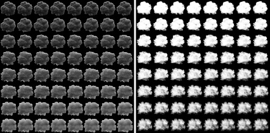
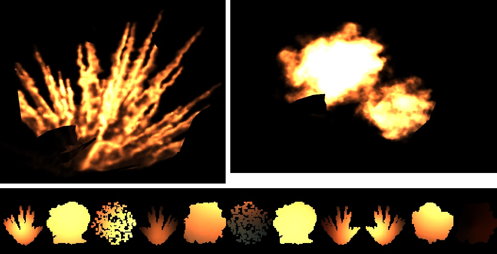

## Particles

### Screen Space Particles

Искры, гильзы, осколки и другие короткоживущие частицы симулируются в экранном пространсве, для обработки столкновений берется буфер глубины и нормали.

Эффект появился еще в Infiltrator Demo: [Infiltrator Breakdown: Visual Effects 01](https://youtu.be/-VANuJCM29E?t=243), [Infiltrator Breakdown: Visual Effects 02](https://www.youtube.com/watch?v=RURQSR788Dg).

[Пример](https://github.com/azhirnov/AsEn-ShaderEditor/tree/main/src/scripts/particles/ScreenSpace.as)

### Explosion

Эффект взрыва рисуется анимированными текстурами, которые хранятся в большом атласе (8к*8к).
R канал хранит яркость, а G - прозрачность.

Отдельным проходом симулируется освещенность каждого спрайта в низком разрешении, результат записывается в отдельный атлас (4к*2к).

Эффект комбинируется из небольшого количества спрайтов, на картинке слева - 4 спрайтов, справа - 3.

В Starwars Battlefront II эффект состоит из намного большего количества спрайтов.
Подробно разбирается в статье [Battlefront II: Layered Explosion](https://simonschreibt.de/gat/battlefront-ii-layered-explosion/) и [Community Transmission — Visual Effects in Star Wars Battlefront II](https://www.reddit.com/r/StarWarsBattlefront/comments/cho15m/community_transmission_visual_effects_in_star/).

Пример эффекта: 

Геометрия: 

[Fallout 4 – The Mushroom Case](https://simonschreibt.de/gat/fallout-4-the-mushroom-case/) - как сделан ядерный взрыв в F4.
Используется атлас с покадровой анимацией, а для задания цвета - градиентная текстура.

### Splash

Подробно разобрано в [Jedi: Fallen Order – Splishy Splashy](https://simonschreibt.de/gat/jedi-fallen-order-splishy-splashy/).

Эффект брызг состоит из частиц для мелких капель и геометрии для более крупных деталей.
Геометрия нужна когда направление на камеру может сильно меняться и спрайты в таком случае выглядят нереалистично. Также геометрию можно вращать.

### Rain

Дождь делается частицами перед камерой. Вдали заменяется туманом.

Можно объединить с симуляцией частиц по буферу глубины для обнаружения мест столкновения со сценой и включения эффекта брызг.

Рефракция в капле делается аналогично стеклу, когда читается уменьшенная и заблуреная сцена.

### Следы / Декали

Отметки от лазера и сварки. Разбирается в [Alien vs Wolfenstein – Cutting Torch](https://simonschreibt.de/gat/alien-vs-wolfenstein-cutting-torch/).

[GDC2014: Advanced Visual Effects with DirectX 11: Compute-Based GPU Particle Systems](https://gdcvault.com/play/1020002/Advanced-Visual-Effects-with-DirectX) 
[GDC2014: Scripting Particles: Getting Native Speed from a Virtual Machine](https://gdcvault.com/play/1020176/Scripting-Particles-Getting-Native-Speed)
