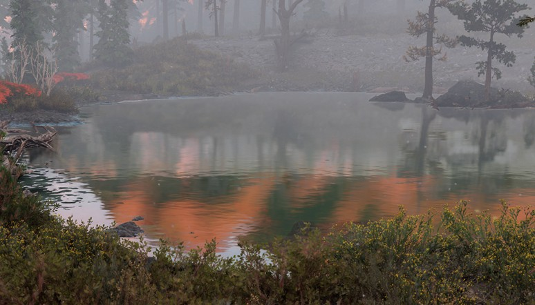
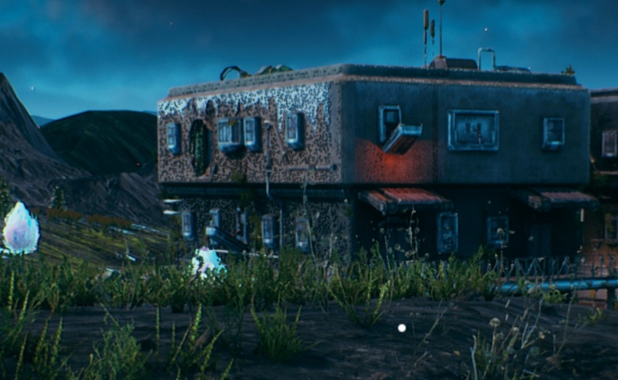
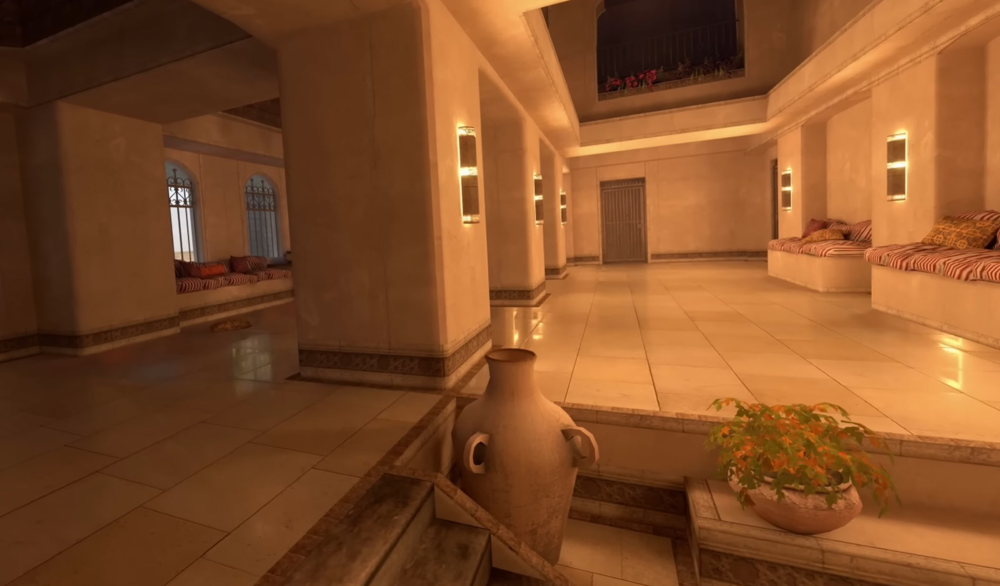

## Screen-space Reflections (SSR)

Один из самых неоднозначных эффектов. При неправильном использовании дает множество артефактов и зашумление, из-за чего глаза реагируют на движение, которого нет.
Уже ближе к 2020 годам научились делать более стабильную трассировку, к тому же появился RTX, который включался для пикселей не нашедших пересечение по SSR.

В Doom 2016 происходит после заполнения G-буфера, поэтому не происходит отставания на кадр и картинка не содержит тумана.
Но в комбинации с light probe получаются другие артефакты:

В Cyberpunk 2077 сделали иначе и в отражении оказывается больше тумана чем нужно.
Зато вариант с трассировкой лучей (справа) работает корректнее.

В Horizon Forbidden West отражения читают текстуру после рисования полупрозрачных из-за чего листья дерева перед водой попадают в отражения.
Зато меньше артефактов из-за несработавшего SSR. Если не приглядываться, то даже не заметно.

Еще в Horizon Forbidden West сделали переключение на cubemap в случае промаха SSR, что в сочетании с туманом сильно бросается в глаза.

В более старой Outer Worlds все намного хуже - SSR применяют для отражений на металических поверхностях из-за чего происходят частые промахи и сильное зашумление.

### Оптимизация

Один из способов оптимизации SSR - уменьшить количество шагов за счет трассировки по HiZ:
[Screen Space Reflections : Implementation and optimization – Part 2 : HI-Z Tracing Method](https://sugulee.wordpress.com/2021/01/19/screen-space-reflections-implementation-and-optimization-part-2-hi-z-tracing-method/).

## Cubemap

Во многих играх для оптимизации не используют SSR и ограничиваются только кубическими картами, но это создает неточности, когда точка захвата отражений находится далеко от камеры.

Для исправления таких искажений используется parallax corrected cubemap.

Сселки:
* [Image-based Lighting approaches and parallax-corrected cubemap](https://seblagarde.wordpress.com/2012/09/29/image-based-lighting-approaches-and-parallax-corrected-cubemap/)
* [Parallax-corrected cubemapping with any cubemap](https://interplayoflight.wordpress.com/2013/04/29/parallax-corrected-cubemapping-with-any-cubemap/)
