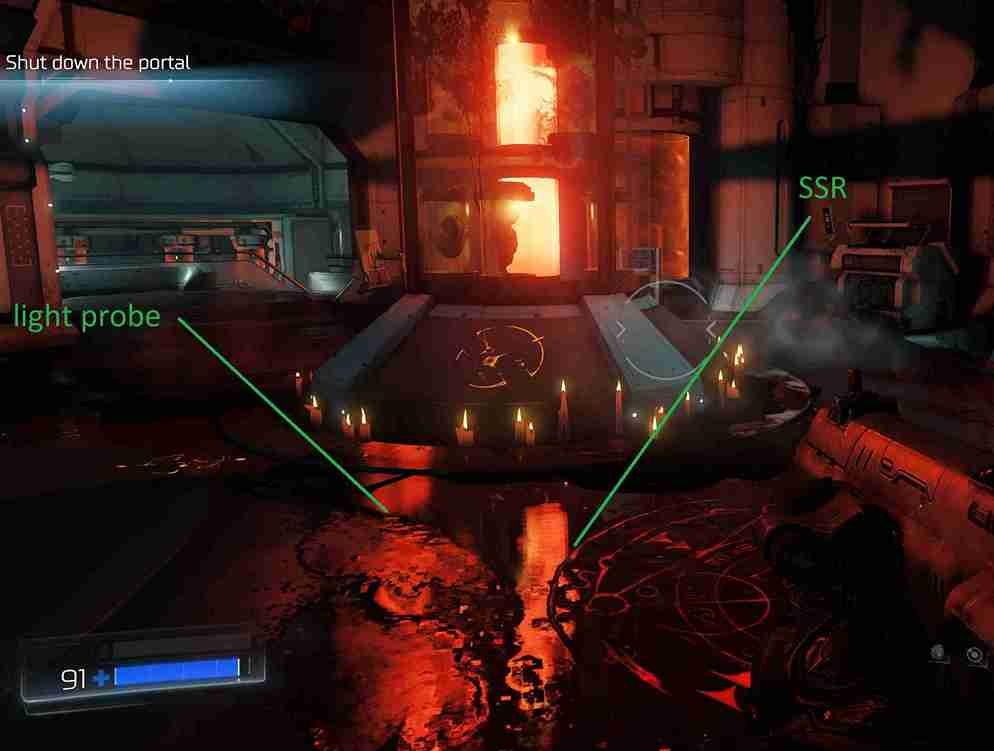
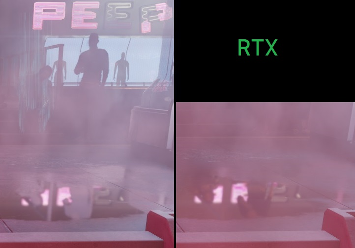
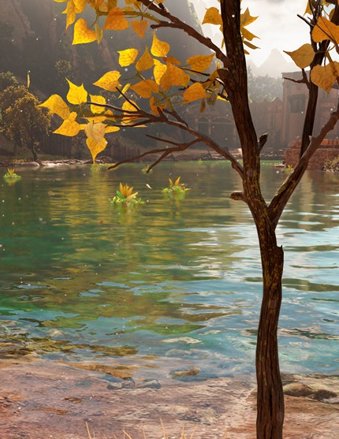

## Screen-space Reflections (SSR)

Один из самых неоднозначных эффектов. При неправильном использовании дает множество артефактов и зашумление, из-за чего глаза реагируют на движение, которого нет.
Уже ближе к 2020 годам научились делать более стабильную трассировку, к тому же появился RTX, который включался для пикселей не нашедших пересечение по SSR.

В Doom 2016 происходит после заполнения G-буфера, поэтому не происходит отставания на кадр и картинка не содержит тумана.
Но в комбинации с light probe получаются другие артефакты:

В Cyberpunk 2077 сделали иначе и в отражении оказывается больше тумана чем нужно.
Зато вариант с трассировкой лучей (справа) работает корректнее.

В Horizon Forbidden West отражения читают текстуру после рисования полупрозрачных из-за чего листья дерева перед водой попадают в отражения.
Зато меньше артефактов из-за несработавшего SSR. Если не приглядываться, то даже не заметно.

