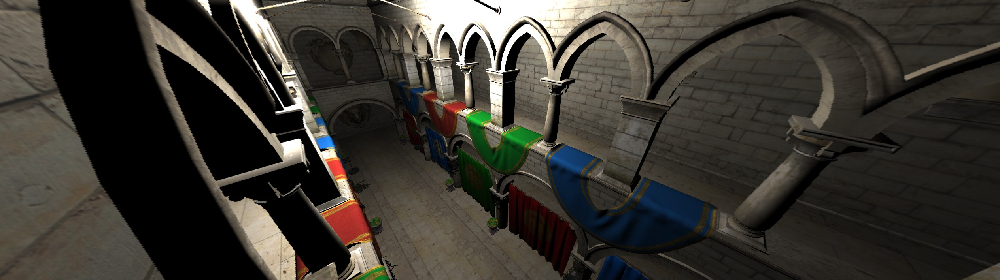
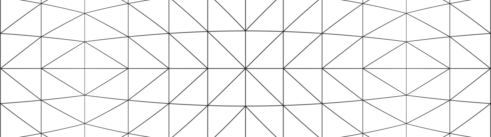
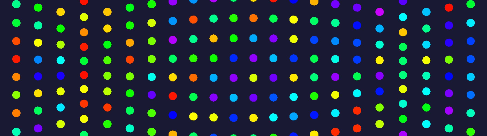
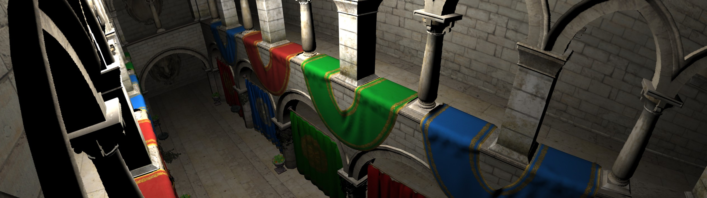
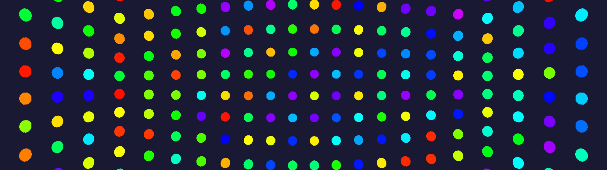
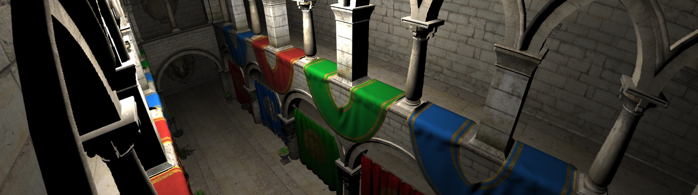

**Screen Projection Types**

## Linear Projection (Rectilinear)

Also known as perspective projection.

Pros:
* Straight lines remain straight
* Compatible with projection matrices

Cons:
* The larger the FOV, the more distortion at the edges, as part of the sphere is projected onto a plane.
* Due to distortion, pixel density is lower in the center compared to the edges. This causes issues during post-processing projection changes.

## Stereographic Projection (Stereographical)

The 3D vector is converted to spherical coordinates and displayed on the plane.

Pros:
* Angular distance is not distorted.
* Shape remains unchanged.
* Suitable for drawing spheres, starry skies.

Cons:
* Straight lines become curved, making it difficult to view rectangular shapes.
* Uncomfortable to view dynamically.
* Distortion begins at the poles when fovY>120°, but for ultra-wide monitors fov={360°, 101°}.

## Panini

A stereographic projection where the camera is moved backward. The displacement is set from 0 to 1.0; for larger angles, 1.0 can be fixed, with 0 displacement matching the perspective projection.

Pros:
* Most comfortable to perceive dynamically.
* Distortions are less noticeable.
* Vertical lines remain straight.

Cons:
* Angular distance is distorted.
* Horizontal lines are slightly distorted.
* Maximum angle is 180°.

## Features of 180° Projections

180° projection requires changes in rendering:
* Implemented by drawing in 3 cameras at 45° each and post-processing with correction stacks.
* Billboards at the edges will be distorted, so it's better to draw them in world space rather than screen space.
* Cascaded shadows (CSM) will need to be modified to something similar to GeoClipMap.
* SSR and other screen-space techniques must be adjusted to avoid artifacts at the camera boundaries, or replaced with other techniques, such as ray tracing.

## Examples

* [Panini](https://github.com/azhirnov/AsEn-ShaderEditor/tree/main/src/scripts/posteffects/Panini.as) - the scene is rendered with perspective projection, then a post-process with Panini projection is applied.
* [RenderToCubemap](https://github.com/azhirnov/AsEn-ShaderEditor/tree/main/src/scripts/projections/RenderToCubemap.as) - the scene is rendered into a cubic map, then the required texel is selected based on 3D coordinates, similar to ray tracing.

## References

* [Comparing Graphical Projection Methods at High Degrees of Field of View](https://www.diva-portal.org/smash/get/diva2:1229190/FULLTEXT02.pdf) - compares which projection is most comfortable to perceive.
* [Panini Projection in UE](https://dev.epicgames.com/documentation/en-us/unreal-engine/panini-projection-in-unreal-engine) - Panini as a post-process, works up to angles of approximately 120°, beyond which the center pixel density becomes too low.
* [Pannini: A New Projection for Rendering Wide Angle Perspective Images](http://tksharpless.net/vedutismo/Pannini/panini.pdf) - original article on Panini projection.
* [RayTracingGems2: Essential Ray Generation Shaders](https://www.researchgate.net/publication/354065227_Essential_Ray_Generation_Shaders) - compares different projections, includes code for ray tracing.
* [Reducing stretch in high-FOV games using barrel distortion](https://www.decarpentier.nl/lens-distortion) - another way to compensate for distortions through post-processing.
* [Lens Matched Shading](https://developer.nvidia.com/lens-matched-shading-and-unreal-engine-4-integration-part-1) - compensation for distortions in VR through multiview - rendering into 4 textures.
