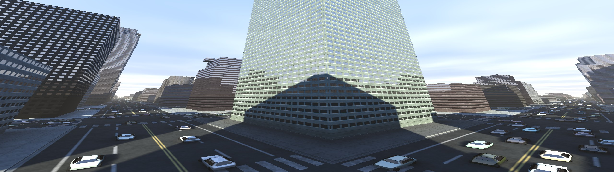
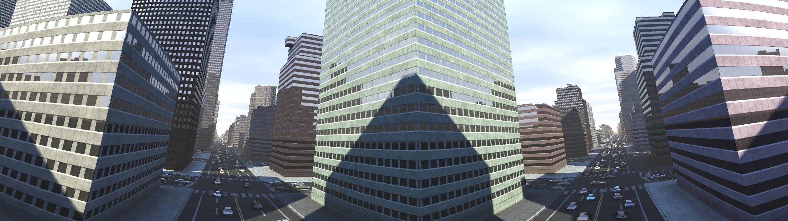
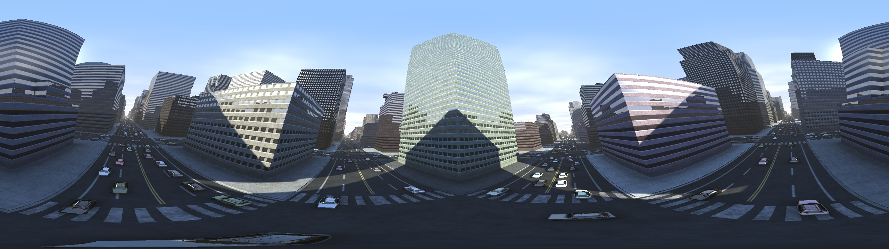
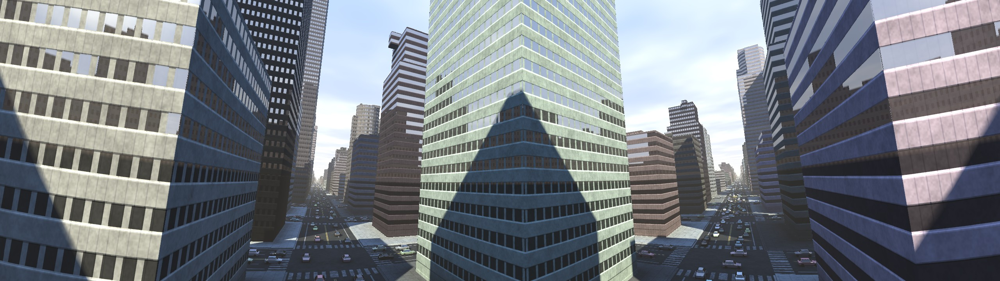
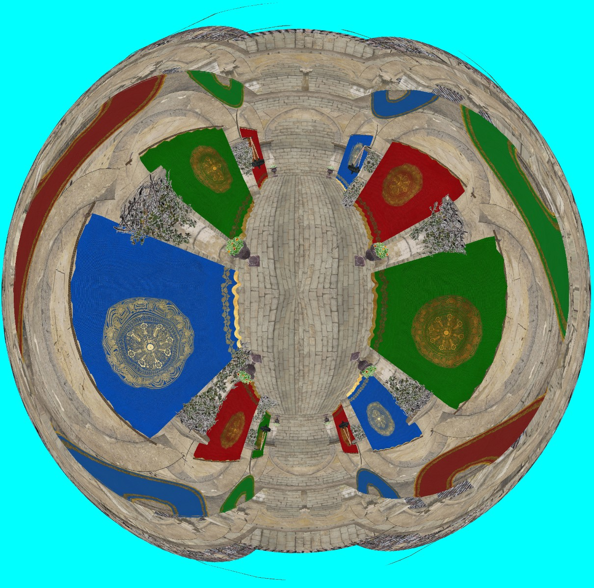
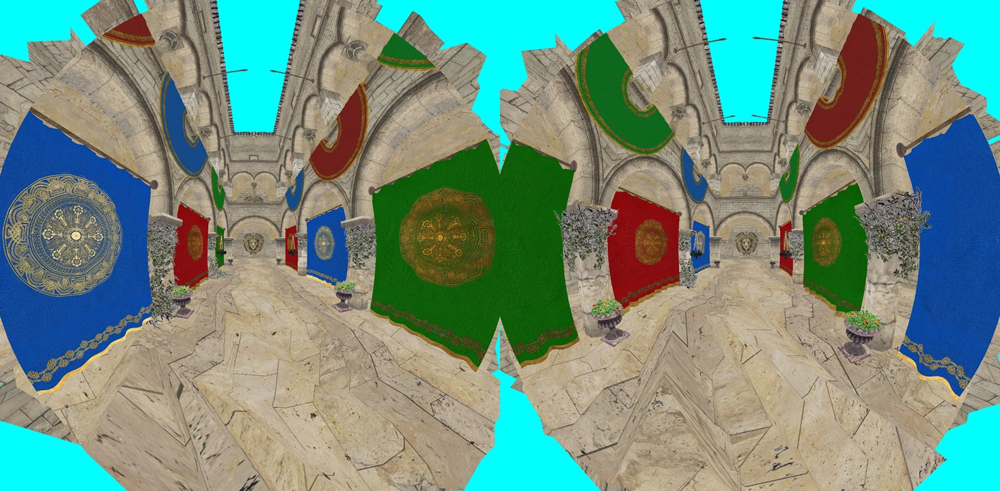
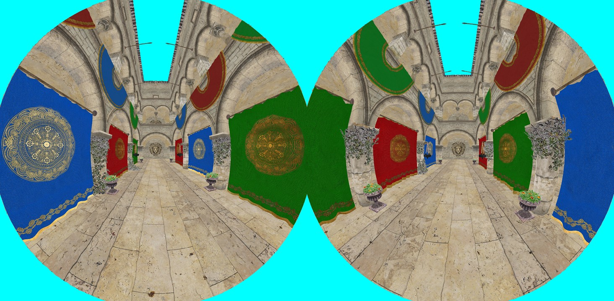
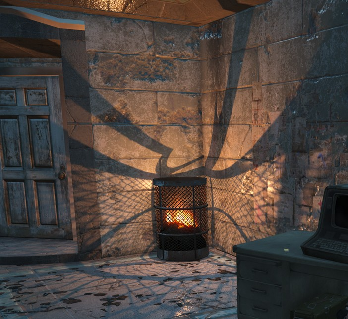

**Виды проекций на экран.**

## Проекция на 180°

### Прямолинейная проекция (Rectilinear)

Она же перспективная проекция.

Плюсы:
* Прямые линии остаются прямыми
* Совместима с матрицами проекции

Минусы:
* Чем больше FOV тем больше искажения по краям, так как часть сферы проецируется на плоскость.
* Из-за искажений плотность пикселей в центре больше, чем по краям. Это создает проблемы при изменении проекции пост-процессом.

### Стереографическая проекция (Stereographical)

Вектор в 3D конвертируется в сферические координаты и отображается на плоскости.

Плюсы:
* Угловое расстояние не искажается.
* Форма не искажается.
* Хорошо подходит для рисования сфер, звездного неба.

Минусы:
* Прямые линии искривляются, из-за чего тяжело смотреть на прямоугольные формы.
* Некомфортно смотреть в динамике.
* При fovY>120° начинаются искажения на полюсах, но для ультраширокого монитора максимальный fov={360°, 101°}.

Проекция на 360°

### Panini

Стереографическая проекция, где камера смещена назад. Смещение задается от 0 до 1, для больших углов можно зафиксировать 1, смещение 0 совпадает с перспективной проекцией.

Плюсы:
* Наиболее комфортно воспринимается в динамике.
* Искажения менее заметные.
* Вертикальные линии остаются прямыми.

Минусы:
* Угловое расстояние искажается.
* Горизонтальные линии немного искажаются.
* Максимальный угол 180°.

### Особенности проекций на 180°

Проекция на 180° потребует изменений в рендеринге:
* Делается через рисование в 3 камеры по 45° и пост-процессом с коррекцией на стаках.
* Билборды на стыках будут искажаться, поэтому их лучше рисовать в мировом пространсве, а не в экранном.
* Каскадные тени (CSM) придется переделать под что-то похожее на GeoClipMap.
* SSR и прочие экранные техники нужно дорабатывать, чтобы не было артефактов на границе между камерами, либо заменить на другие техники, например трассировку.

## Проекция на 360°

Применяется для:
* тени для точечтных источников света
* проба с отражениями

### Cubemap

Самый простой способ - отрисовать сцену 6 раз в кубическую карту с перспективной проекцией.
Но из-за этого и самый дорогой.

Обычно используются для качественных отражений.

### Single Paraboloid

Проекция похожа на fish eye 180°x360°, но совместима с растеризацией.

Центр проекции наиболее четкий, а к краям искажения усиливаются.

Главный недостаток - сильные искажения на больших треугольниках, что решается только тесселяцией.

### Dual Paraboloid

Проекция похожа на две fish eye 180°x180°.

Немного сложнее обычного параболоида, так как требуется вручную отсекать треугольники за камерой.
Для этого есть несколько способов:
* discard в фрагментном шейдере, на современном железе это [почти бесплатно](GeometryCulling-ru.md#Discard).
* gl_ClipDistance, также работает быстро, но не поддерживается на старых ARM Mali.
* различные проекции, заставляющие работать W клиппинг.

Адаптивная тесселяция убирает все искажения, при этом уровень тесселяции в 2-3 раза меньше, чем необходим для аналогичного качества в параболоид проекции.

Раньше проекция часто использовалась для оптимизации теней, а также для проекционных теней (декалей).

## Примеры

* [Panini](https://github.com/azhirnov/AsEn-ShaderEditor/blob/main/src/scripts/posteffects/Panini.as) - сцена рисуется с перспективной проекцией, затем применяется пост-процесс с Panini проекцией.
* [RenderToCubemap](https://github.com/azhirnov/AsEn-ShaderEditor/blob/main/src/scripts/projections/RenderToCubemap.as) - сцена рисуется в кубическую карту, затем нужный тексель выбирается по 3D координатам, аналогично трассировке лучей.
* [RayProjections](https://github.com/azhirnov/AsEn-ShaderEditor/blob/main/src/scripts/projections/RayProjections.as) - все виды проекции на экран, большинство совместимо только с трассировкой лучей.
* [RasterProjections](https://github.com/azhirnov/AsEn-ShaderEditor/blob/main/src/scripts/projections/RasterProjections.as) - проекции, совместимые с растеризацией.

## Ссылки

* [Comparing Graphical Projection Methods at High Degrees of Field of View](https://www.diva-portal.org/smash/get/diva2:1229190/FULLTEXT02.pdf) - сравнивают какая проекция наиболее комфортно воспринимается.
* [Panini Projection in UE](https://dev.epicgames.com/documentation/en-us/unreal-engine/panini-projection-in-unreal-engine) - Panini как пост-процесс, работает на углах до примерно 120°, после плотность пикселей в центре слишком мала.
* [Pannini: A New Projection for Rendering Wide Angle Perspective Images](http://tksharpless.net/vedutismo/Pannini/panini.pdf) - оригинальная статься про Panini проекцию.
* [RayTracingGems2: Essential Ray Generation Shaders](https://www.researchgate.net/publication/354065227_Essential_Ray_Generation_Shaders) - сравнивают разные проекции, есть код для рейтрейса.
* [Reducing stretch in high-FOV games using barrel distortion](https://www.decarpentier.nl/lens-distortion) - другой способ компенсации искажений через пост-процесс.
* [Lens Matched Shading](https://developer.nvidia.com/lens-matched-shading-and-unreal-engine-4-integration-part-1) - компенсация искажения для VR через multiview - рисование в 4 текстуры.
