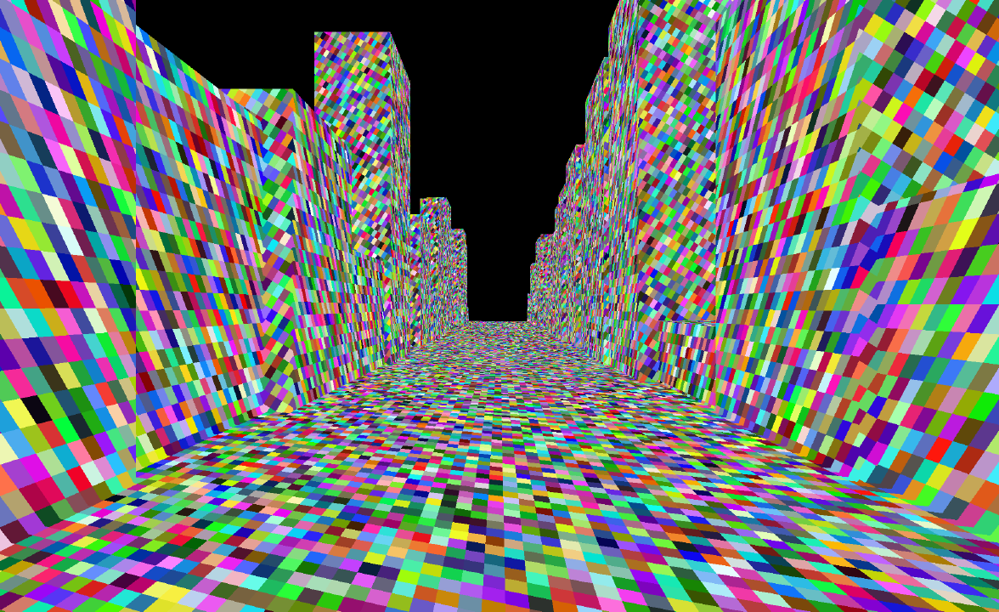
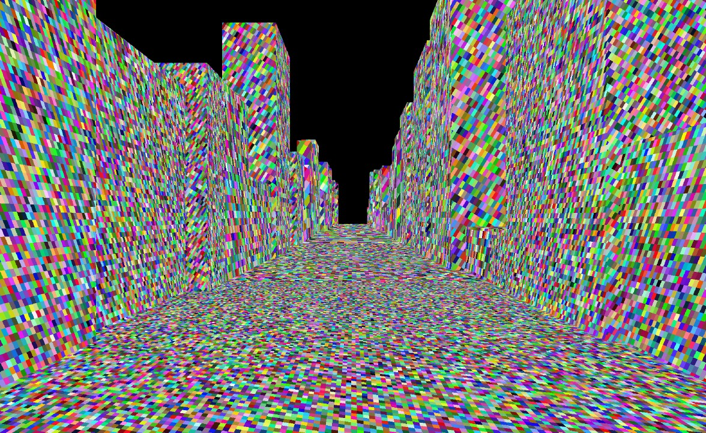
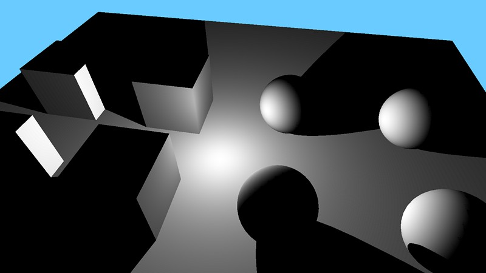
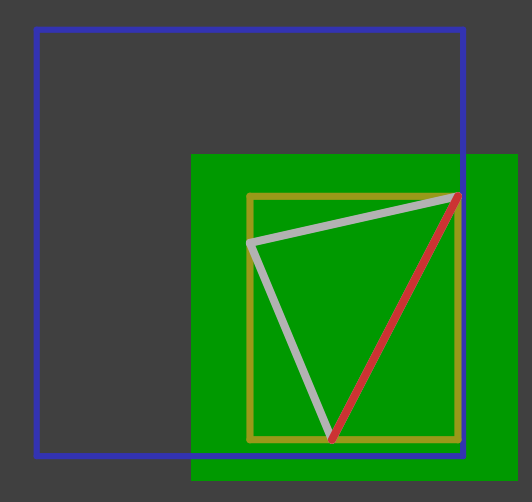
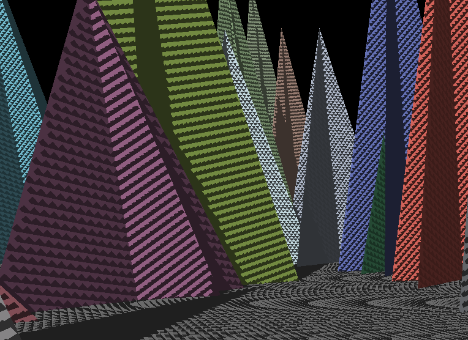
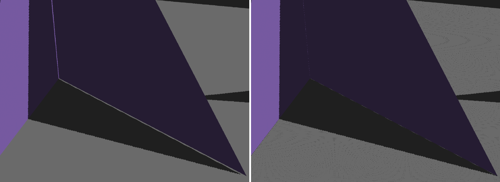

## Техники

### Stencil shadows

Контур геометрии вытягивается по направлению от источника света и рисуется в stencil-буфер.

Из плюсов - дает четкие тени.
Минусов больше:
* Большие вытянутые треугольники медленно рисуются на дотайловых архитектарах, например AMD GCN 1-4.
* Сейчас при увеличении плотности геометрии работает еще хуже.

В некоторых случаях все еще применимы, например на мобилках и VR, где детализация геометрии ниже, а производительности никогда нехватает.

### Shadow Map

Рисуется глубина сцены со стороны источника света, это shadow map.
Затем каждый фрагмент при виде из основной камеры проецируется в пространство источника света (light space) и его глубина сравнивается с глубиной, записаной в shadow map.

Главное преимущество такого способа - рисование идет привычным для видеокарты образом, оптимизации со стороны движка такие же - frustum culling, HiZ и тд.
В результате тень рисуется очень быстро, а простаивающие ALU (так как нет фрагментного шейдера) используются в async compute.

Недостатков больше:
* Низкая плотность текселей вблизи делает видимые лесенки.
* Высокая плотность текселей вдали сильно нагружает память из-за частых кэш промахов.
* При низкой плотности текселей становится заметно дрожание тени, когда камера или тень двигается.
* Независимо от разрешения shadow map, детализация геометрии должна быть такой же, что и на экране. Из-за этого получается много однопиксельных треугольников, но рисовать их достаточно дешево.
* Линейная фильтрация работает некорректно, что требует увеличивать смещение для устранения [самозатенения](#Самозатенение).

### Cascaded Shadow Maps

Используется для глобального направленного источника, такого как солнце.

Решают проблему плотности текселей вблизи и вдали за счет разделения на каскады.
Также лучше повторяет детализацию сцены, что уменьшает количество однописельных треугольников.

### Perspective Shadow Map

Вместо ортографической проекции используется перспективная, так чтобы растянуть пространство вблизи камеры на всю ширину shadow map.

Сюда же относится и Light Space Perspective Shadow Maps (LiSPSM).

### Virtual Shadow Maps

Попытка добиться попиксельной точности теней.

### ESM, VSM, MSM

В shadow map записывается не только глубина, но и дополнительные параметры (моменты), необходимые для лучшей фильтрации.
Обычный PCF фильтр некорректно работает с тестом глубины, поэтому приходится дополнительно подкручивать смещение, что усиливает вызываемые этим артефакты типа щелей между объектами и их тенью (detached shadows).

В данных техниках используется только линейная фильтрация вместо PCF, предполагается 1 сэмпл на пиксель, что также лучше для производительности.
Предварительно можно сделать блур, что корректно работает для моментов и невозможен для просто глубины из shadow map.

ESM, VSM и EVSM используют дешевую реконструкцию при сэмплинге тени, а MSM использует более тяжелые расчеты, что хуже для слабого железа.
Также на запись моментов больше нагружается память, а на мобилках это приводит к выделению тепла.

Исходники:
* [FilterSM](https://github.com/azhirnov/AsEn-ShaderEditor/blob/main/src/scripts/shadows/FilterSM.as)

Ссылки:
* [Реализация ESM (exponential shadow maps) ver.2](https://gamedev.ru/community/ogl/blog/glslesm)
* MomentShadowMapping.pdf
* NonLinearMSM.pdf

### Ray Traced Shadows

Самое простое применение трассировки лучей.
Дает идеально четкие тени, как и stencil shadows.

Главный недостаток - работают медленее других техник теней, что критично для слабого железа.

В трассировке лучей есть оптимизация для теней, позволяющая останавливать поиск пересечений, когда найдено хотя бы одно.

Есть вариант оптимизации: первым проходом отрисовать shadow map, а затем на границе тени запустить лучи для повышения разрешения.

Исходники:
* [RT-Shadow](https://github.com/azhirnov/AsEn-ShaderEditor/blob/main/src/scripts/ray-trace/RT-Shadow.as)
* [HybridShadow](https://github.com/azhirnov/AsEn-ShaderEditor/blob/main/src/scripts/shadows/RT-HybridShadow.as)

Ссылки:
* [Advanced Graphics Summit: 'Cyberpunk 2077': Bringing Light to Night City](https://www.youtube.com/watch?v=NvK1apLLF6w) 41.08

### Signed Distance Field Shadows

Основная техника теней для SDF рендеринга, например на shadertoy.
Ранее техница использовалась в UE.

Преимущества:
* Сразу дает мягкие тени, без дополнительных лучей.
* Не требует специализированных блоков в железе.
* Часто дешевле чем рендеринг в текстуры и размытие для получения такого же эффекта.
* Может использоваться как sphere tracing для одного луча, так и для cone tracing для расчета AO.

Недостатки:
* Требуется построение SDF, то есть вокселизация геометри, от ее точности зависит качество теней.
* Все недостатки SDF, например большое количество мелких шагов при движении вдоль плоскости.

Ссылки:
* [Distance Field Soft Shadows](https://dev.epicgames.com/documentation/en-us/unreal-engine/distance-field-soft-shadows-in-unreal-engine)
* [SDF soft shadow](https://www.shadertoy.com/view/3lsGWj) - мой пример на shadertoy, рассчитывает сглаживание при маршинге, без дополнительных лучей.
* [Soft Shadow Variation](https://www.shadertoy.com/view/lsKcDD)

## Irregular shadow mapping

Алгоритм:
1. Рисуем сцену с позиции камеры, можно использовать depth pre-pass.
2. Буфер глубины проецируется в пространство источника света.
3. Для видимых точек строится связаный список (Linked list).
4. Сцена рисуется со стороны света и определяется какие точки затенены.

Ссылки:
* [The Irregular Z-Buffer and its Application to Shadow Mapping](https://www.cs.utexas.edu/ftp/techreports/tr04-09.pdf)

## Оптимизация

### CSM Scrolling

В презентации [CSM Scrolling, an Acceleration Technique for the Rendering of Cascaded Shadow Maps](https://advances.realtimerendering.com/s2012/insomniac/Acton-CSM_Scrolling(Siggraph2012).pdf)
предлагают вместо обновления каскадов каждый кадр смещать их аналогично geometry clipmap и дорисовывать только недостающую часть.

Сейчас в играх много динамических объектов, анимированой растительности, разрушаемых объектов, все это требует постоянного обновления каскадов.
Поэтому такой способ оптимизации работает только для дальних каскадов.

Увеличить разрешение каскадов тоже не получится, так как это больше влияет на расход памяти и скорость чтения при наложении теней, а в этой части никаких ускорений нет.

### Ограниченное количество теней

Динамические тени нужно обновлять каждый кадр, чтобы отображать анимации персонажей, растительности и тд.
На это тратится всемя как на ЦП так и на ГП. Во времена до GPU driven подхода время на ЦП могло быть даже больше.

По этой причине динамические тени включают только на небольшом расстоянии от игрока.

В Cyberpunk количество динамических теней ограничено 4-6 источниками.
[Advanced Graphics Summit: 'Cyberpunk 2077': Bringing Light to Night City](https://www.youtube.com/watch?v=NvK1apLLF6w) 49.53

### Статичные тени

Чтобы не обновлять тени каждый кадр, часть светильников помечается как отбрасывающие статичные тени.

Таким образом экономится время на их обновление, но остается еще нагрузна на чтение из shadow map и расход видеопамяти на хранение.

В Cyberpunk источники света помечаются как статичные и редко обновляются.
[Advanced Graphics Summit: 'Cyberpunk 2077': Bringing Light to Night City](https://www.youtube.com/watch?v=NvK1apLLF6w) 50:45

### Shadow map cache

Статичные и динамические тени рисуются в один большой атлас.

Такой способ пришел еще во времена до [bindless](Bindless-ru.md).
Сейчас это может быть хуже из-за отступов для фильтрации и невозможности применить clamp адресацию при фильтрации, то есть придется в шейдере делать проверки и ветвления.

### Paraboloid

Для теней от точечного источника требуется кубическая карта и рисование сцены 6 раз, что раньше было дорого.
А [Paraboloid](ScreenProjections-ru.md#Single-Paraboloid) проекция позволяет отрисовать сцену за один проход, но в одном направлении будут большие искажения, что не страшно, так как в этом направлении ставят ближайшую поверхность (стена, потолок).

## Проблемы shadow map

Так как shadow map техника и различные ее вариации долгое время используется, то накопилось множество проблем и их (частичных) решений.

### Дрожание при движении

Происходит из-за того что при смещении или повороте камеры, объект отбрасывающий тень также смещается и немного иначе рисуется в shadow map.

Для стабилизации тени фиксируют камеру по центру shadow map и выравнивают позицию по центру текселя.
Тогда неподвижные объекты будут рисоваться точно также независимо от движения камеры.

В таком случае большое пространство shadow map не используется, поэтому ее делают "виртуальной", а физическая текстура рассчитывается как максимальный AABB от проекции фрустума камеры.
Часто память физической текстуры выделяется под максимальный размер AABB, который зависит от FOV камеры и дальности рисования тени/каскада.
Для оптимизации можно добавить scissor test по фактическому размеру AABB.
Другой вариант оптимизации: очистить глубину 0, затем отрисовать геометрию фрустума и записать 1 в глубину, тогда оптимизации в железе типа LRZ и HiZ будут отбрасывать примитивы до растеризации.

На схеме синий цвет - виртуальная текстура с камерой в цетре, желтый прямоугольник - AABB фрустума, зеленая область - максимальный размер AABB.

Исходники:
* [Stable SM](https://github.com/azhirnov/AsEn-ShaderEditor/blob/main/src/scripts/shadows/test-StableSM.as)
* [Stable CSM](https://github.com/azhirnov/AsEn-ShaderEditor/blob/main/src/scripts/shadows/test-StableCSM.as)
* [CSM optimization](https://github.com/azhirnov/AsEn-ShaderEditor/blob/main/src/scripts/shadows/CascadedSM-2.as) - применяются перечисленные выше оптимизации.

Ссылки:
* [Common Techniques to Improve Shadow Depth Maps](https://learn.microsoft.com/en-us/windows/win32/dxtecharts/common-techniques-to-improve-shadow-depth-maps)

### Самозатенение

Происходит из-за того что разрешение shadow map не совпадает с пикселями экрана, часто тексели повернуты или растянуты, что приводит к ошибкам при сравнении глубины. 
Также актуально и для трассировки лучей, особенно когда восстанавливается глубина из GBuffer.

Это выглядит как z-fighting тени, как случайные затененные треугольники или как пиксельный шум.

Решается различными способами:
* Смещение полигонов при рисовании в shadow map, это параметры depthBiasConstFactor и depthBiasSlopeFactor. Есть вариан с эмуляцией через фрагментный шейдер. Для тонкой геометрии создает щель между тенью и объектом ее отрасывающим.
* Смещение Z координаты при чтении shadow map. Также создает щель.
* Смещение позиции в мире по нормали к поверхности, применяется до трансформации в пространство светильника. Из недостатков - остается сложно различимый пиксельный шум при недостаточном смещении.
  Хуже работает с отложенным освещением, так как в GBuffer могут быть уже искаженные нормали из-за рельефного текстурирования или декалей. Немного смещает тень вбок, но не создает щелей.
* Не делать тонкую геометрию. Достаточная толщина в сочетании с рисованием только задних граней позволяет скрыть щели при применении различных способов смещения.
* Рисовать только задние грани (backfaces), работает в комбинации с первыми двумя и "толстой" геометрией.
* Совсем мелкие щели скрываются за счет SSAO и контактных теней.

Исходники:
* [Depth bias](https://github.com/azhirnov/AsEn-ShaderEditor/blob/main/src/scripts/shadows/DepthBias.as)

Ссылки:
* [Common Techniques to Improve Shadow Depth Maps](https://learn.microsoft.com/en-us/windows/win32/dxtecharts/common-techniques-to-improve-shadow-depth-maps)

### Detached shadows

Еще называется peter-panning из-за того что между объектом и его тенью появляется тень, что создает иллюзию парящего в воздухе объекта.

Происходит, когда для исправления [самозатенения](#Самозатенение) делают слишком большое смещение.

Для сравнения слева используется depthBiasConstFactor и depthBiasSlopeFactor, справа - смещение по нормали к поверхности.

### Depth Clamp

Для лучшей точности тени нужно использовать AABB фрустума, но тут возникает проблема с объектами за камерой.
Они не попадают в фрустум, но все еще отбрасывают тень.

Есть 2 варианта решения проблемы:
* Подвинуть ближнюю плоскость по Z, чтобы вместить все большие объекты, но это снизит точность.
* Использовать depth clamp, который приведет Z координату к диапазону {0, 1]. Это увеличивает overdraw, что плохо для ESM, VSM, MSM, но достаточно дешево для обычных SM.

## Фильтрация shadow map

## Ссылки

* [Sample Distribution Shadow Maps](https://advances.realtimerendering.com/s2010/Lauritzen-SDSM(SIGGRAPH%202010%20Advanced%20RealTime%20Rendering%20Course).pdf)
* [Adaptive Volumetric Shadow Maps](https://advances.realtimerendering.com/s2010/Salvi-AVSM(SIGGRAPH%202010%20Advanced%20RealTime%20Rendering%20Course).pdf)
* [Rendering Roblox Vulkan Optimisations on PowerVR](https://ubm-twvideo01.s3.amazonaws.com/o1/vault/gdc2020/presentations/ImaginationTechnologies_Rendering_Roblox_Vulkan_Alhuwalia_Maya_slides.pdf)
* [Cascaded Shadow Maps](https://learn.microsoft.com/en-us/windows/win32/dxtecharts/cascaded-shadow-maps)
* [Common Techniques to Improve Shadow Depth Maps](https://learn.microsoft.com/en-us/windows/win32/dxtecharts/common-techniques-to-improve-shadow-depth-maps)
* [A Sampling of Shadow Techniques](https://therealmjp.github.io/posts/shadow-maps/), [sources](https://github.com/TheRealMJP/Shadows)
* [Advanced Soft Shadow Mapping Techniques](https://developer.download.nvidia.com/presentations/2008/GDC/GDC08_SoftShadowMapping.pdf)

## Исходники

* [Split frustum on cascades](https://github.com/azhirnov/AsEn-ShaderEditor/blob/main/src/scripts/shadows/test-ProjCSM.as) - визуализация разбиения на каскады.
* [Forward shadow map](https://github.com/azhirnov/AsEn-ShaderEditor/blob/main/src/scripts/shadows/ShadowMap.as)
* [Deferred shadow map](https://github.com/azhirnov/AsEn-ShaderEditor/blob/main/src/scripts/shadows/DeferredSM.as)
* [Cascaded shadow map](https://github.com/azhirnov/AsEn-ShaderEditor/blob/main/src/scripts/shadows/CascadedSM.as)
* [CSM optimization](https://github.com/azhirnov/AsEn-ShaderEditor/blob/main/src/scripts/shadows/CascadedSM-2.as)
* [Stable shadow map](https://github.com/azhirnov/AsEn-ShaderEditor/blob/main/src/scripts/shadows/test-StableSM.as)
* [Stable cascaded shadow map](https://github.com/azhirnov/AsEn-ShaderEditor/blob/main/src/scripts/shadows/test-StableCSM.as)
* [Ray traced shadows](https://github.com/azhirnov/AsEn-ShaderEditor/blob/main/src/scripts/ray-trace/RT-Shadow.as)
* [Hybrid Shadows](https://github.com/azhirnov/AsEn-ShaderEditor/blob/main/src/scripts/shadows/RT-HybridShadow.as) - рисование в GBuffer, а затем трассировка лучей
* [Depth bias](https://github.com/azhirnov/AsEn-ShaderEditor/blob/main/src/scripts/shadows/DepthBias.as) - способы устранения самозатенения с помощью смещения.
