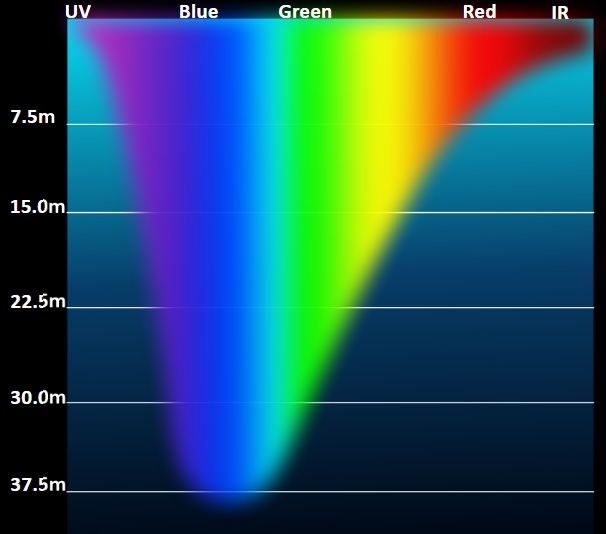
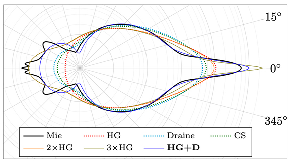
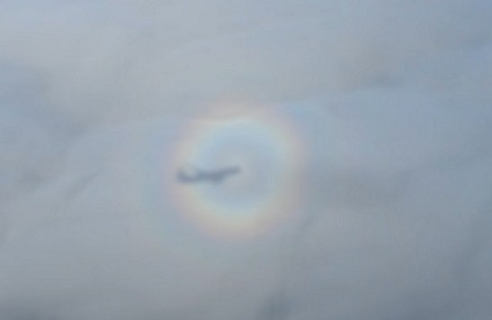
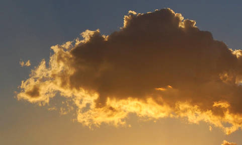
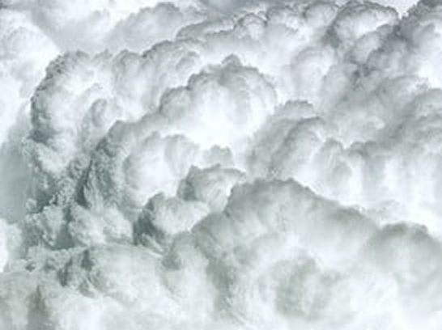
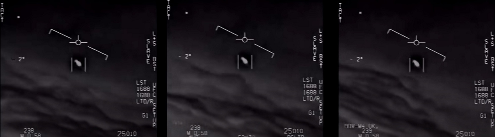

Contents:
* [Fog](#Fog)
* [Fog](#Fog)
* [Clouds](#Clouds)
    - [Examples](#Examples-1)
	- [Optimization](#Optimization)
* [Atmosphere](#Atmosphere)
* [Source Code](#Source-Code)


# Fog

There are specific cases that do not require complex ray tracing for lighting calculations, unlike clouds.<br/>
These include:
* White smoke, steam, fine dust, fog, and upper-level clouds.<br/>
  At low densities, they are fully transparent to light, and the weakening of light is compensated by scattered light from the same source.
  In addition to direct lighting, there is a contribution from indirect (ambient) lighting.
* Black smoke, coarse dust.<br/>
  Black absorbs more light than scatters, so lighting has a weaker effect. Such fog creates self-shadows, but subsurface scattering is minimal, and it is rendered more as an opaque surface.
* Gray smoke, distant rain.<br/>
  A more complex case where both scattering and absorption occur. It may require ray tracing or baking (DLUT).
* Stratospheric clouds.<br/>
  The contribution of light refraction is significant, and few people have seen them, so an approximation would suffice. The same applies to the solar halo in high clouds.


## Examples

[Realistic smoke lighting with 6-way lighting in VFX Graph](https://blog.unity.com/engine-platform/realistic-smoke-with-6-way-lighting-in-vfx-graph)<br/>
Baking lighting from three sides into RGB channels, sometimes called DLUT. Suitable for gray smoke. Increases texture cache load on mobile devices.

[Battlefront II: Layered Explosion](https://simonschreibt.de/gat/battlefront-ii-layered-explosion/)<br/>
Baking lighting and emission for explosion and smoke effects.


# Fog

Variants:
* Uniform fog, haze.<br/>
  The simplest option.
* Non-uniform fog, rain areas.

## Presentations

1. [A Simple Shader for Point Lights in Fog](https://ijdykeman.github.io/graphics/simple_fog_shader)<br/>


# Clouds

Detailed physical properties of cloud lighting are covered in presentations; here's a brief overview.

Components of cloud lighting:
* Beer-Lambert-Bouguer Law (Beer's law)<br/>
  Determines light attenuation in an absorbing medium, i.e., it accounts for light absorption (absorption). Formula: `T=exp(-depth)`<br/>
  The effect is most pronounced in water.<br/>
  <br/

* Henyey-Greenstein phase function<br/>
  In clouds, light begins to reflect and refract, but with a higher probability of traveling in a straight line with slight deviation, which is defined by the HG function.
  This effect creates a glowing edge around clouds, where density is much lower and fewer reflections occur. The HG function is an approximation of the Mie scattering function.<br/>
  <br/
  In reality, there is a peak in backward reflection, leading to special effects. In the Horizon presentation [1], this was not considered as there was no flight through clouds.<br/>
  <br/
  The HG function also accounts for the glow around cloud edges, which becomes more pronounced when the angle between the view direction and the light direction is less than 10°, and weaker up to 60°.<br/>
  <br/

* "Dark outlining" (Powder effect)<br/>
  In dense rain clouds, scattered light contributes significantly, making it seem as if light is coming from within the cloud, with external details only shading it.
  This effect appears at specific angles when light passes through the cloud from the side, is then shaded by external details, and reaches the camera. The angles are determined by the HG function.
  It is the opposite of the SilverLining effect (glowing edges).<br/>
  <br/
  It is clearly visible in the infrared range.<br/>
  <br/

## Presentations

1. [The Real-Time Volumetric Cloudscapes of Horizon Zero Dawn](https://advances.realtimerendering.com/s2015/The%20Real-time%20Volumetric%20Cloudscapes%20of%20Horizon%20-%20Zero%20Dawn%20-%20ARTR.pdf)<br/
2. [The Real-Time Volumetric Superstorms of 'Horizon Forbidden West'](https://www.gdcvault.com/play/1027688/The-Real-Time-Volumetric-Superstorms)<br/

3. [Understanding the Role of Phase Function in Translucent Appearance](https://persci.mit.edu/pub_pdfs/translucency.pdf)<br/
Part of the materials are compatible with the Henyey-Greenstein approximation, but others are not.

4. [Production Volume Rendering, SIGGRAPH 2017 Course](https://graphics.pixar.com/library/ProductionVolumeRendering/paper.pdf)<br/

5. [Physically Based Sky, Atmosphere and Cloud Rendering in Frostbite](https://media.contentapi.ea.com/content/dam/eacom/frostbite/files/s2016-pbs-frostbite-sky-clouds-new.pdf)<br/

6. [Nubis3: Methods (and madness) to model and render immersive real-time voxel-based clouds](https://advances.realtimerendering.com/s2023/Nubis%20Cubed%20(Advances%202023).pdf)

## Examples

### Shadertoy: 60FPS Volumetric Clouds on iGPU

[](https://www.shadertoy.com/view/DtBGR1)

Simple implementation, readable and fast-running code, but these are not physically accurate clouds.

<details><summary>Details</summary>

Cloud rendering is done in `Buffer C`.

```glsl
//< line 139
float fog = pow(1.0 - (dist_from_camera / DRAW_DISTANCE), 0.5);

vec3 lighting = lightMarch(current_position, direction);

vec3 cloud_color = mix(
    sky,
    lighting,
    clamp(fog, 0.0, 1.0)
);

accumulation = alphaOver(accumulation, vec4(cloud_color, density));
```

As in Horizon, a limited number of samples are used.
This is not PBR cloud rendering, as the cloud color is calculated by interpolating between shadow and background color, which looks good when the sun is high and clouds are sparse.

```glsl
vec3 lightMarch(vec3 start_position, vec3 view_direction) {
    // Computes the lighting in the cloud at a given point
    float lighting = 1.0;
    float transmission = 1.0 - dot(LIGHT_DIRECTION, view_direction);  //< simplified phase function, should be HG
    transmission += 0.1;
    lighting *= clamp(1.0 - sampleCloudMapDensity(start_position + LIGHT_DIRECTION * 1.0) * 0.2 * transmission, 0.0, 1.0); // Self
    lighting *= clamp(1.0 - sampleCloudMapDensity(start_position + LIGHT_DIRECTION * 2.0) * 0.2 * transmission, 0.0, 1.0); // Far
    lighting *= clamp(1.0 - sampleCloudMapDensity(start_position + LIGHT_DIRECTION * 4.0) * 0.2 * transmission, 0.0, 1.0); // Far
    lighting *= clamp(1.0 - sampleCloudMapDensity(start_position + LIGHT_DIRECTION * 8.0) * 0.2 * transmission, 0.0, 1.0); // Far
    return vec3(lighting);
}
```

Color accumulation formula.

```glsl
vec4 alphaOver(vec4 top, vec4 bottom) {
    float A1 = bottom.a * (1.0 - top.a);

    float A0 = top.a + A1;
    return vec4(
        (top.rgb * top.a + bottom.rgb * A1) / A0,
        A0
    );
}
```

</details>

### Shadertoy: Single Sample Tricubic Sampling

[](https://www.shadertoy.com/view/tdtyzj)

Only the dark outlining (powder effect) is implemented, but it looks good and runs quickly.

<details><summary>Details</summary>

```glsl
//< line 178
sigma  = -f * (1024.0*1.0);                              //< f - density, sigma - scattering coefficient

float rad  = 1.0 - exp2(-sigma * 0.04);                  //< dark outlining
      rad *= 1.0 - Pow2(cubic(1.0-clamp01(p0.y + 0.5))); //< effect depends on height

tau += sigma * stepSize;                                 //< tau - optical density

float T0 = T;                                            //< T - transmission coefficient, varies from 1 to 0
T = exp2(-tau);                                          //< light absorption (Beer's law)

float prob = T0 - T;                                     //< scattering probability
r += rad * prob;                                         //< light accumulation
```

</details>

### Shadertoy: PBR CLOUDS

[](https://www.shadertoy.com/view/XcjXWy)

Looks physically accurate, but the code is more complex to read.

<details><summary>Details</summary>

Cloud rendering is done in `Buffer B`.

</details>

### Shadertoy: Cloud Flight

[](https://www.shadertoy.com/view/XtlfDn)

No physical accuracy, but looks good and runs quickly.

### Shadertoy: Swiss Alps

[](https://www.shadertoy.com/view/ttcSD8)

Looks physically accurate.

<details><summary>Details</summary>

Cloud rendering is done in `Buffer C`.
Lighting is calculated for each point inside the cloud in a loop.

```glsl
//< line 158
float density = getCloudDensity(p, heightFract, true);
if (density > 0.)
{
    ambient = mix(CLOUDS_AMBIENT_BOTTOM, CLOUDS_AMBIENT_TOP, heightFract);

    // cloud illumination
    vec3 luminance = (ambient * SAT(pow(sun.z + .04, 1.4))
        + skyCol * .125 + (sunHeight * skyCol + vec3(.0075, .015, .03))
        * SUN_COLOR * hgPhase                                              //< HG function calculated once, though at this scale the sun is a point source, not directional
        * marchToLight(p, sunDir, sunDot, sunScatterHeight))               //< calculates lighting at this point
        * density;                                                         //< lighting contribution depends on density

    // improved scatter integral by Sébastien Hillaire
    float transmittance = exp(-density * cameraRayStepSize);               //< light absorption (Beer's law)
    vec3 integScatter = (luminance - luminance * transmittance) * (1. / density);  //< integral - here seems to be an error, as luminance is multiplied by density and they cancel out

    intScatterTrans.rgb += intScatterTrans.a * integScatter;
    intScatterTrans.a *= transmittance;
}
```

Ray marching for lighting calculation.
Density is summed along the direction of the sun at each point, then the density is substituted into the Beer's-Powder formula.

```glsl
float marchToLight(vec3 p, vec3 sunDir, float sunDot, float scatterHeight)
{
    float lightRayStepSize = 11.;
    vec3 lightRayDir = sunDir * lightRayStepSize;
    vec3 lightRayDist = lightRayDir * .5;
    float coneSpread = length(lightRayDir);
    float totalDensity = 0.;
    for(int i = 0; i < CLOUD_LIGHT_STEPS; ++i)
    {
        // cone sampling as explained in GPU Pro 7 article
        vec3 cp = p + lightRayDist + coneSpread * noiseKernel[i] * float(i);
        float y = cloudHeightFract(length(p));
        if (y > .95 || totalDensity > .95) break; // early exit
        totalDensity += getCloudDensity(cp, y, false) * lightRayStepSize;
        lightRayDist += lightRayDir;
    }

    return 32. *
           exp(-totalDensity * mix(CLOUD_ABSORPTION_BOTTOM, CLOUD_ABSORPTION_TOP, scatterHeight)) * //< light absorption (Beer's law)
           (1. - exp(-totalDensity * 2.));                                                          //< dark outlining (powder effect)
}
```

Final color with atmospheric scattering.

```glsl
//< line 185
float fogMask = 1. - exp(-smoothstep(.15, 0., ray.direction.y) * 2.);
vec3 fogCol = atmosphericScattering(uv * .5 + .2, sun.xy * .5 + .2, false);
intScatterTrans.rgb = mix(intScatterTrans.rgb, fogCol * sunHeight, fogMask);
intScatterTrans.a = mix(intScatterTrans.a, 0., fogMask);

col = vec4(max(vec3(intScatterTrans.rgb), 0.), intScatterTrans.a);
```

</details>

### Shadertoy: Volumetric Overcast Clouds

[](https://www.shadertoy.com/view/Xttcz2)

### Real time PBR Volumetric Clouds

[](https://www.shadertoy.com/view/MstBWs)

### Shadertoy: STARRY NIGHT

[](https://www.shadertoy.com/view/3dlfWs)

Fine cloud details are visible.

<details><summary>Details</summary>

Here `mu = dot(rayDir, lightDirection)`, which is the cosine of the average scattering angle.

In presentation [4], it is stated that multiple octaves of the HG function are used to approximate more complex phase functions.

```glsl
float multipleOctaves(float extinction, float mu, float stepL){

    float luminance = 0.0;
    const float octaves = 4.0;

    //Attenuation
    float a = 1.0;
    //Contribution
    float b = 1.0;
    //Phase attenuation
    float c = 1.0;

    float phase;

    for(float i = 0.0; i < octaves; i++){
        //Two-lobed HG
        phase = mix(HenyeyGreenstein(-0.1*c, mu), HenyeyGreenstein(0.3*c, mu), 0.7);  //< HG function
        luminance += b * phase * exp(-stepL * extinction * a);                        //< light absorption (Beer's law)
        //Lower is brighter
        a *= 0.25;
        //Higher is brighter
        b *= 0.5;
        c *= 0.5;
    }
    return luminance;
}
```

Combination of light absorption and dark outlining, where the dark outlining depends on the angle between the view direction and the light direction, which looks physically accurate.

```glsl
//< line 371
float beersLaw = multipleOctaves(lightRayDensity, mu, stepL);

//Return product of Beer's law and powder effect depending on the
//view direction angle with the light direction.
return mix(beersLaw * 2.0 * (1.0-(exp(-stepL*lightRayDensity*2.0))), beersLaw, 0.5+0.5*mu);
```

The combination of lighting at each ray marching step is slightly different from the Swiss Alps version and looks more correct by the formulas.

```glsl
//< line 445

//Amount of sunlight that reaches the sample point through the cloud
//is the combination of ambient light and attenuated direct light.
vec3 luminance = 0.2 * ambient + moonLight * phaseFunction *
                	lightRay(org, p, mu, lightDirection);

//Scale light contribution by density of the cloud.
luminance *= sampleSigmaS;

//Beer-Lambert.
float transmittance = exp(-sampleSigmaE * stepS);

//Better energy conserving integration
//"From Physically based sky, atmosphere and cloud rendering in Frostbite" 5.6
//by Sebastian Hillaire.
colour +=
    totalTransmittance * (luminance - luminance * transmittance) / sampleSigmaE;  //< integral, here luminance is multiplied by sampleSigmaS and divided by sampleSigmaE

//Attenuate the amount of light that reaches the camera.
totalTransmittance *= transmittance;
```

But in the end `sigmaA = 0` and `sampleSigmaS == sampleSigmaE`.

```glsl
//< line 429

//Scattering and absorption coefficients.
float sigmaS = 1.0;
float sigmaA = 0.0;

//Extinction coefficient.
float sigmaE = sigmaS + sigmaA;

float sampleSigmaS = sigmaS * density;
float sampleSigmaE = sigmaE * density;
```

</details>

## Optimization

**View from below upwards**

If the camera is always on the ground and the clouds are high enough, the view of the clouds will be from below upwards. Views at an angle are possible but limited by atmospheric haze.
For such cases, the Horizon [1] approach works well as the ray-tracing volume is small and detail levels are fixed. Ray tracing is only done for low clouds (rain clouds), while higher clouds are rendered using 2D sprites.

**Flying through clouds**

Here problems begin. The distance to the clouds can range from a few meters to tens of kilometers, with large empty spaces in between.
A significant portion of the screen can be occupied by clouds, increasing the load. Sudden movements can break reprojection.

Rain clouds up close contain swirls across the entire surface, which is very similar to a fractal, meaning detail can increase indefinitely until particles become too transparent.

