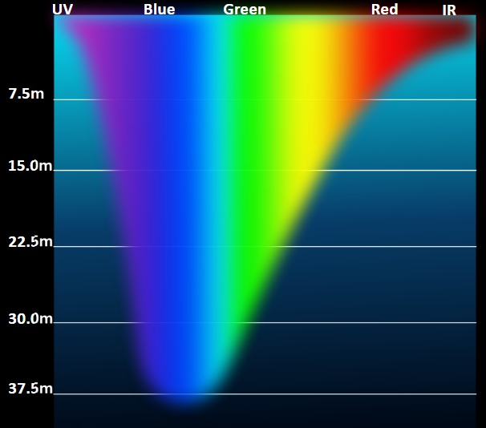
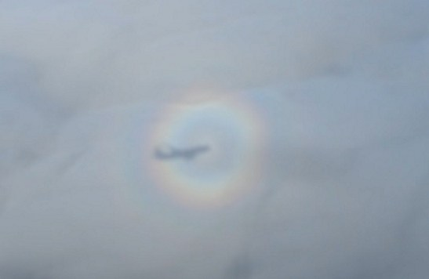
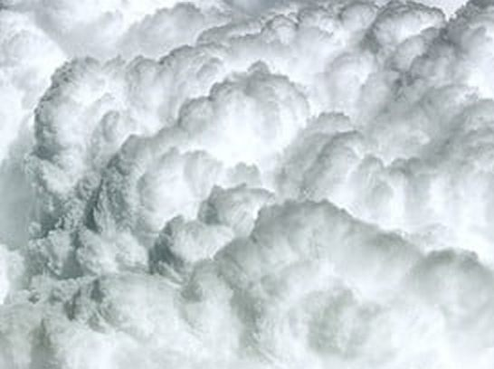
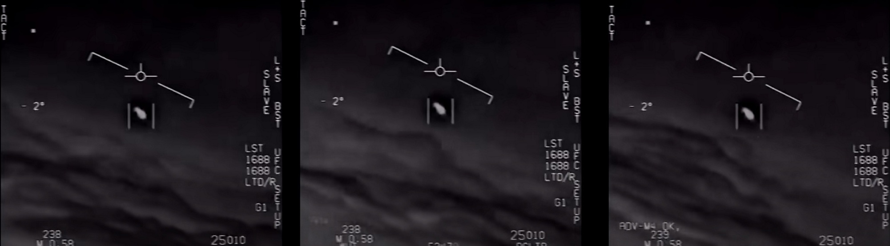

Содержание:
* [Дым](#Дым)
* [Туман](#Туман)
* [Облака](#Облака)
    - [Примеры](#Примеры-1)
	- [Оптимизируем](#Оптимизируем)
* [Атмосфера](#Атмосфера)
* [Исходники](#Исходники)


# Дым

Есть отдельные случаи, не требующие сложных трассировок для просчета освещения как это сделано в облаках.<br/>
К ним относится:
* Белый дым, пар, мелкая пыль, туман, облака верхнего яруса.<br/>
  При низкой плотности они полностью проницаемы для света, а само ослабление света компенсируется рассеяным светом от того же источника.
  Кроме прямого освещения есть вклад непрямого (ambient) освещения.
* Черный дым, крупная пыль.<br/>
  Черный цвет больше поглощает свет чем рассеивает, поэтому освещение влияет слабо. Такой дым создает самозатенение, но подповерхностное рассеивание минимально и рисуется больше как непрозрачная поверхность (opaque).
* Серый дым, дождь вдали.<br/>
  Более сложный случай, когда происходит и рассеивание и поглощение. Может потребовать трассировку или запекание (DLUT).
* Стратосферные облака.<br/>
  Большой вклад дает преломление света, их мало кто видел, так что сойдет аппроксимация. Тоже самое с солнечным гало в высотных облаках.


## Примеры

[Realistic smoke lighting with 6-way lighting in VFX Graph](https://blog.unity.com/engine-platform/realistic-smoke-with-6-way-lighting-in-vfx-graph)<br/>
Запекание освещения с трех сторон в RGB каналы, иногда называют DLUT. Подходит для серого дыма. На мобилках увеличивает нагрузку на текстурный кэш.

[Battlefront II: Layered Explosion](https://simonschreibt.de/gat/battlefront-ii-layered-explosion/)<br/>
Запекание освещения и эмиссии для эффекта взрыва и дыма.


# Туман

Варианты:
* Однородный туман, дымка.<br/>
  Самый простой вариант.
* Неоднородный туман, области дождя.

## Презентации

1. [A Simple Shader for Point Lights in Fog](https://ijdykeman.github.io/graphics/simple_fog_shader)<br/>


# Облака

Подробно физические сфойства освещение облаков есть в презентациях, здесь же кратко.

Из чего состоит освещение облака:
* Закон Бугера — Ламберта — Бера (Beer's law)<br/>
  Определяет ослабление света в поглощающей среде, то есть отвечает за поглощение света (absorption). Формула: `T=exp(-depth)`<br/>
  Лучше всего эффект проявляется в воде.<br/>
  <br/>

* Henyey-Greenstein phase function<br/>
  В облаке свет начинает отражаться и преломляться, но с большей вероятностью он пойдет в прямом направлении с небольшим отклонением, это задает HG-функция.
  Эффект дает свечение по краям облака, где плотность намного меньше и меньше переотражений. HG-функция является аппроксимацией Mie-функции рассеивания.<br/>
  <br/>
  В реальности есть пик отражения в обратную сторону, что приводит к особым эффектам. В презентации Horizon [1] это не рассматривалось, так как нет полета в облаках.<br/>
  <br/>
  Также HG-функция отвечает за свечение краев облака, эффект проявляется, когда угол между взглядом и направлением освещения <10°, слабее до 60°.<br/>
  <br/>

* "Темная обводка" (Powder effect)<br/>
  В плотных дождевых облаках большой вклад вносит рассеяное освещение, тогда кажется что свет идет изнутри облака, а внешние детали только затеняют его.
  Эффект проявляется на определенных углах, когда свет сбоку проходит через облако, затем затеняется внешними деталями и попадает на камеру. Углы определяются HG-функцией.<br/>
  Является противоположностью SilverLining эффекта (свечение краев).<br/>
  <br/>
  Хорошо заметен в инфракрасном диапазоне.<br/>
  <br/>

## Презентации

1. [The Real-Time Volumetric Cloudscapes of Horizon Zero Dawn](https://advances.realtimerendering.com/s2015/The%20Real-time%20Volumetric%20Cloudscapes%20of%20Horizon%20-%20Zero%20Dawn%20-%20ARTR.pdf)<br/>
2. [The Real-Time Volumetric Superstorms of 'Horizon Forbidden West'](https://www.gdcvault.com/play/1027688/The-Real-Time-Volumetric-Superstorms)<br/>

3. [Understanding the Role of Phase Function in Translucent Appearance](https://persci.mit.edu/pub_pdfs/translucency.pdf)<br/>
Часть материалов совместимы с апроксимацией Henyey-Greenstein, но другие - нет.

4. [Production Volume Rendering, SIGGRAPH 2017 Course](https://graphics.pixar.com/library/ProductionVolumeRendering/paper.pdf)<br/>

5. [Physically Based Sky, Atmosphere and Cloud Rendering in Frostbite](https://media.contentapi.ea.com/content/dam/eacom/frostbite/files/s2016-pbs-frostbite-sky-clouds-new.pdf)<br/>

6. [Nubis3: Methods (and madness) to model and render immersive real-time voxel-based clouds](https://advances.realtimerendering.com/s2023/Nubis%20Cubed%20(Advances%202023).pdf)

## Примеры

### Shadertoy: 60FPS Volumetric Clouds on iGPU

[](https://www.shadertoy.com/view/DtBGR1)

Сделано просто, код читаем и работает быстро, но это не физически-корректные облака.

<details><summary>Подробнее</summary>

Рисование облаков сделано в `Buffer C`.

```glsl
//< строка 139
float fog = pow(1.0 - (dist_from_camera / DRAW_DISTANCE), 0.5);

vec3 lighting = lightMarch(current_position, direction);

vec3 cloud_color = mix(
    sky,
    lighting,
    clamp(fog, 0.0, 1.0)
);

accumulation = alphaOver(accumulation, vec4(cloud_color, density));
```

Как в Horizon используется ограниченное количество сэмплов.
Также это не PBR облака, так как цвет облака расчитывается интерполяцией между тенью и цветом фона, это хорошо смотрится когда солнце высоко, а облака разряженые.

```glsl
vec3 lightMarch(vec3 start_position, vec3 view_direction) {
    // Computes the lighting in the cloud at a given point
    float lighting = 1.0;
    float transmission = 1.0 - dot(LIGHT_DIRECTION, view_direction);  //< упрощенная фазовая функция, должна быть HG
    transmission += 0.1;
    lighting *= clamp(1.0 - sampleCloudMapDensity(start_position + LIGHT_DIRECTION * 1.0) * 0.2 * transmission, 0.0, 1.0); // Self
    lighting *= clamp(1.0 - sampleCloudMapDensity(start_position + LIGHT_DIRECTION * 2.0) * 0.2 * transmission, 0.0, 1.0); // Far
    lighting *= clamp(1.0 - sampleCloudMapDensity(start_position + LIGHT_DIRECTION * 4.0) * 0.2 * transmission, 0.0, 1.0); // Far
    lighting *= clamp(1.0 - sampleCloudMapDensity(start_position + LIGHT_DIRECTION * 8.0) * 0.2 * transmission, 0.0, 1.0); // Far
    return vec3(lighting);
}
```

Формула накопления цвета.

```glsl
vec4 alphaOver(vec4 top, vec4 bottom) {
    float A1 = bottom.a * (1.0 - top.a);

    float A0 = top.a + A1;
    return vec4(
        (top.rgb * top.a + bottom.rgb * A1) / A0,
        A0
    );
}
```

</details>

### Shadertoy: Single Sample Tricubic Sampling

[](https://www.shadertoy.com/view/tdtyzj)

Сделана только темная обводка (powder effect), но смотрится хорошо и работает быстро.

<details><summary>Подробнее</summary>

```glsl
//< строка 178
sigma  = -f * (1024.0*1.0);                              //< f - плотность, sigma - коэффициент рассеивания

float rad  = 1.0 - exp2(-sigma * 0.04);                  //< темная обводка
      rad *= 1.0 - Pow2(cubic(1.0-clamp01(p0.y + 0.5))); //< эффект зависит от высоты

tau += sigma * stepSize;                                 //< tau - оптическая плотность

float T0 = T;                                            //< T - коэффициент пропускания, меняется от 1 до 0
T = exp2(-tau);                                          //< поглощение света (Beer's law)

float prob = T0 - T;                                     //< вероятность рассеивания
r += rad * prob;                                         //< накопление света
```

</details>

### Shadertoy: PBR CLOUDS

[](https://www.shadertoy.com/view/XcjXWy)

Выглядит физически корректно, но код сложнее читать.

<details><summary>Подробнее</summary>

Рисование облаков сделано в `Buffer B`.

</details>

### Shadertoy: Cloud Flight

[](https://www.shadertoy.com/view/XtlfDn)

Нет физической корректности, но смотрится хорошо и работает быстро.

### Shadertoy: Swiss Alps

[](https://www.shadertoy.com/view/ttcSD8)

Выглядит физически корректно.

<details><summary>Подробнее</summary>

Рисование облаков сделано в `Buffer C`.
В цикле считается освещение для каждой точки внутри облака.

```glsl
//< строка 158
float density = getCloudDensity(p, heightFract, true);
if (density > 0.)
{
    ambient = mix(CLOUDS_AMBIENT_BOTTOM, CLOUDS_AMBIENT_TOP, heightFract);

    // cloud illumination
    vec3 luminance = (ambient * SAT(pow(sun.z + .04, 1.4))
        + skyCol * .125 + (sunHeight * skyCol + vec3(.0075, .015, .03))
        * SUN_COLOR * hgPhase                                              //< HG-функция расчитывается один раз, хотя на таком масштабе солнце это точечный источник, а не направленный
        * marchToLight(p, sunDir, sunDot, sunScatterHeight))               //< рассчитывается освещение в данной точке
        * density;                                                         //< вклад освещения зависит от плотности

    // improved scatter integral by Sébastien Hillaire
    float transmittance = exp(-density * cameraRayStepSize);               //< поглощение света (Beer's law)
    vec3 integScatter = (luminance - luminance * transmittance) * (1. / density);  //< интеграл - тут похоже ошибка, так как luminance умножено на density и они сократятся

    intScatterTrans.rgb += intScatterTrans.a * integScatter;
    intScatterTrans.a *= transmittance;
}
```

Трассировка для расчета освещения.
Суммируется плотность в точках по направлению к солнцу, затем плотность подставляется в Beer's-Powder формулу.

```glsl
float marchToLight(vec3 p, vec3 sunDir, float sunDot, float scatterHeight)
{
    float lightRayStepSize = 11.;
    vec3 lightRayDir = sunDir * lightRayStepSize;
    vec3 lightRayDist = lightRayDir * .5;
    float coneSpread = length(lightRayDir);
    float totalDensity = 0.;
    for(int i = 0; i < CLOUD_LIGHT_STEPS; ++i)
    {
        // cone sampling as explained in GPU Pro 7 article
        vec3 cp = p + lightRayDist + coneSpread * noiseKernel[i] * float(i);
        float y = cloudHeightFract(length(p));
        if (y > .95 || totalDensity > .95) break; // early exit
        totalDensity += getCloudDensity(cp, y, false) * lightRayStepSize;
        lightRayDist += lightRayDir;
    }

    return 32. *
           exp(-totalDensity * mix(CLOUD_ABSORPTION_BOTTOM, CLOUD_ABSORPTION_TOP, scatterHeight)) * //< поглощение света (Beer's law)
           (1. - exp(-totalDensity * 2.));                                                          //< темная обводка (powder effect)
}
```

Финальный цвет с учетом атмосферного рассеивания.

```glsl
//< строка 185
float fogMask = 1. - exp(-smoothstep(.15, 0., ray.direction.y) * 2.);
vec3 fogCol = atmosphericScattering(uv * .5 + .2, sun.xy * .5 + .2, false);
intScatterTrans.rgb = mix(intScatterTrans.rgb, fogCol * sunHeight, fogMask);
intScatterTrans.a = mix(intScatterTrans.a, 0., fogMask);

col = vec4(max(vec3(intScatterTrans.rgb), 0.), intScatterTrans.a);
```

</details>

### Shadertoy: Volumetric Overcast Clouds

[](https://www.shadertoy.com/view/Xttcz2)

### Real time PBR Volumetric Clouds

[](https://www.shadertoy.com/view/MstBWs)

### Shadertoy: STARRY NIGHT

[](https://www.shadertoy.com/view/3dlfWs)

Хорошо видны мелкие детали облаков.

<details><summary>Подробнее</summary>

Здесь `mu = dot(rayDir, lightDirection)`, это косинус от среднего угла направления рассеивания.

В презентации [4] сказано, что множество октав HG-функции используется для аппроксимации более сложных фазовых функций.

```glsl
float multipleOctaves(float extinction, float mu, float stepL){

    float luminance = 0.0;
    const float octaves = 4.0;

    //Attenuation
    float a = 1.0;
    //Contribution
    float b = 1.0;
    //Phase attenuation
    float c = 1.0;

    float phase;

    for(float i = 0.0; i < octaves; i++){
        //Two-lobed HG
        phase = mix(HenyeyGreenstein(-0.1*c, mu), HenyeyGreenstein(0.3*c, mu), 0.7);  //< HG-функция
        luminance += b * phase * exp(-stepL * extinction * a);                        //< поглощение света (Beer's law)
        //Lower is brighter
        a *= 0.25;
        //Higher is brighter
        b *= 0.5;
        c *= 0.5;
    }
    return luminance;
}
```

Комбинация поглощение света и темной обводки, темная обводка зависит от угла между взглядом и светом, что как раз выглядит физически корректно.

```glsl
//< строка 371
float beersLaw = multipleOctaves(lightRayDensity, mu, stepL);

//Return product of Beer's law and powder effect depending on the
//view direction angle with the light direction.
return mix(beersLaw * 2.0 * (1.0-(exp(-stepL*lightRayDensity*2.0))), beersLaw, 0.5+0.5*mu);
```

Комбинация освещения на каждом шаге маршинга немного отличается от варианта **Swiss Alps** и по формулам выглядит более корректно.

```glsl
//< строка 445

//Amount of sunlight that reaches the sample point through the cloud
//is the combination of ambient light and attenuated direct light.
vec3 luminance = 0.2 * ambient + moonLight * phaseFunction *
                	lightRay(org, p, mu, lightDirection);

//Scale light contribution by density of the cloud.
luminance *= sampleSigmaS;

//Beer-Lambert.
float transmittance = exp(-sampleSigmaE * stepS);

//Better energy conserving integration
//"From Physically based sky, atmosphere and cloud rendering in Frostbite" 5.6
//by Sebastian Hillaire.
colour +=
    totalTransmittance * (luminance - luminance * transmittance) / sampleSigmaE;  //< интеграл, тут luminance умножено на sampleSigmaS и делится на sampleSigmaE

//Attenuate the amount of light that reaches the camera.
totalTransmittance *= transmittance;
```

Но в итоге `sigmaA = 0` и `sampleSigmaS == sampleSigmaE`.

```glsl
//< строка 429

//Scattering and absorption coefficients.
float sigmaS = 1.0;
float sigmaA = 0.0;

//Extinction coefficient.
float sigmaE = sigmaS + sigmaA;

float sampleSigmaS = sigmaS * density;
float sampleSigmaE = sigmaE * density;
```

</details>

## Оптимизируем

**Вид снизу вверх**

Если камера всегда на земле, а облака достаточно высоко, то вид на них будет снизу вверх. Вид под углом возможен, но ограничен дымкой в атмосфере.
Для таких случаев хорошо подходит вариант Horizon [1], так как объем для трассировки небольшой и уровень детализации фиксирован. Трасировка сделана только для низких облаков (дождевых), более высокие рисуются 2D спрайтами.

**Полет в облаках**

И тут начинаются проблемы. Расстояние до облаков может быть от нескольких метров до десятков километров, по середине могут быть огромные пустые пространства.
Большая часть экрана занята облаками, что увеличивает нагрузку. Возможны резкие движения, которые ломают репроекцию.

Дождевые облака вблизи содержат завихрения по всей поверхности, это очень похоже на фрактал, то есть детализация может увеличиваться до бесконечности, пока частицы не становятся слишком прозрачными.
