# Spherical Cube

## Applications

* Drawing planets.
* Outputting cubic textures (skybox) and 360/VR video.
* For evenly distributing points on a sphere.

## Types of Projections

The article [Cube-to-sphere Projections for Procedural Texturing and Beyond](https://www.jcgt.org/published/0007/02/01/paper.pdf) explores various types of projections:

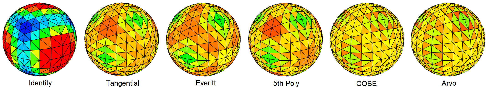

The colored area represents the triangle's surface, and identical colors indicate equal surface areas on the sphere. 
[Code](https://github.com/azhirnov/AsEn-ShaderEditor/blob/main/src/scripts/planets/SphericalCube-1.as).

## Performance and Accuracy

The highest accuracy is achieved by the Tangential, Everitt, and Arvo methods. 
In the test, the sphere's unwrap is applied along with inverse and forward projections, vectors are compared, and error is output. 
[Code](https://github.com/azhirnov/AsEn-ShaderEditor/blob/main/src/scripts/screenshot-test/CubeMapTest-1.as)

The highest performance is achieved by Everitt, which uses a single Sqrt operation, allowing for fast execution on GPUs. Next is 5thPoly, which uses only FMA operations. 
Tangential and Arvo are 30% slower due to the use of Atan and other trigonometric functions, which are very slow on GPUs. 
COBE is slightly slower, but its method is independent of trigonometry, so it may be faster on certain GPUs.

In the end, Everitt proved to be the best in terms of both accuracy and performance.

## Texture Projection

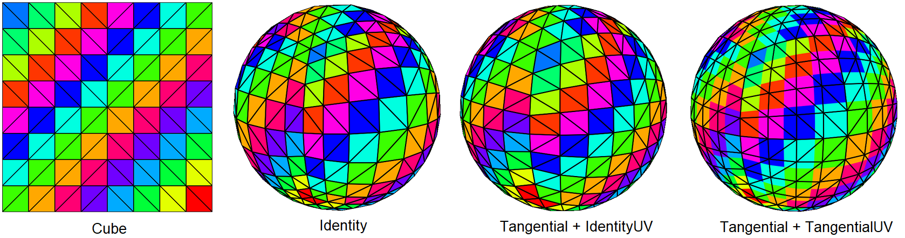

The correct combination is using Tangential projection for vertices and Identity projection for texture coordinates. This results in vertices being evenly distributed across the sphere, while the texture is applied with minimal distortion and, consequently, the best detail.

[Code](https://github.com/azhirnov/AsEn-ShaderEditor/blob/main/src/scripts/planets/SphericalCube-2.as).

## Topology

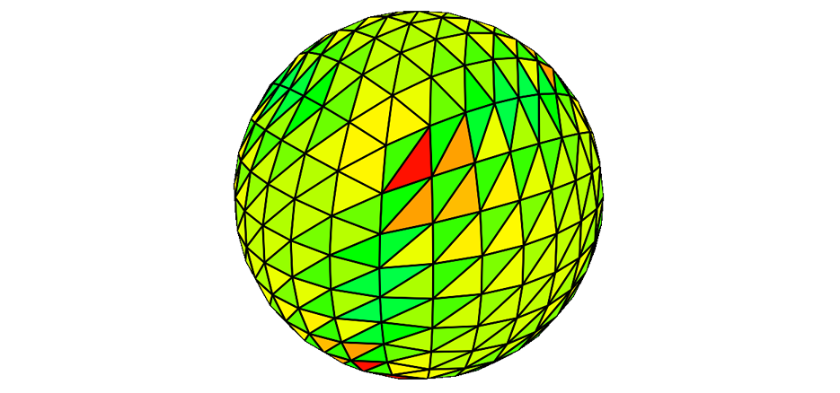

A standard grid after projection results in severely distorted triangles, so the grid must be symmetric relative to the center of each face. 
The image shows incorrect triangle matching at the cube's face edges, leading to increased area for some triangles. Distorted triangles increase the number of fragment shader streamer threads (quad overdraw).

## Projection from 3D

### Distortions

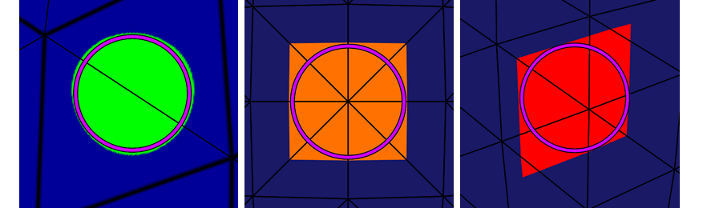

Example of projecting a circle onto a spherical cube. Minor distortions begin near the cube's face, which is not critical for a circle. 
Projecting a square onto a spherical cube has no distortion only at the center of the face, but begins at the edges. However, the radius of the inscribed circle remains unchanged. Below is a method for distortion correction. 
[Code](https://github.com/azhirnov/AsEn-ShaderEditor/blob/main/src/scripts/planets/SphericalCube-3.as).

### Interpolation Error

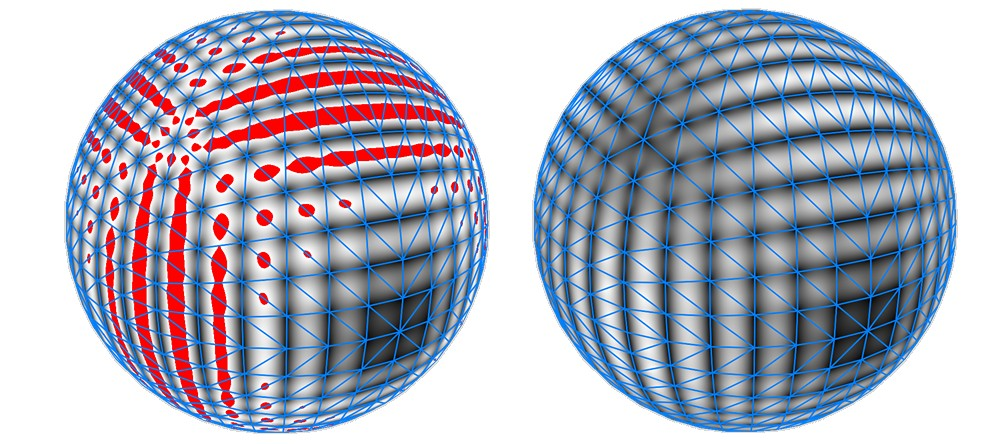

The test shows error when projection is applied to vertices, with linear interpolation occurring between them. Due to the discrepancy between projection and interpolation, error occurs. On the image, the error size is shown in white, red indicates when the error exceeds 1 after scaling.

Accuracy can be improved by repeating the linear interpolation between control points. The right option is shown on the image.

Code: 
[Error correction in the computational shader](https://github.com/azhirnov/AsEn-ShaderEditor/blob/main/src/scripts/planets/SphericalCube-4.as). 
[Error correction in the fragment shader](https://github.com/azhirnov/AsEn-ShaderEditor/blob/main/src/scripts/planets/SphericalCube-5.as).

## Projection from 2D

There are two options for recording data into a cube map:
1. Use UV coordinates for each cube face and process each face separately.
2. Render geometry into a texture, either with a texture or with UV for procedural generation in the fragment shader.

### Rendering into a Texture

Projecting a square onto the boundary between cube map faces results in incorrect UV coordinates.

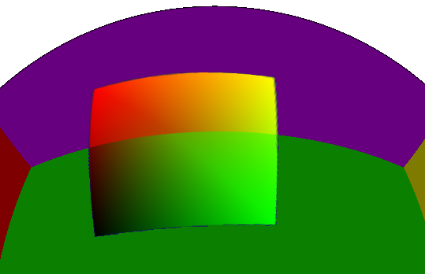

The square is drawn into the texture with distortions to preserve proportions in 3D, but this causes incorrect UV interpolation - vertices outside the drawing area diverge even more from each other. 
This is what one face of the cube map looks like.

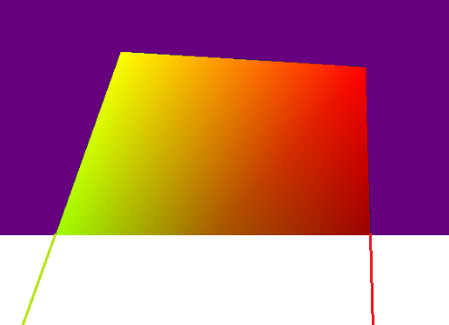

Tangential projection significantly improves UV interpolation, but the boundary is still noticeable.

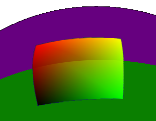

The problem can be solved in several ways:
* Add additional points at the face boundaries.
* Calculate UV in the fragment shader using tangent, bitangent vectors, and 3D coordinates of the sphere center.

[Code](https://github.com/azhirnov/AsEn-ShaderEditor/blob/main/src/scripts/planets/UVSphere-2.as).

## Sphere without Geometry

When to use geometry:
* For high detail with a displacement map.
* When other geometry is nearby, such as buildings on a planet.
* For significant geometric deformation, such as sphere collisions.

In all other cases, it's more efficient to use a procedural sphere without geometry.
Only a square or hexagon is used for geometry; in the fragment shader, the normal at the sphere's specified point is calculated using UV. Additional calculations can also yield depth and write to `gl_FragDepth`.
Further goes per-pixel texture coordinate projection (correction).
For perspective projection, the sphere's normal must be projected, as the visible parts of the sphere vary depending on the distance between the camera and the sphere.

Advantages:
* Memory savings on geometry.
* At low detail, geometry shows noticeable edges, while a procedural sphere is always perfectly round with edge smoothing.
* At high detail, geometry uses significantly more fragment shader streams due to auxiliary streams being called on triangle edges (quad overdraw). A procedural sphere with hexagon geometry uses significantly fewer streams.
* As a result, performance is twice as high, even on mobile devices.

[Code](https://github.com/azhirnov/AsEn-ShaderEditor/blob/main/src/scripts/planets/UVSphere-1.as).

## Procedural Planet Generation

The planet's surface is formed by:
* Meteor impacts leaving craters.
* Volcanic activity creates individual volcanoes, volcanic chains (mountain ranges), volcanic craters, lava caves with collapses.
* Tectonic plate movement creates rifts and mountain ranges.
* Water erosion destroys mountains, carves canyons, creates rocks and sand.

### Craters

**3D Voronoi**
Pros include immediately getting circles without distortion, but that's it. 
Circles on the planet are formed by the intersection of multiple 3D spheres with the planet, where the sphere's center does not lie on the planet, resulting in incorrect distance on the planet's surface, making it impossible to overlay the crater shape. 
In the example [Lunar Cubemap](https://www.shadertoy.com/view/4t3yzj), this distance distortion is solved by distorting the distance, which works but results in identical crater shapes that don't look good up close. The main disadvantage of this approach is 125 iterations for each Voronoi diagram layer, and multiple layers are needed.

**2D Voronoi on Cube Face**
In the example [Space egg](https://www.shadertoy.com/view/Mtj3DV), Voronoi diagrams are used for cube maps, resulting in 9 distance calculations considering adjacent faces and correction calculations. This isn't much, but there's room for optimization.

**Variant from Coding Adventure** 
In the video [Coding Adventure: Procedural Moons and Planets](https://youtu.be/lctXaT9pxA0?t=189), craters are generated on the CPU in [CraterSettings](https://github.com/SebLague/Solar-System/blob/Episode_02/Assets/Celestial%20Body/Scripts/NoiseSettings/CraterSettings.cs#L46), followed by a full iteration in the compute shader: [Craters.cginc](https://github.com/SebLague/Solar-System/blob/Episode_02/Assets/Celestial%20Body/Scripts/Shaders/Includes/Craters.cginc#L18) and [MoonHeight.compute](https://github.com/SebLague/Solar-System/blob/Episode_02/Assets/Celestial%20Body/Scripts/Shaders/Compute/Height/MoonHeight.compute#L26) for each vertex on the sphere. 
Craters are defined as 3D spheres on the planet's surface, distance to the sphere's center is used for crater overlay. The crater shape is defined by a combination of curves and smoothing as in SDF ([more details in the video](https://youtu.be/lctXaT9pxA0?t=338)). 
The main disadvantage is the full iteration of all craters for each vertex, requiring the use of a quad tree and additional memory allocation for this.

**1st Option** 
Distribute points on the sphere and render squares in the texture to fill only selected areas. Crater overlapping is done using blending. 
The disadvantage of this approach is the problem of projecting geometry onto the cube map.

[Example](https://github.com/azhirnov/AsEn-ShaderEditor/blob/main/src/scripts/planets/UVSphere-2.as)

**2nd Option** 
Modify [one of the examples](https://github.com/azhirnov/AsEn-ShaderEditor/blob/main/src/scripts/planets/UVSphere-1.as). Voronoi diagrams are not required; randomly distribute circles without overlapping within a single layer. Multiple layers will be used, simulating meteor impacts in older craters. 
Algorithm:
1. A point in 2D on the cube face is projected into 3D sphere normal and rotated.
2. The normal is projected back into 2D and the nearest grid cell center is found.
3. The cell center is projected back into 3D and distance to the sphere's surface normal is calculated.
4. For the cell center, tangent (tangent, bitangent) vectors are calculated, from which UV for the crater texture is derived.
5. UV coordinates are corrected based on the distance between the cell center and the 3D point. An example of correction is shown in the image. 
	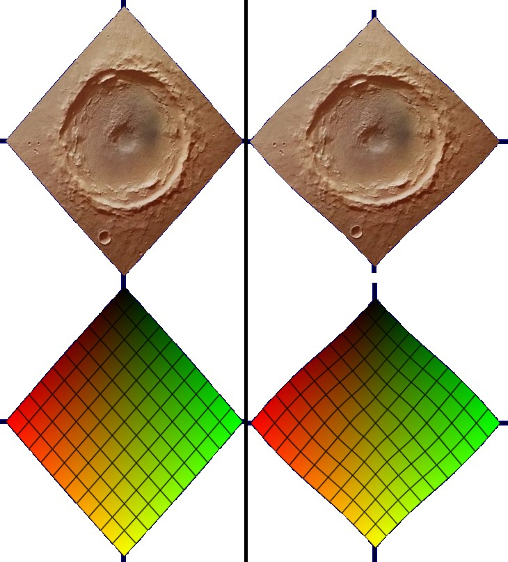

Code:
* [UV calculation and correction](https://github.com/azhirnov/AsEn-ShaderEditor/blob/main/src/scripts/planets/UVSphere-3.as) 
* [Random circle distribution on the sphere](https://github.com/azhirnov/AsEn-ShaderEditor/blob/main/src/scripts/planets/UVSphere-4.as) 

<b>Details on Crater Overlapping</b>

The problem is unrelated to sphere projection but affects the choice of crater point generation algorithm. 
In the video [Coding Adventure: Procedural Moons and Planets](https://youtu.be/lctXaT9pxA0?t=424), this problem is solved with noise, which works for low crater density but is unsuitable for realistic lunar landscapes. 
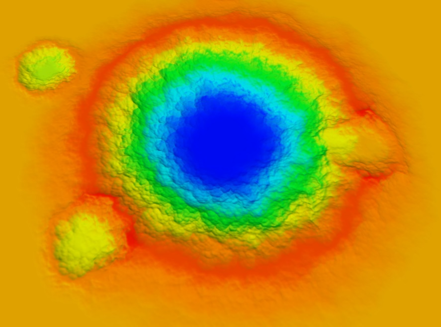

Another option is to store a history of craters contributing to height for each pixel and use this for proper mixing.
To prevent memory overflow, craters can be divided into several layers with noise and erosion added between them. The latest layer would represent fresh impacts, while earlier layers represent older craters.
In terms of performance, 4 crater layers on Mali G57 take 9.7ns per pixel, while Perlin noise takes 3.4ns.

[Code](https://github.com/azhirnov/AsEn-ShaderEditor/blob/main/src/scripts/samples-2d/CraterOverlaping.as)

### Canyons, Faults, and Other Lines

The sphere is intersected with a plane, and for each point, distance to the intersection is calculated. Then, angular coordinates are calculated to obtain `UV` coordinates for texture overlay.

Distance to the sphere and plane intersection can be added with 3D noise to get a curve, but the resulting `UV` will be distorted. Therefore, all distortions should be applied after `UV` calculation.

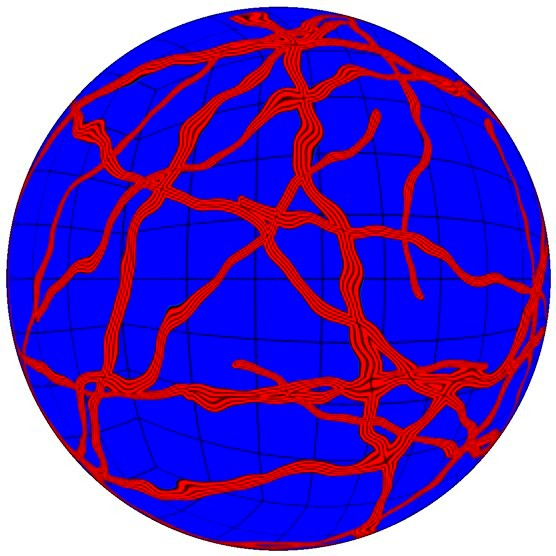

A broken line can be obtained by combining multiple planes. 
Multiple lines are created through random plane generation and by rotating the layer with lines, similar to how it's done for craters.

[Code](https://github.com/azhirnov/AsEn-ShaderEditor/blob/main/src/scripts/planets/UVSphere-5.as)