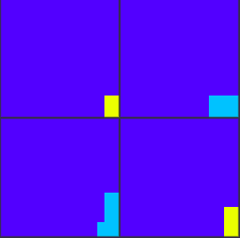
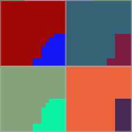
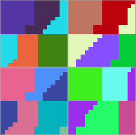

# Как ГП масштабируются при увеличении количества регистров

Одно ядро (CU/SM) может держать десятки активных варпов.
Но только часть из них выполняет инструкции, например 4 варпа на SM у NVIDIA.
Остальные в это время ждут либо пока до них дойдет очередь, что плохо, либо пока загружается запрошеный кусок памяти, что лучше.
Чем больше варпов помещается в одно ядро, тем большую задержку на чтение памяти получается скрыть - всегда есть варпы, которые выполняют инструкции и ядро не простаивает.

Количество активных варпов зависит от размера регистрового файла и количества регистров, которое требуется варпу.
На более новых моделях, типа RDNA4, регистры выделяются динамически, а на старых - при запуске варпа выделяются регистры под худший случай.

Также есть разделение на скалярные и векторные регистры. Скалярные это 32 бита на варп, а векторные - 32 бита на поток варпа, то есть 1024 бита (32х32) для simd32.

У каждого производителя свои эвристики чтобы выбрать оптимальный режим для запуска графических шейдеров, чтобы получить хорошее распараллеливание и обойтись без простаивающих ядер, когда все варпы ждут данные.
Для компьют шейдера эвристик меньше, так как пользователь сам устанавливает размер рабочей группы и размер варпа, если это поддерживается.


## NVIDIA

На NV используется фиксированный simd32 режим, точнее в железе это simd16, который 2 раза выполняет одну и ту же инструкцию для разных половин векторного регистра.

Экран делится на тайлы 16х16, при низкой нагрузке один тайл закрашивает один SM, таким образом для 10x SM получаем 320 потоков (пикселей).
Когда количество регистров увеличивается, а количество варпов в SM уменьшается, то на один тайл назначается 2 SM, таким образом потоков становится 160, то есть экран начал закрашиваться в 2 раза медленее.

Количество SM на тайл зависит не только от регистров, но и от количества фрагментов, которые нужно обработать. Так чем больше треугольников попало в тайл, тем больше SM будет задействовано.
Особенность тайлового рендеринга NV в том, что варпы не выходит за пределы тайла. SM может обработать разные тайлы за кадр, но не объединяет фрагменты из разных тайлов в один для лучшего заполнения варпа.

Это приводит к неиспользуемым потокам в варпе, но дает лучшую локальность данных, например при чтении списка светильников в tiled deferred shading.
Если выровнять размер тайла со светильниками для фиксированного тайла 16х16, то производительность заметно увеличивается.

На картинке цветом показано количество активных потоков на варп, темно-синий - все потоки, желтный - половина. Поверх наложена сетка 16х16 пикселей, так легко замерить размер тайла.



На картинке каждый SM раскрашен в свой цвет.
Когда рисуется полноэкранный треугольник, то один SM заполняет весь тайл, получается тайл 16x16, 32 потока на варп и 8 варпов на тайл.
Когда рисуется два треугольника на тайл, из-за quad overdraw количество фрагментов на тайл увеличивается и второй SM забирает часть работы.



Когда количество регистров увеличивается в несколько раз (с 16 до 96), то количество варпов на SM уменьшается и больше SM участвует в рисовании одного тайла. Тут получилось 5 SM на тайл.




## Mali

У ARM Mali алгоритм похож на NV, только с учетом TBDR подхода: размер тайла начинается с 16х16 и уменьшается при увеличении G-буфера.
Начиная с Valhall gen3 тайл увеличили до 32х32 пикселей. Размер варпа зафиксирован на 16 потоков, скорее всего там simd8 с dual issue.

Для компьют шейдера даже есть размеры регистров, так неизменным остается 0-32 векторных регистра для максимального количества потоков в рабочей группе и 32-64 для вдвое меньшего количества потоков.
Также у ARM есть расширение GL_ARM_shader_core_builtins по аналогии с GL_NV_shader_sm_builtins. Другие производители используют иные алгоритмы, поэтому не предоставляют возможность узнать ID ядра.


## Intel

Intel оказался намного интереснее. В Vulkan он поддерживает размер сабгруппы от 8 до 32, то есть в железе там simd8 с 2/4 повторными выполнениями инструкции.
В вершинном шейдере всегда используется simd8 режим, видмо для упрощения логики предположили что VS будет тяжелым.
В легком фрагментном шейдере включается simd16 режим, а с большим расходом регистров уменьшается до simd8.


Изначально планировщик пытается объединить фрагменты в тайл 4х4 независимо от режима simd8 или simd16.
Либо растеризатор обрабатывает треугольники тайлами 4х4 из-за чего они поступают планировщику уже объединенными.
Треугольник проходит этапы неточной растеризации тайлами (скорее всего 4х4 пикселя), где в том числе тестируется по HiZ, затем идет точная растеризация и попиксельный EarlyZ тест.

Если же фрагментов мало, то для оптимизации они объединяются с фрагментами другого треугольника, в тестах максимальное расстояние между пикселями варпа - 48.
Таким образом меньше потоков простаивает, но доступ к памяти не всегда когерентный, а кэши у Intel сильно меньше, чем у NV и память у встроек сильно медленее.

Получается у них все еще используется тайловая растеризация со своими преимуществами, но далее фрагметный шейдер не ограничен тайлом.


У более свежих Xe2 заявлена нативная поддержка simd16 режима, соответственно он должен заменить simd8 режим, а simd32 будет использовать для легких фрагментных шейдеров.

Кстати, на старых драйверах у Intel был баг - в шейдере `gl_SubgroupSize=32`, а выполнялось только 16, потом это исправили, но Vulkan до сих пор возвращает `VkPhysicalDeviceSubgroupProperties::subgroupSize=32`.
Исправляется это только через расширение `VK_EXT_subgroup_size_control`, где уже явно задается 32.


## AMD

AMD использует simd32 с возможность выполнить инструкцию 2 раза: wave32 и wave64 режимы.
Вершинный шейдер использует wave32 режим, а фрагментный - wave64.

Каждый CU может забрать варпы из очереди другого CU. Варпы перераспределяются в зависимости от нагрузки на память и в зависимости от нагрева CU.

Алгоритм частично описан в [Life of triangle](https://gpuopen.com/download/AMD_Graphics_pipeline_GIC2020.pdf). Растеризатор наполняет очередь квадратами (2х2 фрагмента), как только их хватает для полного варпа он отправляется на CU.

По моим тестам все не так хаотично и в приоритете объединить квадраты одного треугольника в один варп, отдельные квадраты объединяются с такими же квадратами других треугольников, что дает большое вырождение по данным.
Максимальное расстояние между пикселями варпа оказалось 142, на картинке этот варп выделен белым. В таких случаях кластерный forward+ кажется не лучшим вариантом.


## Adreno

В Adreno сделали большой варп на 64 потока и 128 в режиме dual issue.<br/>
*Кстати, на Adreno 660 у меня так и не получилось увеличить производительность за счет dual issue и максимальные FLOPS оказались в разы меньше чем рекламе.*

Также как у Intel, вершинный шейдер выполняется с меньшим размером сабгруппы - 64, а фрагментный на большем - 128.

В новой 800-серии и некоторых из 700й (730, но не 740) перешли на 64 потока.


## PowerVR


## Maleoon

В 910 - 920 варп на 64 потока, а в новых 935 перешли на 32 потока, возможно для лучшей совместимости с NV.


# Как это влияет на оптимизацию

## Скаляризация

Операции над сабгруппами типа Broadcast, BroadcastFirst, All, Any, Add, Mul, Or и тд возвращают одинаковое значение для всего варпа, что позволяет компилятору записать его в скалярный регистр, тем самым уменьшив количество векторных регистров.
В результате получаем экономию регистров и однородное выполнение: все потоки варпа идут по одному пути в ветвлении и циклах.

Пример скаляризации:
```glsl
uint scalarReg = subgroupBroadcastFirst( vectorReg );
```

В Metal шейдерах скаляризации выделяют особое внимание, все однородные данные оборачиваются в шаблон `uniform<T>`.


## Nonuniform

Когда-то давно считал, что gl_InstanceIndex всегда однородный в пределах варпа, затем в одной из презентаций сказали что это не так для мобилок, а затем сам провел тесты.

В итоге - все современные ГП объединяют разные инстансы в один варп и в вершинном и в фрагментном шейдере.
И это работает без nonuniform потому что компиляторы лучше знают что может измениться в пределах варпа.
В моих тестах только AMD GCN требовал явного использования nonuniform, почему непонятно, ведь на RDNA также не поддерживается NonUniformIndexingNative, но компилятор сам находит неоднородность и генерирует waterfall loop.

Подробнее разобрано в [статье про Bindless](Bindless-ru.md#Nonuniform).


## Скалярный поток

На NVIDIA это uniform datapath, на Intel - SIMD1, на AMD - scalar ALU.

Это отдельный ALU (только int) пайплайн, который работает параллельно с SIMD и выполняет операции только над однородными (uniform) данными.
В основном это операции над адресами, в AMD ISA можно подробнее посмотреть какие операции поддерживаются.

В более новых AMD RDNA4 и NV Blackwell появлися и scalar FMA пайплайн для операций над плавающей точкой.

Если сравнивать архитектуру ГП и ЦП, то они становятся идентичными - скалярные инструкции + векторный SIMD.
Но в ЦП намного больше скалярных инструкций, так как это основной режим выполнения, да и SIMD инструкций побольше за счет шифрования.
На ГП все это урезано в пользу уменьшения места на чипе и увеличения количества ядер.


## Префетч текстур

Раньше регистров было сильно меньше, а память медленее, поэтому варпы старались не блокировать.

Если `uv` из вершинного шейдера без изменений используется для чтения текстуры, то варп не стартует и не занимает регистры пока не прочитается текстура.
Таким образом регистры используются только пока идут расчеты и небольшие паузы на чтение из кэша.

Случай, когда `uv` меняется во время выполнения варпа называется "dependent texture lookup", термин часто встречается в рекомендациях по оптимизации старых Apple и других мобилок.

Но префетч невозможен например для параллакса с трассировкой по текстуре глубины, поэтому давно уже нарастили количество регистров и сделали быстрое переключение между варпами.


## SoA vs AoS

При чтении из памяти все потоки варпа выполняют одинаковую инструкцию, но запрашивают разные участки памяти.
Пока идет запрос к памяти варп простаивает.

У NVIDIA чтение SSBO и TBO идет через L1 data cache (L1TEX в NSight), затем L2 и VRAM.<br/>
Характеристики L1:
* 32B cache line
* 32B load granularity
* 128B update granularity

То есть L1 способен кэшировать до 128 байт, что приводит к двум чтениям из L2, где кэш линия 64 байта. Но чтение из L1 в регистры идет по 32 байта.
Получается для SoA подхода 8 потоков прочитают float4 из одной кэш линии, значит будет меньше медленных чтений из L2 и VRAM, следовательно варп будет меньше ждать данные.

AoS подход не так плох, если нужно прочитать всю структуру, иначе это приводит к загрязнению кэша ненужными данными.
Но часто вся структура не нужна сразу и варп может возобновить работу получив только часть структуры, а затем остановиться в ожидании следующей части, поэтому подход SoA во многом лучше.


# Термины

**Векторный ГП** - первая версия видеокарт, которые были построены по аналогии с SIMD инструкциями на ЦП, то есть каждая инструкция выполняла одну операцию над вектором.
Таким образом операции над RGBA цветом использовали 100% мощности ГП, а операции над 3D векторами только 3/4 мощности, а 2D вектора всего 2/4.
Такая архитектура не позволяет увеличить размер SIMD без полного переосмысления подхода к программированию шейдеров.

**Скалярный ГП** - следующая ступень эволюции, здесь SIMD инструкция выполняет одну операцию над скаляром в потоке. Так операции над float4 это 4 инструкции, а над float2 - всего 2 инструкции.
Это позволяет загрузить ГП на 100% без необходимости вручную группировать все в float4 типы как на векторных ГП.

**SIMD/SIMT** - физический блок, который выполняет одну инструкцию над векторным регистром. Внутри содержит несколько пайплайнов: FMA (fp32), ALU (i32), SFU, очередь запросов к памяти и тд.

**CU** - compute unit. Физический блок, содержащий массив SIMD, L1 кэш и планировщик варпов.
Другие названия SM - streaming multiprocessor (NV), WGP - workgroup processor (AMD), SP - Shader Processor (Adreno), EU - execution unit (Intel, Apple), Xe Core (Intel), Core (ARM Mali).

**Варп** (warp на NV, wave на AMD) - логический элемент, содержит: векторные и скалярные регистры, указатель на инструкцию, дополнительные параметры типа запросов к памяти и состояния ожидания данных.
Одновременно на одном SM могут быть десятки варпов, планировщик решает на какой из варпов отправить инструкцию. За один такт только ограниченное количество варпов может получить новую инструкцию, обычно это 2-4 варпа.

**Dual issue**  - режим выполнения инструкций при котором сначала инструкция выполняется для первой части векторного регистра, затем повторяется для второй части.
Так как между половинами векторного регистра нет зависимостей, то реализовать такое выполнение достаточно легко.
Бонусом к этому идет возможность пропустить одну из половин в случае вырождения потоков, например из-за ветвления.


# Исходники

* [TBR tile size - change register count](https://github.com/azhirnov/AsEn-ShaderEditor/blob/main/src/scripts/perf/TileSize-TBR.as)
* [TBDR tile size - change attachment size](https://github.com/azhirnov/AsEn-ShaderEditor/blob/main/src/scripts/perf/TileSize-TBDR.as)

